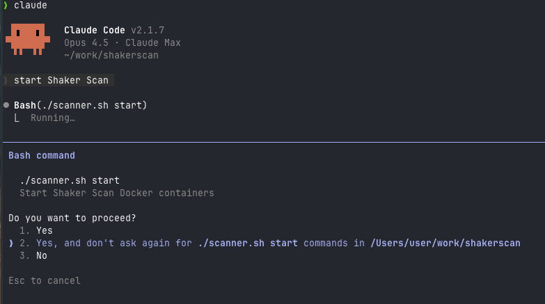
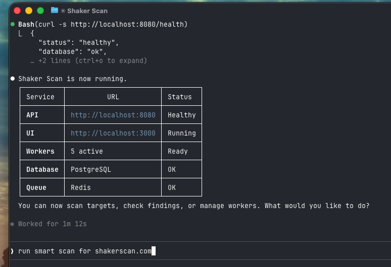
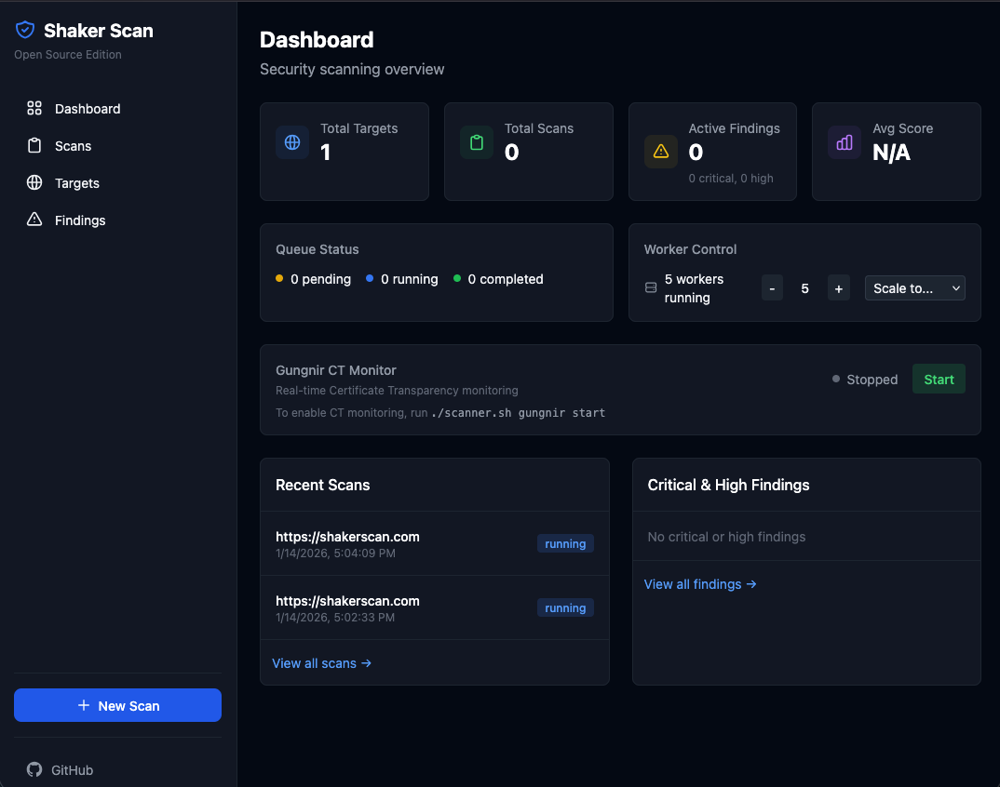
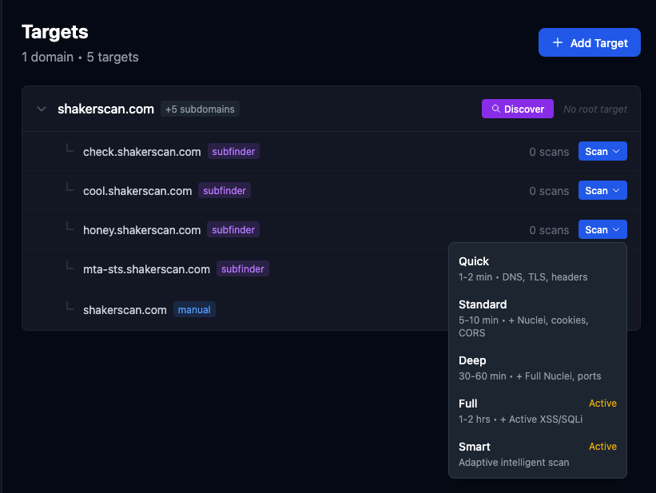

# Shaker Scan - Visual Walkthrough

This guide shows how to use Shaker Scan via Claude Code (terminal) and the Web UI.

## Terminal Experience (Claude Code)

### 1. Start the Scanner

Just ask Claude to start the scanner - it handles the Docker setup:



### 2. Scanner Ready

Once running, you'll see all services healthy:



### 3. Run a Scan

Ask for a scan in natural language. For active testing (smart/full scans), Claude asks for authorization first:


### 4. Scan Submitted

Claude submits the scan and gives you tracking info:


### 5. View Findings

Ask about findings - Claude formats them in a readable table:


---

## Web UI Experience

### Dashboard

Real-time overview with metrics, queue status, and worker controls:



### Targets

Manage targets with subdomain discovery and scan type selection:



### Findings

Browse all findings with severity filters and status management:


---

## Quick Commands

```bash
# Start scanner
"start shaker scan"

# Run scans
"scan example.com"
"run smart scan for example.com"

# Check findings
"show me critical findings"
"any vulnerabilities?"

# Manage workers
"scale to 5 workers"
```

See [README.md](README.md) for full documentation.
