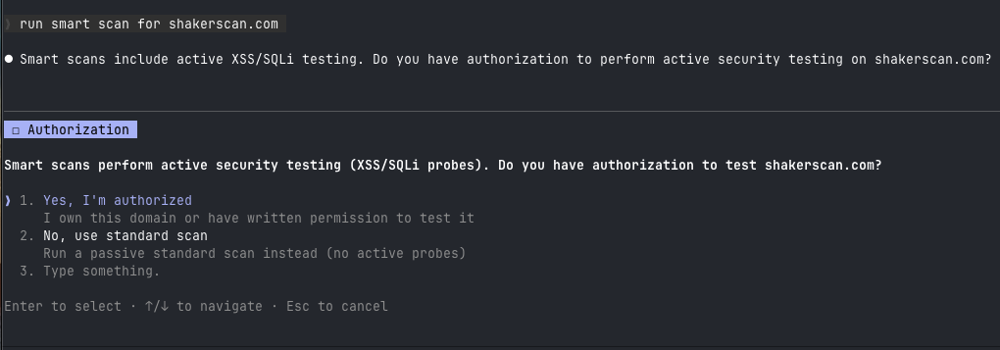
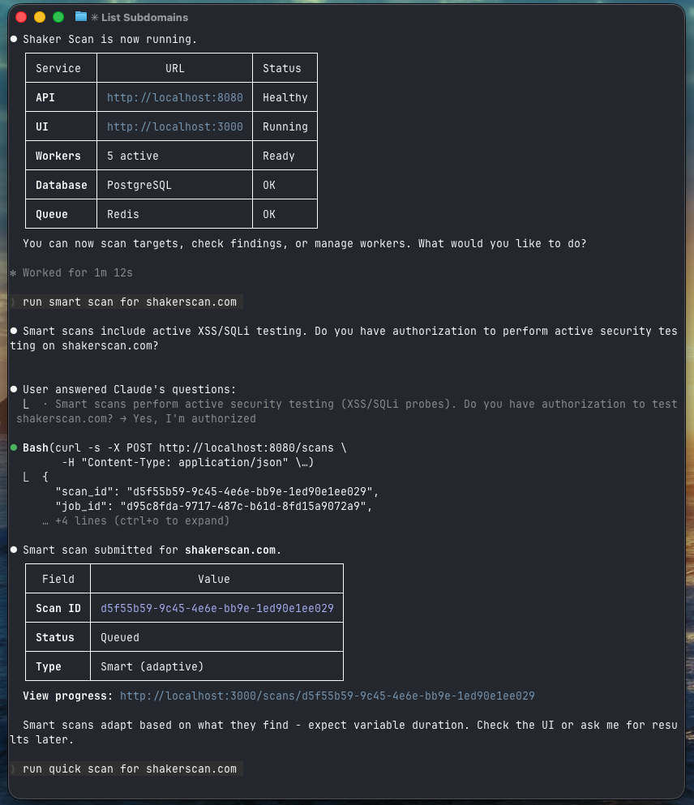
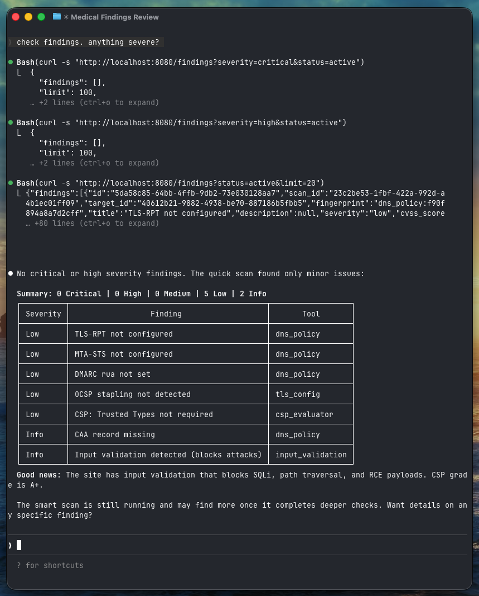
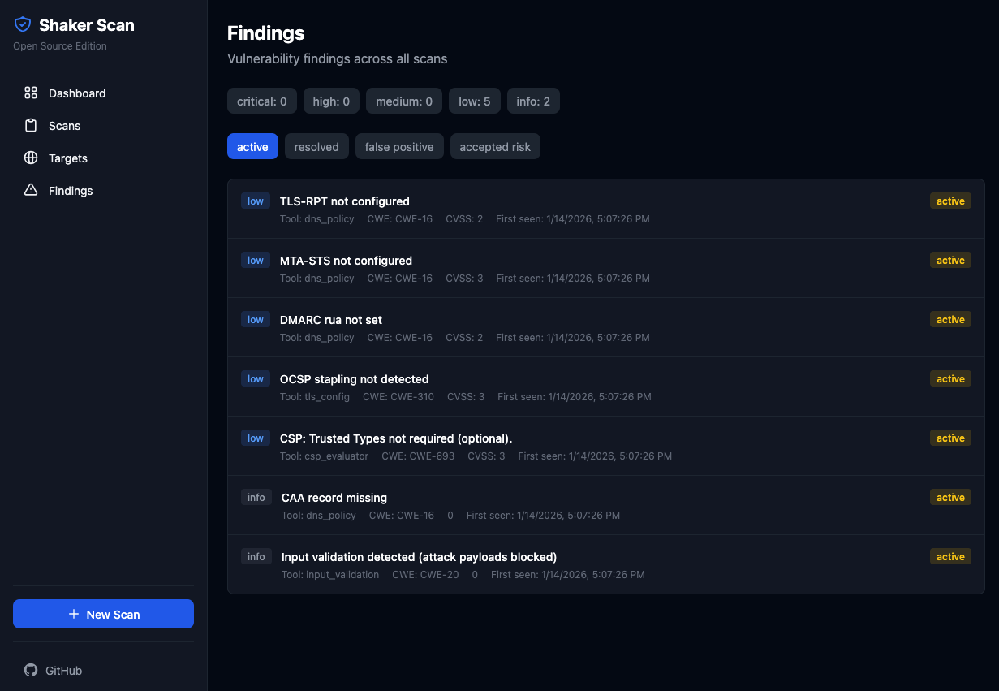

# ShakerScan visual walkthrough

This guide shows the basic ShakerScan flow through an AI coding agent and the web UI. The screenshots
use Claude Code, but the same plain-English workflow works with Codex and OpenCode.

## Agent terminal experience

### 1. Start the Scanner

Ask the agent to start the scanner. It checks Docker and the local API:


### 2. Scanner Ready

Once running, you'll see all services healthy:


### 3. Run a Scan

Ask for a scan in natural language. For active testing (`smart`, `full`, or `aggressive`), the agent
asks for authorization first:



### 4. Scan Submitted

The agent submits the scan and gives you its ID and UI link:



### 5. View Findings

Ask about findings and the agent formats the current API results:



---

## Web UI experience

### Dashboard

Real-time overview with metrics, queue status, and worker controls:


### Targets

Manage targets with subdomain discovery and scan type selection:


### Findings

Browse all findings with severity filters and status management:



---

The current UI also includes Continuous ASM, Exposure, AI Gate, Model Intake, Interactive sessions,
Evidence, Timeline, Campaigns, Exceptions, the AI Operations Router, and Autonomous Hunt. See the
[README](README.md#web-ui-map) for a concise map and the
[Functionality Reference](docs/functionality-reference.md#16-ui-cli-skills-and-agent-surfaces) for
the exhaustive route list.

## Quick Commands

```bash
# Start scanner
"start ShakerScan"

# Run scans
"scan my authorized staging app"
"run a smart scan on my authorized staging app"

# Check findings
"show me critical findings"
"any vulnerabilities?"

# Manage workers
"scale to 5 workers"
```

See the [README](README.md) for installation and everyday use.
