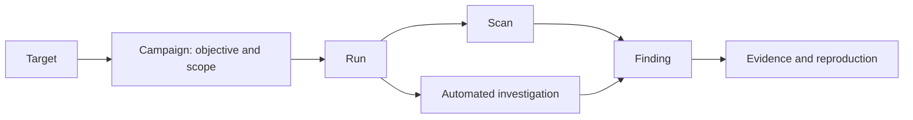

# Deep UI/UX audit report

## 1. Executive summary

The current build is not release-ready.

The recent commits improved local presentation—navigation labels are clearer, legacy settings routes redirect correctly, the dashboard exposes more operational information, and Findings now explains some terminology—but they did not make the complete product workflow simpler. The application still presents several overlapping control planes: Campaigns, Auto Hunt, Scans, Coverage, AI Operations, Command Arsenal, Leads, Timeline, and Evidence. Their relationships are not obvious to a first-time user.

The most serious problems are:

1. Evidence-retention execution is not bound to the previewed criteria, creating a potential bulk data-loss path.
2. Stored evidence can expose credentials embedded inside serialized request bodies.
3. Evidence marked “Proven” can be created with caller-supplied verification and provenance fields.
4. Command Arsenal crashes on real data.
5. Evidence deep links fail for supported non-UUID finding identifiers.
6. The Autonomous Findings filter is incompatible with the backend and leaves misleading stale results.
7. Campaigns can be created but provide no coherent way to start, progress, or complete work.
8. Exposure can call an attack path “complete” with 100% confidence even when most of the displayed chain is hypothetical.

For a junior developer, individual pages are often decipherable, but the product as a whole is not. Security and implementation terms appear before users understand the basic workflow, advanced controls dominate multiple pages, and successful completion often produces internal ledgers rather than a concise outcome and next step.

Evidence has meaningful potential. One BOLA record contained a useful owner/attacker/control comparison, a successful reproduction count, and state-restoration information. However, the current redaction, provenance, deep-linking, retention, and readability defects mean Evidence cannot yet be trusted as a safe or consistently useful release feature.

No files, configuration, tests, data, or documentation were changed during the audit. The worktree remained clean.

## 2. Scope and methodology

### Commits reviewed

The latest eight commits were included in the audit:

| Commit | Intent |
|---|---|
| `6cd4ea4ae2f3791ce4b3db1d78c37a2953a52989` | Complete the `/settings/*` route migration across backend, docs, and skills |
| `f9ee0f4f2331ab5e03b9bc465eff65206c172747` | Expand the Evidence UI |
| `6a9fcb519b175edcac80787a0690307acd59159b` | Add two dashboard action panels |
| `a29754d38e66a78594da8f6a30418399384fc62e` | Move AI Gate, Model Intake, and Exceptions out of Settings |
| `92acd3fc5b0f73172cc120bfda9567b71535c1a7` | Add the Findings source/verification legend |
| `5e69225` | Align navigation titles and simplify subtitles |
| `996a5dd` | Regroup navigation and unify AI Investigator terminology |
| `8a2722c` | Add query-string object identifiers and planner instructions |

The latest five received detailed file- and contract-level review. The preceding three were reviewed as redesign context.

### Environment

- UI: `http://localhost:3000`
- API: `http://localhost:8080`
- UI build label: `dev`
- Expected scanner version: `6cd4ea4`
- Expected worker fingerprint: `a20ab8b45f34c35d`
- Actual worker fingerprint: `9958e0af5bb1a15a`
- Workers: 16 running, all 16 reported stale
- Queue at audit start: zero pending and zero running

Because the fleet was build-stale, I did not submit scans. This follows the repository’s own fail-closed benchmarking guidance and avoids treating results from old workers as valid current-build evidence.

### Browser coverage

I opened the normal `/` entry point and visited:

- Dashboard
- Targets
- New Scan
- Scans and scan detail
- Findings and finding detail
- Campaigns and campaign detail
- Auto Hunt and paused/completed run detail
- Evidence, including finding-scoped views
- Settings
- Policy Profiles
- Exceptions
- AI Gate
- Model Intake
- Command Arsenal
- AI Operations
- Research Leads
- Manual Test
- Timeline
- Schedules
- Continuous ASM/Coverage
- Exposure and attack paths
- Application Graph
- Interactive testing

I also tested the legacy routes:

- `/settings/ai-gate`
- `/settings/model-intake`
- `/settings/exceptions`

All three redirected to their new locations.

### Interactions exercised

Browser interactions included:

- Loading and refresh states
- Search and clearing search
- Source, status, proof, domain, grade, and findings filters
- Pagination in both directions
- Dropdowns and scan-type menus
- Target-group expansion
- Add/create modals
- Empty required-field validation
- Confirmation dialogs, cancelled before mutation
- Dry-run retention preview, without execution
- Evidence expansion and object modal
- Finding evidence expansion
- Auto Hunt mode, target, duration, and authorization controls
- Browser back and forward navigation
- Failed, completed, paused, empty, and blocked states
- Viewports of 1280×800, 1024×768, 768×768, and 640×800
- Mobile navigation, focus behavior, and Escape handling

Browser captures were taken during the session, but intentionally not persisted to files because this was an audit-only request.

### Static checks

- TypeScript `tsc --noEmit`: passed
- Capability inventory check: passed
- Four inventory tests: passed
- `git diff --check HEAD~8..HEAD`: passed
- Host collection of `test_source_type_filter.py`: blocked by a missing `asyncpg` dependency

Passing TypeScript did not detect several runtime schema defects described below.

### Important limitations

- No scans, hunts, schedules, retests, settings changes, retention sweeps, or destructive actions were executed.
- Save persistence was therefore inspected from code but not mutated in the live environment.
- The stale worker fleet prevented trustworthy end-to-end scan validation.
- AI Gate’s extremely large rendered page caused an interaction timeout before testing its connection workflow.
- Model Intake’s large DOM caused a timeout while locating the “Minimal example” control.
- No organization, billing, team, notification, or general user-profile settings were visible to test.

## 3. Critical findings

### AUD-01 — Retention execution is not bound to the dry-run preview

- Severity: P0
- Confidence: Reproduced; confirmed from code
- Affected workflow: Evidence retention
- Route: `/evidence`

Reproduction:

1. Select the `standard` retention class.
2. Set “older than” to 1 day.
3. Preview the sweep.
4. Observe “Dry run — 200 candidate(s).”
5. Change the class to `short`.
6. Do not run a new preview.
7. Observe that the UI still displays the earlier 200-candidate result.

Actual behavior: the stale preview remains visible, while execution would submit the newly selected criteria. The backend independently recomputes the cohort and has no preview token or preview hash binding the confirmed execution to what the user reviewed.

Finding-scoped Evidence pages add a second scope problem: `finding_id` scopes export/manifest retrieval but is not included in the sweep request. A retention control displayed in a single-finding context can therefore execute a global class-based sweep.

Expected behavior: any criteria change must invalidate the preview. Execution should require a server-issued preview token covering all criteria, count, scope, and timestamp. A finding-scoped control should either be scoped to that finding or clearly identified as a global administrative action.

User impact: a user can approve one displayed deletion cohort and execute a different, potentially much larger one. This is a direct data-loss risk.

Relevant implementation:

- `ui/src/components/EvidenceRetentionPanel.tsx:27`
- `ui/src/components/EvidenceRetentionPanel.tsx:70`
- `ui/src/components/EvidenceRetentionPanel.tsx:114`
- `ui/src/lib/api.ts:2453`
- `api/api.py:38034`

Recommended direction: require preview invalidation on every criteria change and make execution consume an immutable server preview receipt. Move global retention administration out of finding-scoped pages.

### AUD-02 — Stored evidence can expose nested credentials

- Severity: P0
- Confidence: Reproduced; confirmed from code
- Affected workflow: Finding detail and Evidence object display

Reproduction:

1. Open finding `/findings/92d6c2a8-2783-481e-90a0-e5890db0fccb`.
2. Expand Object content or Raw Evidence.
3. Inspect the serialized request body.

Actual behavior: a cleartext password was visible inside a nested JSON string despite the evidence object reporting the `redact_sensitive_v1` profile. The same value appeared in both durable-object and raw-evidence presentations.

Expected behavior: credentials must be redacted before persistence and again before presentation. Redaction must parse nested JSON, form data, cookies, authentication headers, query strings, and stringified HTTP messages.

User impact: evidence exports, screenshots, support tickets, or access to the UI can disclose live credentials.

Technical cause: `redact_finding_evidence` primarily masks sensitive dictionary keys plus Bearer/JWT forms. Credentials embedded in serialized strings, cookies, Basic authentication, and password-like form/query values can survive. The worker then persists the result.

Relevant implementation:

- `api/evidence_triage.py:25`
- `api/worker.py:2636`
- `ui/src/components/EvidenceObjectModal.tsx:48`

Recommended direction: parse and structurally redact known content types before storage; apply a second output redaction layer; add fixtures for nested JSON strings, cookies, Basic auth, multipart, URL-encoded data, and malformed bodies. Existing affected objects should be treated as compromised data requiring migration or deletion.

### AUD-03 — “Proven” status and provenance can be caller-supplied

- Severity: P1
- Confidence: Confirmed from code
- Affected workflow: Evidence ingestion and global Evidence list

The Evidence creation contract accepts caller-controlled fields including:

- `proof_state: "verified"`
- `evidence_strength`
- `created_by`

It can also omit meaningful finding, scan, target, durable-object, or approval-receipt links. The UI converts `verified` to the stronger user-facing word “Proven” and presents `created_by` as its source.

Actual behavior: the trust classification and provenance displayed to users are not necessarily derived from an authoritative verification process.

Expected behavior: the server should derive verification state, evidence strength, and provenance from an authenticated producer, signed receipt, replay result, or trusted internal workflow. Client-supplied claims should be labeled “reported” or “unverified.”

User impact: users can be materially misled about whether a vulnerability has been reproduced.

Relevant implementation:

- `api/api.py:3918`
- `api/api.py:19553`
- `api/api.py:37898`
- `ui/src/components/ui/Badge.tsx:88`

Recommended direction: make proof state and producer identity server-owned. Require provenance links and distinguish asserted, heuristic, model-interpreted, replayed, and independently verified evidence.

### AUD-04 — Command Arsenal crashes on current data

- Severity: P1
- Confidence: Reproduced; confirmed from code
- Affected page: `/settings/arsenal`

Reproduction:

1. Open Command Arsenal.
2. Observe the global “This page couldn’t load” state.
3. Select Reload.
4. Observe the same failure.

Actual behavior: the entire route is unusable.

Expected behavior: the page should load, or isolate malformed records and show a recoverable row-level warning.

Technical cause: `hypotheses.promoted_finding_ids` is JSONB. The public serializer does not decode it, and the frontend assumes `string[]` and calls `.map`. With the repository’s asyncpg JSONB behavior, the runtime value can be encoded text, causing `TypeError: promotedFindingIds.map is not a function`.

Relevant implementation:

- `api/retest_contract.py:1665`
- `api/api.py:15718`
- `api/api.py:29456`
- `ui/src/lib/api.ts:712`
- `ui/src/app/settings/arsenal/page.tsx:427`
- `ui/src/app/settings/arsenal/page.tsx:560`

Recommended direction: normalize JSONB in the API serializer, validate responses at the frontend boundary, and add a browser/contract fixture containing populated `promoted_finding_ids`.

### AUD-05 — Supported Evidence deep links fail for fingerprint identifiers

- Severity: P1
- Confidence: Reproduced; confirmed from code
- Affected page: `/evidence?finding_id=…`

Reproduction:

1. Open `/evidence?finding_id=t%3Aa13ec17a99b68a50`.
2. Observe “Failed to load evidence.”
3. Compare the API calls.

Actual behavior:

- `/findings/<fingerprint>/evidence` succeeds with HTTP 200.
- `/evidence/instances?finding_id=<fingerprint>` fails with HTTP 400 because it accepts UUIDs only.
- The page combines both calls with `Promise.all`, so the failed optional source discards the successful evidence-object result.

Expected behavior: all advertised finding identifiers should resolve, or unsupported evidence-instance lookups should not prevent durable evidence from loading.

A second defect hides durable-object request failures by converting them into an empty array, making operational errors look like honest empty states.

Relevant implementation:

- `ui/src/app/evidence/page.tsx:80`
- `ui/src/app/evidence/page.tsx:88`
- `api/api.py:37846`
- `api/api.py:37865`

Recommended direction: use settled, independently rendered sources; normalize identifiers server-side; and distinguish “no evidence” from “evidence service failed.”

### AUD-06 — Autonomous Findings filter is incompatible with the backend

- Severity: P1
- Confidence: Reproduced; confirmed from code
- Affected page: `/findings`

Reproduction:

1. Open Findings.
2. Select `Autonomous`.
3. Observe the toast “Failed to refresh findings.”
4. Observe that rows from the previous all-source view remain visible.

The API returns HTTP 422 because `source_type=autonomous` is not accepted by the backend validator.

Actual behavior: the selected filter says Autonomous while the table continues showing stale mixed-source findings, including DAST records.

Expected behavior: filter options must share one canonical source taxonomy. A failed filter request must clear or visibly invalidate the previous results.

Relevant implementation:

- `ui/src/app/findings/page.tsx:57`
- `ui/src/app/findings/page.tsx:226`
- `ui/src/lib/api.ts:3643`
- `api/api.py:37264`

Recommended direction: add the correct backend mapping or remove the option, and replace stale results with an explicit error state.

### AUD-07 — Campaigns are record creation without an executable lifecycle

- Severity: P1
- Confidence: Reproduced; confirmed from code
- Affected workflow: `/campaigns` and `/campaigns/{id}`

Reproduction:

1. Open Campaigns.
2. Select New campaign.
3. Observe that the form asks for an optional raw Target ID UUID rather than offering target selection.
4. Open an existing planned campaign.
5. Look for Start, Configure target, Add work, Pause, Complete, Results, or a recommended next action.

Actual behavior: a campaign can be created as a grouping record, but creation queues no work. The detail page displays status, type, risk, finding impact, and an action ledger, but has no lifecycle transition or execution path. An existing planned campaign showed zero impact and zero actions with no explanation of what to do next.

Expected behavior: Campaigns should either be executable workflows or be clearly named and scoped as organizational groupings. A planned campaign needs a clear next step.

User impact: users can create dead-end objects and reasonably believe security work has been scheduled when it has not.

Relevant implementation:

- `ui/src/app/campaigns/page.tsx:44`
- `ui/src/app/campaigns/page.tsx:72`
- `ui/src/components/CampaignCreateForm.tsx:70`
- `ui/src/components/CampaignCreateForm.tsx:126`
- `ui/src/app/campaigns/[id]/page.tsx:128`
- `api/api.py:22755`

Recommended direction: either make Campaign the target/objective parent of executable runs, or remove the standalone page and create campaigns implicitly when a run starts.

### AUD-08 — Attack paths can be presented as complete when most steps are hypothetical

- Severity: P1
- Confidence: Reproduced; confirmed from code
- Affected workflow: Exposure → Attack paths

Reproduction:

1. Open `/exposure`.
2. Expand the critical “SQL Injection to Privilege Escalation” path.
3. Compare the completion/confidence labels with the evidence attached to each step.

Actual behavior: the chain was labeled complete with 100% confidence and 80% completeness. Only the SQL injection step had supporting evidence. Later steps such as credential extraction and role modification were unproven template possibilities.

Expected behavior: a chain is complete only when every required transition has supporting evidence. Hypothetical next steps must be visually distinct from observed steps.

Technical cause: the template requires any SQLi evidence, computes completeness at a threshold that can reach `0.8`, and then copies all template steps into the displayed chain without per-step evidence. Confidence from a supporting finding becomes confidence for the overall chain.

Relevant implementation:

- `scanner/scanner_tools/attack_chains.py:139`
- `scanner/scanner_tools/attack_chains.py:722`
- `scanner/scanner_tools/attack_chains.py:806`
- `scanner/scanner_tools/attack_chains.py:1002`
- `ui/src/app/exposure/AttackPaths.tsx:83`
- `api/api.py:11797`

Recommended direction: model observed nodes and inferred next steps separately. Rename incomplete templates to “possible escalation path” and calculate confidence per edge.

### AUD-09 — Auto Hunt hides readiness and does not summarize outcomes

- Severity: P1
- Confidence: Reproduced; confirmed from code
- Affected workflow: `/settings/research-agent`

Reproduced behaviors:

- Deep mode disabled Start until ownership was checked, but did not explain the server readiness condition.
- Paused authenticated work displayed raw blocker codes such as `authenticated_preflight_required`.
- A completed run showed `3/3`, zero findings, three inconclusive/blocked experiments, 24 recon actions, and 735,323 model units, but no concise user-facing conclusion or recommended next step.
- “Verified findings” actually represented active linked findings, not necessarily verified findings.
- Stop was available without confirmation.
- The target selector lacked a programmatic label and initially selected a synthetic test target.

Code review found:

- `executionReady` only disables Start; the reason is not rendered.
- Launch responses include blockers, preflight information, and `ui_path`, but the UI ignores these fields and always routes to the run detail.
- History-load failure can render “No hunts yet.”
- The hub does not poll for changing status.
- Detail request errors can leave stale data.

Relevant implementation:

- `ui/src/app/settings/research-agent/page.tsx:85`
- `ui/src/app/settings/research-agent/page.tsx:97`
- `ui/src/components/hunt/index.tsx:19`
- `ui/src/components/hunt/index.tsx:388`
- `ui/src/app/settings/research-agent/runs/[id]/page.tsx:195`
- `api/api.py:15431`
- `api/api.py:22820`
- `api/api.py:31801`

Recommended direction: show a plain-language preflight before launch, summarize scope and maximum consequences, honor server-provided navigation/blockers, and make the run detail outcome-first.

## 4. High-priority UX findings

### Risky scan modes rely on warning text

Reproduced on `/scan/new`: selecting Full, Aggressive, or Smart leaves Start Scan available after only a text warning. There is no required ownership/authorization acknowledgement in the visible flow.

Schedules also offered Full, Aggressive, and Smart scan types without an explicit authorization step. Whether the backend would reject unauthorized execution was not tested.

Classification: Reproduced UI; server acceptance Needs verification.  
Severity: P1.

Recommended direction: require a target-scoped authorization receipt or explicit acknowledgement at execution time, explain active probes in user language, and show the expected maximum impact.

### Failed scan pages are dead ends

The failed scan `/scans/ff0f6153-86c9-4654-b333-658b77b90b55` showed `runtime_dns_private_range` and raw `curl`/`./scanner.sh rebuild` instructions, but no Retry, view logs, check target, inspect worker readiness, or return-to-configure action.

Classification: Reproduced.  
Severity: P2.

### Continuous ASM exposes too much at once

The selected target detail rendered an approximately 120,000-character DOM containing:

- Close gaps autonomously
- Test untested
- Improve coverage
- Discovery
- Pruning
- Policy controls
- Family metrics
- Thousands of endpoint rows
- Internal campaign identifiers

A junior user cannot identify the primary action or understand the difference between three competing “improve” actions.

Classification: Reproduced.  
Severity: P2.

### Operational features remain duplicated under Settings

Although AI Gate, Model Intake, and Exceptions were moved to top-level routes, Settings still contains cards linking to them, alongside Research Agent, Arsenal, and Router. The route migration therefore changed URLs without completing the information-architecture migration.

Classification: Reproduced; confirmed from code.  
Severity: P2.

### Target selectors mix incompatible asset types

Auto Hunt, Leads, Manual Test, and Schedules showed model-artifact URLs beside ordinary web targets. This creates confusing and potentially invalid choices for web-testing workflows.

Classification: Reproduced.  
Severity: P2.

### Dashboard hides part of its own priority count

The dashboard reported nine priority actions but rendered only six cards with no “View all” path. The Area health count and title tooltip were also difficult to interpret.

Relevant implementation:

- `ui/src/app/page.tsx:465`
- `ui/src/app/page.tsx:529`

Classification: Reproduced; confirmed from code.  
Severity: P2.

### Mobile navigation fails basic focus behavior

At 640 pixels:

- Two controls had the same “Close navigation” accessible label.
- Focus remained on the background navigation opener.
- Escape did not close the drawer.
- The background was not made inert.

Relevant implementation: `ui/src/components/Sidebar.tsx:222`.

Classification: Reproduced; confirmed from code.  
Severity: P2.

### Internal output dominates several pages

Examples include:

- Raw Scan Options JSON on completed scan reports
- Raw action ledger names in Timeline
- Planner reasoning and event logs in Auto Hunt
- UUIDs and server flags in Campaigns and AI Operations
- Serialized route metadata in Application Graph
- Escaped JSON proof in Evidence

These are useful diagnostic details, but they should be collapsed under Advanced/Developer details rather than presented as primary content.

Classification: Reproduced.  
Severity: P2.

## 5. Campaigns audit

### First-time comprehension

The page title and empty-state wording imply Campaigns are groupings of related work. Elsewhere, however, “campaign” also refers to:

- Auto Hunt’s durable research campaigns
- Internal ASM recommended campaigns
- Timeline mission links
- AI Gate run history concepts

A new user cannot tell whether a campaign is a container, an automated process, a scan collection, or a security objective.

### Creation

The New campaign modal asks for:

- Objective
- Type
- Risk
- Name
- Optional Target ID

Problems:

- Target ID is a raw UUID rather than a target picker.
- The form does not say that no scan or hunt will be queued.
- Type and risk are shown before the user has selected what work should happen.
- Creation ends with a planned record, not a guided next step.
- The modal attempts to focus a non-focusable panel rather than the first form field.

### Configuration

There is no clear setup flow for:

- Target selection
- Scope
- Credentials
- Scan versus automated investigation
- Schedule
- Authorization
- Success criteria
- Evidence expectations
- Budget or duration

These concepts are scattered across Targets, Scan, Schedules, Auto Hunt, Coverage, and Settings.

### Lifecycle

Observed states include planned and filtered empty states such as Cancelled, but the detail page lacks visible controls to:

- Start
- Pause
- Resume
- Cancel
- Complete
- Add a run
- Edit the target/objective
- Resolve a blocker

The user cannot infer what moves a campaign from planned to active.

### Status and progress

The detail page displays status and ledgers, but not an understandable progress model. “0 finding impact” and “0 action ledger” are metadata, not progress.

A useful progress view would show:

1. Setup completeness
2. Current run
3. Coverage completed
4. Findings produced
5. Evidence verified
6. Remaining work or blockers

### Results access

There is no clear results-oriented summary connecting:

- Campaign
- Its runs/scans
- Resulting findings
- Evidence
- Target
- Timeline

Links should be explicit and counts should be clickable.

### Responsive behavior

- At 1024 pixels, the page was usable.
- At 768 pixels, the full sidebar remained and the table required horizontal scrolling, hiding useful columns.
- At 640 pixels, the mobile navigation appeared, but inherited the drawer accessibility problems.

### Recommended Campaign information architecture

A Campaign should be one of two things, not both:

1. An automatically created container for a target objective and its runs; or
2. A fully executable project-like workflow.

The simpler option is automatic creation:

- User selects a target and objective.
- User chooses a run mode: Scan or Automated investigation.
- The system creates the campaign implicitly.
- Campaign detail becomes the outcome-oriented history for those runs.

Default Campaign detail:

- Objective and target
- Current status and blocker
- Primary action
- Running/latest run
- Verified findings
- Evidence readiness
- Recommended next step

Advanced:

- Risk tier
- Approval receipt
- Budgets
- Action ledger
- Planner trace
- Internal identifiers

Remove the raw Target UUID field entirely.

## 6. Auto Hunt audit

### Purpose clarity

The top-level purpose is moderately understandable: select a target and let the product investigate it. However, “Auto Hunt,” “Autonomous Hunt,” “Research Agent,” “AI Investigator,” and “campaign” are all used around the same capability.

Recommended user-facing name: **Automated investigation**.

“Research Agent” can remain an internal architecture term.

### Setup clarity

The visible setup combines four modes:

- Analyze
- Hunt
- Relentless
- Deep

with four durations:

- Quick
- Standard
- Extended
- Marathon

This creates 16 apparent combinations before the user understands the basic consequences.

The labels do not clearly communicate:

- Whether active requests will be sent
- Whether authenticated principals are required
- Whether findings may be retested
- Whether accounts may be provisioned
- Maximum request/model budget
- How long work may continue after the browser closes
- What approval is required

For example, the default Hunt/Standard combination can authorize substantial active-action, request-unit, and model-token budgets, while the UI summarizes it mainly as a duration and episode count.

### Advanced settings are shown too early

Risk tiers, intensity, duration, episode ceilings, and ownership confirmation should be derived from a few intent-oriented choices:

- Review only
- Safely investigate
- Deep authorized test

The exact budgets belong in an expandable “Limits and approvals” section.

### Dangerous or expensive consequences

Deep mode does show an ownership checkbox, which is positive. It does not adequately explain the resulting authority or possible principal provisioning.

The launch screen should show a final plain-language preflight:

> This will actively test Juice Shop for up to X hours, may send up to Y reserved request units, may use two test identities, and will stop when Z occurs.

### Status and history

The paused and completed run pages expose extensive internal detail but fail to answer:

- What did it learn?
- Is the application safer or riskier?
- Why did it stop?
- What should I do next?
- Which findings are verified?
- Which areas were not tested?

A completed run with zero findings and three blocked/inconclusive experiments should say:

> No vulnerabilities were verified. Authenticated coverage was blocked because a second test identity was unavailable. Add a second credential profile, then rerun access-control checks.

### Empty and error states

- “No hunts yet” can also represent a history-load failure.
- Readiness failures disable controls without sufficient explanation.
- Detail fetch failures can leave stale content.
- A stopped run has no confirmation or recovery explanation.

### Recommended changes

Remove or hide:

- Planner reasoning by default
- Raw event stream
- Request/model counters from the main summary
- Internal blocker codes
- Separate Relentless and Deep choices unless their outcome differs materially

Rename:

- Auto Hunt → Automated investigation
- Hunt → Active investigation
- Analyze → Read-only review
- Verified findings → Linked findings, unless verification is actually enforced

Add:

- Readiness checklist
- Scope/consequence summary
- Clear blocker remediation
- Outcome summary
- “Next recommended action”
- Explicit Findings and Evidence links
- Confirmation before Stop
- Polling or live-status indication

Merge it into the same run model as scans rather than treating it as a separate product universe.

## 7. Evidence audit

### Does it load?

The global page loaded and reported:

- 98 records
- 3 Proven
- 2 Inconclusive
- 93 Unverified

Search, proof filters, expansion, a no-results state, and retention preview were exercised.

It does not load reliably for supported fingerprint-based finding deep links.

### Meaningful evidence example

A useful BOLA record included:

- A stated objective
- Expected supporting signal
- Falsifier
- Owner and attacker comparisons
- An anonymous 401 control
- Proof marked as reproduced twice
- State-restoration status
- A receipt/reference trail

This is the right conceptual content for helping a developer reproduce an access-control issue.

It would be substantially better if rendered as a structured comparison:

| Step | Principal | Request | Expected | Actual | Result |
|---|---|---|---|---|---|
| Control | Anonymous | Resource request | 401/403 | 401 | Control passed |
| Owner | Owner account | Resource request | 200 | 200 | Baseline |
| Attack | Other account | Same resource | 403/404 | 200 | Authorization bypass |

### Evidence that is technically present but useless

Examples observed:

- Large escaped JSON blobs instead of formatted requests and responses
- One-line raw object payloads with no field hierarchy
- Evidence without meaningful target/finding/scan links
- Caller-supplied “verified” proof status
- Action receipts and hashes without user interpretation
- Hypotheses or model output without an explicit observed-versus-inferred distinction
- Stored request data containing an unredacted credential

### Correctness and relationships

The global page primarily lists autonomous evidence instances. Ordinary durable finding evidence is mainly discoverable through a finding identifier. This makes the page feel incomplete.

The object modal included IDs, hash, redaction profile, storage details, finding, scan, and timestamp, but lacked:

- Direct navigation to related finding/scan/target
- Request/response interpretation
- Reproduction steps
- Copy action
- Download/export action
- Expand/collapse for long fields
- Screenshot presentation
- Clear provenance chain

### Request and response readability

Requests and responses were often embedded in JSON rather than rendered into:

- Method and URL
- Headers
- Parameters
- Body
- Status
- Response headers
- Response body
- Timing
- Principal/context
- Redaction indicators

Long payloads need wrapping, syntax highlighting, line numbers, truncation with explicit expansion, and download of the redacted original.

### Storage status contract mismatch

The backend returns fields such as `storage_status`, `storage_integrity`, and `storage_error`. The frontend expects names such as `storage_backend` and `integrity_status`, so important storage/integrity failure information can disappear.

Relevant implementation:

- `api/evidence_storage.py:292`
- `api/evidence_storage.py:312`
- `ui/src/lib/api.ts:3701`
- `ui/src/components/EvidenceObjectModal.tsx:87`

The underlying storage layer positively verifies SHA-256 and withholds mismatched bytes. The UI simply fails to expose that protection consistently.

### Filtering and pagination

- The global list silently caps results at 200.
- No total or pagination is shown.
- Search lacks a programmatic label.
- Proof filter buttons do not expose pressed state accessibly.
- Some valid proof shapes fall back to generic rendering.

### Empty and unavailable states

The Suspected filter correctly showed “No evidence matches these filters.” That is a good empty state.

By contrast, durable-object failures can be swallowed into empty arrays, and fingerprint deep links show a generic failure even when one evidence source succeeded.

### Provenance model needed

Evidence should visibly distinguish:

- Observed raw signal
- Deterministic detector result
- Model interpretation
- Replayed/reproduced proof
- Independently verified proof
- Incomplete or contradicted signal

“Proven” should be reserved for server-derived, reproducible proof.

### Next steps

Every verified or incomplete record should offer an appropriate next step:

- Reproduce safely
- View finding
- View originating run
- Review remediation
- Retest after fix
- Export redacted proof
- Add missing authentication context

## 8. Settings audit

### `/settings` — Automation Defaults

Areas tested:

- Auto-sharding
- Default Continuous ASM
- Approval-receipt enforcement
- Presets

Issues:

- Scope is not clear enough: these appear global, but the page does not consistently distinguish global, target, campaign, or user settings.
- Enabling approval-receipt enforcement saves global behavior immediately without a confirmation describing which workflows will stop working.
- Operational defaults and safety policy are mixed together.

Relevant implementation: `ui/src/components/ScanExecutionSettingsPanel.tsx:201`.

### `/settings` — AI & Verification

Areas tested:

- Basic and Advanced views
- Provider URL/model/fallback
- Masked API key field
- Scan-time AI
- Retest verification
- Verification policy
- Auto-retest
- Severity thresholds
- Persist-to-`.env`

Positive behavior: saved keys are masked and are not repopulated in cleartext.

Problems:

- Basic mode can alter several policies through one severity control without making the mapping explicit.
- Advanced mode presents overlapping severity thresholds whose precedence is unclear.
- Runtime Redis persistence and local `.env` persistence are mixed in one form without a clear durability model.
- “Persist to `.env`” is an implementation-level action with significant scope but insufficient explanation.
- Tooltips and repository instructions still describe legacy dedicated verification provider fields that the backend no longer accepts.

### `/settings/policy-profiles`

Tested:

- Existing profile list
- Create form
- Delete dialog
- Cancellation

Positive behavior: deletion has a clear confirmation.

Problems:

- Several fields appear to accept blank or arbitrary values with weak guidance.
- The relationship between a policy profile and AI Gate, Model Intake, DAST, or global deployment decisions is not immediately clear.
- Activation scope is ambiguous.

### `/exceptions`

Tested:

- Summary
- Expiry preview
- Repair modal
- Receipt requirement

Positive behavior:

- Preview gave a concrete count.
- Repair was approval-receipt gated.
- The modal explained lifecycle fields better than most operational forms.

Issues:

- “Exception,” “control repair,” “receipt,” and “lifecycle sweep” remain specialist terminology for a junior developer.
- It needs a simpler opening explanation: what risk is being temporarily accepted, by whom, until when, and what happens on expiry.

### `/settings/arsenal`

Unusable due to AUD-04.

### `/settings/ai-ops-router`

Tested with “Run full coverage on this target.”

Positive behavior:

- Dry-run behavior was explicit.
- Confirmation and execution gating were visible.

Issues:

- Raw `POST /scans` JSON and the `AI_OPS_ROUTER_EXECUTE_ENABLED` server flag are presented as primary UI output.
- The user should first see the planned target, test type, risk, estimated duration, required approval, and what will happen.

### Settings areas not present

No visible sections were found for:

- Organization profile
- Personal user profile
- General account security
- General integrations
- Product API keys or personal tokens
- Notifications
- Billing or usage plans
- Team membership
- Roles and access control
- Account/workspace deletion

Classification: Needs verification against product scope. If ShakerScan is intentionally single-user/self-hosted, these may be out of scope. If it is presented as multi-user or organization-aware, their absence is a significant product gap.

### Overall Settings organization

Settings should contain configuration, not operational destinations. AI Gate, Model Intake, Exceptions, Auto Hunt, Arsenal, Leads, and Router should not all be advertised as sibling settings cards.

Recommended Settings structure:

- General
- Scanning defaults
- AI provider
- Verification policy
- Credentials and integrations
- Access and approvals
- Data retention
- Advanced/system

Operational workflows should live in the main application.

## 9. Page-by-page usability review

| Page | Five-second clarity and primary action | Main problems | Recommended simplification |
|---|---|---|---|
| Dashboard `/` | Moderately clear; priority actions compete with metrics | Nine actions reported but six shown; area health ambiguous; stale worker state not dominant enough | Lead with readiness, one “Scan a target” CTA, running work, then verified risks |
| Targets `/targets` | Purpose clear | All 15 groups expanded; huge model artifact URLs; multiple row actions; malformed URL gets little guidance | Collapse groups by default, separate web and model assets, make “Run test” primary |
| New Scan `/scan/new` | Primary action clear | Active modes insufficiently authorized; advanced credentials and knobs shown too early | Three intent presets, mandatory authorization for active modes, Advanced collapsed |
| Scans `/scans` | Clear list | Duplicate top/bottom paginator; dense metadata; six rescan options per row | One paginator, one “Run again” action opening a concise chooser |
| Failed Scan detail | Failure visible | Raw codes/commands; no retry, logs, or guided recovery | Explain failure, show affected prerequisite, offer Retry/Configure/View logs |
| Completed Scan detail | Results visible but extremely dense | Attempt ledger, discovery URLs, raw finding data, giant options JSON; nested `<main>` | Summary → verified findings → coverage → advanced execution details |
| Findings `/findings` | Mostly clear | Broken Autonomous filter; legend adds another taxonomy; stale results after error | Canonical sources, explicit failed-filter state, outcome-oriented labels |
| Finding detail | Useful but dense | Raw credential leak; duplicated evidence presentations; verification labels unclear | Summary, impact, proof, reproduce, remediation; raw data collapsed and redacted |
| Campaigns `/campaigns` | Purpose ambiguous | Record-only workflow, raw UUID, no launch lifecycle | Make campaign implicit parent of runs or remove standalone creation |
| Campaign detail | Status visible | No primary action or next step | Show setup blocker/current run/results/recommended action |
| Auto Hunt | Basic purpose visible | Too many mode-duration combinations; consequences and blockers hidden | Rename Automated investigation; three intent presets and preflight |
| Auto Hunt run | Status visible | Internal logs dominate; no concise conclusion | Outcome, coverage, blockers, findings, evidence, next step |
| Evidence `/evidence` | Purpose broadly clear | Provenance unsafe; deep links fail; raw JSON; no pagination; retention scope hazard | Finding-first proof view; global evidence library under Advanced |
| Settings `/settings` | Too many scopes and destinations | Operational cards, persistence ambiguity, overlapping policy controls | Configuration-only sections with explicit scope |
| Policy Profiles | Specialist purpose | Weak value guidance and scope | Start from “What should block deployment?” and reveal raw thresholds later |
| Exceptions | Understandable after reading | Security-governance jargon | Plain-language risk acceptance workflow |
| AI Gate | Purpose visible | 315 inventory surfaces and 357 assets overwhelm setup; Add Target expands a massive inline workflow; localhost links | Wizard: select surface → configure → review → run; inventory on separate page |
| Model Intake | Purpose eventually understandable | Three steps displayed simultaneously; many trust and metadata controls | Sequential wizard with a preset first and expert fields under Advanced |
| Command Arsenal | Not usable | Render crash | Fix schema normalization; isolate record errors |
| AI Operations | Understandable as preview tool | Raw API contracts and server flag exposed | Render human plan first; JSON under Developer details |
| Leads | Purpose and three-step flow fairly clear | Mixed incompatible target types; internal signal/falsifier language | Filter asset types and translate hypotheses into user-facing questions |
| Manual Test | Guided workflow is positive | Raw token/cookie controls and out-of-scope option are prominent; nested `<main>` | Keep step flow; move raw auth and scope override under Advanced |
| Timeline | Timeline concept clear | Repetitive raw action names and duplicate events; campaign links blur concepts | Group events by run and show user outcomes |
| Schedules | Primary action clear | Active scan types lack explicit authorization; model artifacts in target list | Safe defaults; target-type filtering; approval at schedule creation |
| Coverage `/asm` | Purpose not clear in five seconds | Three competing primary actions, policy controls, internal campaigns, huge endpoint table | One “Improve coverage” CTA; recommendations and endpoint detail progressively disclosed |
| Exposure `/exposure` | Map/triage concept clear | Misleading complete attack paths; inferred steps look verified | Separate observed graph from possible paths |
| Application Graph | Purpose moderately clear | Zero-edge state is explained well; raw serialized metadata and unlabeled back link | Human-readable node details and labeled return navigation |
| Interactive `/interactive` | Step flow understandable | Raw credentials and out-of-scope request option need stronger safety treatment | Credential profiles by default; raw values and scope override under Advanced |
| Mobile navigation | Navigation visible | No Escape close, focus trap, focus restore, or unique labels | Implement modal-drawer accessibility semantics |

## 10. Commit-by-commit risk review

### `6cd4ea4` — `/settings/*` migration completion

Intent: finish route migration through backend-generated links, documentation, agent instructions, and skills.

Major files:

- `AGENTS.md`
- `CLAUDE.md`
- `README.md`
- `api/api.py`
- `api/command_arsenal.py`
- `docs/functionality-reference.md`
- `skills/scanner-skill.md`
- `tests/test_api_helpers.py`

Assessment:

- The visible legacy redirects work.
- Physical duplicate route pages do not appear to coexist.
- Migration remains incomplete in curated documentation.
- Tests largely assert string-level route output, not browser navigation or deep-link behavior.
- Settings still advertises operational features that were supposedly moved out of Settings.
- The migration changed addresses more completely than it changed information architecture.

Risk: medium-to-high cross-cutting documentation and route consistency risk.

### `f9ee0f4` — Evidence UI expansion

Intent: make Evidence more useful and add finding-scoped behavior.

Major file:

- `ui/src/app/evidence/page.tsx`

Assessment:

- Useful proof-state filters and expansions were added.
- A meaningful BOLA record demonstrates the intended value.
- The entire feature was concentrated in one page without accompanying browser tests.
- Fingerprint deep links remain broken.
- `Promise.all` makes optional source failures fatal.
- Other failures are swallowed into false empty states.
- Retention scope/preview safety is incomplete.
- Backend/frontend storage fields do not align.
- No pagination exists beyond a silent 200-row cap.
- Raw JSON remains the dominant detailed representation.

Risk: high. This commit broadened an evidence surface whose trust and data-safety contracts were not yet stable.

### `6a9fcb5` — Dashboard action panels

Intent: provide more useful at-a-glance operational guidance.

Major file:

- `ui/src/app/page.tsx`

Assessment:

- The dashboard is more actionable than a metrics-only page.
- The count of priority actions is inconsistent with the number displayed because the list is sliced to six without a “View all” route.
- Area-health meaning is not self-evident.
- No tests cover truncation, empty action sets, or stale-worker priority behavior.

Risk: moderate. The direction is good, but compressed display introduces misleading counts.

### `a29754d` — Move AI Gate, Model Intake, and Exceptions

Intent: promote operational workflows out of Settings.

Major areas:

- `ui/next.config.js`
- `/ai-gate`
- `/model-intake`
- `/exceptions`
- Scans
- Settings landing page
- Research leads
- Sidebar

Assessment:

- Redirects work.
- Old physical pages were removed rather than duplicated.
- The Settings landing page still links to these workflows, so the conceptual migration is partial.
- Several component and internal names retain old “settings” terminology.
- Query-string state on moved pages is initialized primarily at mount, increasing back/forward and same-route query-change risk.
- There are no meaningful redirect or navigation browser tests.
- AI Gate and Model Intake remain too large and operationally dense regardless of their new routes.

Risk: moderate-to-high due to broad route, navigation, and documentation impact.

### `92acd3f` — Findings legend

Intent: clarify source and verification badges.

Major file:

- Findings page

Assessment:

- Explanatory text helps with unfamiliar labels.
- The legend cannot compensate for inconsistent backend/frontend source taxonomies.
- It gives stronger semantics to verification labels whose provenance is not uniformly trustworthy.
- It adds another block of content above an already dense table.
- No test verifies that legend terms match backend enums and evidence states.

Risk: moderate semantic drift.

### Context from the preceding three commits

- `5e69225` made titles and subtitles visually more consistent, but some plain-language subtitles removed useful consequences and scope.
- `996a5dd` improved sidebar grouping but did not fully unify AI Investigator, Auto Hunt, Research Agent, Campaign, and Timeline concepts.
- `8a2722c` added query-string object ID guidance to server planner instructions, but equivalent agent skills and commands were not updated.

## 11. Code quality and architecture findings

### Runtime schemas are assumed rather than validated

The Arsenal crash and Evidence storage mismatch both result from TypeScript interfaces being treated as runtime guarantees. There is no normalization or schema validation at the API client boundary.

Recommended direction: validate and normalize public API responses with shared generated schemas or a runtime validator.

### JSONB decoding is inconsistent

Some API serializers decode JSONB manually while others expose encoded text. This creates page-specific runtime failures.

Recommended direction: establish a single database decoding policy and contract-test every JSONB response field.

### Error handling preserves stale or misleading UI

Examples:

- Findings keeps old rows after a failed filter.
- Evidence turns some errors into empty arrays.
- Auto Hunt history failures can become “No hunts yet.”
- Auto Hunt detail can retain stale data.
- Arsenal lets one malformed value crash the whole page.

Recommended direction: use explicit `loading`, `success`, `empty`, `partial`, and `error` states, with prior data clearly marked stale if retained.

### No coherent canonical taxonomy

Inconsistent concepts include:

- `autonomous` versus backend source enums
- AI Investigator / Auto Hunt / Research Agent
- Campaign versus mission campaign versus ASM campaign
- Coverage versus Continuous ASM versus Attack Surface
- Proven versus verified versus exploited
- Active linked findings versus verified findings

Recommended direction: define shared enums plus a product terminology glossary, and make display labels map from those canonical contracts.

### Authorization architecture needs explicit review

Confirmed architecture:

- No application-level authentication or route guard was observed around the reviewed API.
- Credentialed wildcard-style CORS behavior is configured broadly.
- Several endpoints accept state-changing or provenance-sensitive data.

Relevant implementation:

- `api/api.py:2949`
- `api/api.py:9322`

Classification: Likely risk; remote exploitability Needs verification.

The intended local/Tailscale deployment model reduces exposure but does not substitute for authorization if the service is remotely reachable or shared.

### Safety policy is split between UI warnings and backend flags

Active scan modes, scheduled scans, research execution, approval receipts, and router execution each use different interaction patterns. Users cannot predict which actions require ownership confirmation or a receipt.

Recommended direction: one reusable server-authoritative preflight component for every state-changing or active action.

### Responsive behavior is breakpoint-driven, not content-driven

The 768-pixel state preserves a large sidebar and forces important tables to overflow. Large pages such as Coverage, AI Gate, and Model Intake render excessive content instead of progressively disclosing it.

### Accessibility gaps

Confirmed or reproduced:

- Mobile drawer has no Escape handling or focus trap.
- Duplicate accessible labels.
- Background focus remains active.
- Campaign modal initial focus is ineffective.
- Evidence search lacks a programmatic label.
- Filter buttons do not consistently expose pressed state.
- Nested `<main>` landmarks appear on completed Scan and Manual Test pages.
- Several icon/back controls lack descriptive labels.
- Dense tables and raw JSON create poor keyboard and screen-reader navigation.

### Testing is not proportional to redesign scope

Gaps include:

- No frontend test/lint script in the UI package covering these workflows
- No Evidence browser regression
- No route-migration browser test
- No Findings source contract test spanning frontend and API
- No Campaign lifecycle test
- No Auto Hunt preflight/outcome test
- No mobile navigation accessibility test
- No JSONB fixture for Arsenal
- No retention preview-binding test
- No credential-redaction fixture for serialized bodies
- Only limited Exposure browser smoke coverage

The latest commits touch high-risk workflows but rely heavily on type checking and inventory/string checks.

### Old and new implementations

No duplicate physical pages were found for the moved routes, which is positive. The more significant coexistence problem is conceptual: new navigation and labels sit on top of old workflow boundaries, old component names, old documentation, and independent API taxonomies.

## 12. Documentation and skills drift

| Priority | File or material | Stale or missing content | Required update |
|---|---|---|---|
| P1 | `docs/functionality-reference.md:979` | Curated sections still reference `/settings/ai-gate`, `/settings/model-intake`, and `/settings/exceptions`, while generated sections use new routes | Reconcile the curated and generated route inventories |
| P1 | `skills/research-agent/SKILL.md:26` | Missing the new query-string object identifier/planner rule | Explain supported object IDs, encoding, and evidence deep links |
| P1 | `.claude/commands/research.md:1` | Research command assumes older navigation and does not carry the identifier guidance | Update launch, inspection, blockers, and deep-link workflow |
| P1 | `skills/research-agent/agents/openai.yaml:1` | Prompt metadata does not reflect the current navigation or object-ID rule | Align agent-facing terminology and URLs |
| P1 | `AGENTS.md` | UI inventory omits or under-explains Campaigns, Evidence, Timeline, Leads, and the current Auto Hunt relationship; AI settings examples include legacy verification-provider fields | Document current routes, concepts, safety model, and supported AI settings contract |
| P1 | `README.md` | UI inventory and screenshots predate current navigation; several visible areas are omitted | Refresh feature inventory, onboarding path, screenshots, and terminology |
| P1 | `docs/E2E_TEST_PLAN.md` | No end-to-end coverage for the recent Campaigns, Auto Hunt, Evidence, Settings, or route changes | Add browser scenarios for the critical workflows and failures found here |
| P1 | `tests/test_functionality_inventory.py` | Inventory checks do not detect curated/generated drift or workflow contract mismatch | Validate both route references and canonical feature terminology |
| P2 | `docs/screenshots/*.png` | Screenshots date from the old navigation; `ai-gate-settings.png` is particularly misleading | Recapture current top-level routes and current setup workflows |
| P2 | Walkthrough documentation | Navigation steps and screenshots refer to former page placement | Rewrite steps around current routes and simplified product concepts |
| P2 | `skills/README.md` | Skill catalog does not fully describe the current Evidence/Campaign/Auto Hunt relationships | Add current supported workflows and safety boundaries |
| P2 | `skills/scanner-skill.md` | Recent UI workflows and operational routes are incomplete | Add current routes, active-testing preflight, and post-run navigation |
| P2 | Developer/contributor setup material | No documented frontend browser-test workflow for these pages | Add UI test commands, fixture setup, and responsive/accessibility checks |
| P2 | New Settings reference | No single source explains global versus target versus runtime versus durable settings | Add a settings-scope and persistence reference |
| P2 | Terminology glossary | The same concepts have several names | Define Run, Scan, Campaign, Automated investigation, Finding, Evidence, Coverage, and Attack path |
| P3 | Historical/archived planning docs | Some overclaim current completion or use deprecated names | Add historical banners or exclude them from current generated references rather than rewriting history |

Mandatory before release:

1. `docs/functionality-reference.md`
2. `skills/research-agent/SKILL.md`
3. `.claude/commands/research.md`
4. `skills/research-agent/agents/openai.yaml`
5. `AGENTS.md`
6. `README.md`
7. `docs/E2E_TEST_PLAN.md`
8. `tests/test_functionality_inventory.py`
9. Current screenshots and walkthrough navigation

## 13. Prioritized issue table

| ID | Severity | Area | Finding | Confidence | User impact | Recommended action | Relevant files |
|---|---|---|---|---|---|---|---|
| AUD-01 | P0 | Evidence retention | Execution criteria are not bound to the displayed preview; finding-scoped control is global | Reproduced; confirmed from code | Wrong evidence cohort can be deleted | Server preview receipt, invalidate on edits, separate global administration | `EvidenceRetentionPanel.tsx`, `api.py` |
| AUD-02 | P0 | Evidence security | Nested serialized request bodies expose credentials | Reproduced; confirmed from code | Credential disclosure | Structural pre-storage and presentation redaction; migrate existing objects | `evidence_triage.py`, `worker.py` |
| AUD-03 | P1 | Evidence trust | Caller can assert verified/Proven state and provenance | Confirmed from code | False proof can mislead remediation and release decisions | Make proof/provenance server-derived | `api.py`, `Badge.tsx` |
| AUD-04 | P1 | Arsenal | Page crashes on JSONB string value | Reproduced; confirmed from code | Whole workflow unusable | Normalize JSONB and validate runtime schemas | `api.py`, `arsenal/page.tsx` |
| AUD-05 | P1 | Evidence navigation | Fingerprint finding deep links fail despite available durable evidence | Reproduced; confirmed from code | Users cannot access proof from valid links | Normalize IDs and render sources independently | `evidence/page.tsx`, `api.py` |
| AUD-06 | P1 | Findings | Autonomous filter returns 422 and leaves stale mixed results | Reproduced; confirmed from code | Users make decisions using the wrong filtered data | Canonical source enum; clear results on failure | `findings/page.tsx`, `api.py` |
| AUD-07 | P1 | Campaigns | Campaign creation produces a dead-end planned record | Reproduced; confirmed from code | User believes work is configured when nothing will run | Make Campaign parent of executable runs or remove standalone creation | `CampaignCreateForm.tsx`, campaign detail |
| AUD-08 | P1 | Exposure | Hypothetical attack path labeled complete with 100% confidence | Reproduced; confirmed from code | Materially misleading risk picture | Evidence per edge; separate observed and possible paths | `attack_chains.py`, `AttackPaths.tsx` |
| AUD-09 | P1 | Auto Hunt | Readiness reasons ignored and completed runs lack conclusions | Reproduced; confirmed from code | Users cannot understand safety, outcome, or next step | Plain-language preflight and outcome-first run detail | hunt hub and run detail |
| AUD-10 | P1 | Active testing | Full/Aggressive/Smart modes have no required visible authorization acknowledgement | Reproduced UI; execution Needs verification | Active probes may be launched without informed consent | Reusable server-authoritative preflight | new scan and schedules pages |
| AUD-11 | P1 | API exposure | No clear application auth/route guard around sensitive APIs | Likely risk; architecture confirmed | Remote/shared deployments may expose control and evidence operations | Define trust boundary, authenticate, authorize by scope | `api/api.py` |
| AUD-12 | P2 | Evidence | Storage field contracts disagree between backend and UI | Confirmed from code | Integrity/storage failures can be hidden | Shared schema and explicit integrity state | `evidence_storage.py`, `api.ts` |
| AUD-13 | P2 | Scans | Failed scan page gives raw operator commands but no recovery workflow | Reproduced | Junior users are stranded | Retry/configure/logs/readiness actions | Scan detail UI |
| AUD-14 | P2 | Coverage | Massive page and three competing primary actions | Reproduced | Core coverage workflow feels more complex than necessary | One recommendation-first CTA and progressive disclosure | ASM page/components |
| AUD-15 | P2 | Accessibility | Mobile drawer lacks Escape, focus trap, focus restore, and unique labels | Reproduced; confirmed from code | Keyboard and screen-reader navigation is unreliable | Implement accessible modal-drawer behavior | `Sidebar.tsx` |
| AUD-16 | P2 | Settings | Global, runtime, durable, target, and operational scopes are mixed | Reproduced; confirmed from code | Changes have unclear blast radius and persistence | Label every control’s scope and durability | settings page and execution panel |
| AUD-17 | P2 | Targets | Model artifacts appear in web-operation selectors | Reproduced | Invalid/confusing target choices | Type-filter selectors by workflow | Auto Hunt, Leads, Manual Test, Schedules |
| AUD-18 | P2 | Dashboard | Priority count says nine while only six are shown | Reproduced; confirmed from code | Users cannot access all stated priorities | Show all or add View all | dashboard page |
| AUD-19 | P2 | Timeline | Raw internal events and duplicated mission terminology dominate | Reproduced | History is hard to interpret | Group by run and summarize outcomes | Timeline page |
| AUD-20 | P2 | AI Gate | Setup expands hundreds of inventory items inline and uses localhost links | Reproduced | Setup becomes slow and overwhelming; remote links can fail | Separate inventory and setup wizard; derive public host | AI Gate page |
| AUD-21 | P2 | Testing | Recent high-risk UI changes lack browser and contract coverage | Confirmed from code/tests | Runtime regressions pass CI/type checks | Add targeted browser, schema, safety, and accessibility tests | UI package and tests |
| AUD-22 | P2 | Documentation | Routes, screenshots, skills, terms, and AI setting examples have drifted | Confirmed from code/docs | Users and agents follow incorrect workflows | Complete mandatory documentation list in section 12 | README, AGENTS, docs, skills |

## 14. Simplification proposal

### Recommended conceptual model

The user should not need to understand internal campaign, episode, shard, action-ledger, or planner distinctions.

### Recommended top-level navigation

1. Home
2. Targets
3. Runs
4. Findings
5. Settings

Under More or Advanced:

- Exposure
- Coverage inventory
- Evidence library
- Policies and exceptions
- Command Arsenal
- AI Operations
- System timeline

Campaigns should either be implicit inside Runs or appear as an optional grouping view—not a separate creation-first product.

### Recommended relationships

- Target: what is being tested.
- Campaign: why it is being tested and the shared scope.
- Run: one execution attempt.
- Scan: deterministic/adaptive scanner run type.
- Automated investigation: AI-guided run type.
- Finding: an actionable security issue produced or linked by a run.
- Evidence: proof belonging primarily to a finding, with provenance back to its run and target.

### Default presentation

Show by default:

- Plain-language purpose
- Target
- Current state
- Readiness blocker
- One primary action
- Verified findings
- Coverage summary
- Outcome and next step
- Estimated duration and active/passive consequence

Place under Advanced:

- Sharding
- Raw request budgets
- Model-token budgets
- Family focus
- Custom headers/cookies
- Planner trace
- Action ledger
- Raw JSON
- Storage hashes
- Internal UUIDs
- Router HTTP payload
- Global retention administration
- Arsenal contracts

Remove entirely from default workflows:

- Raw Target ID input
- Duplicate scan-list pagination
- “Verified findings” labels for merely linked findings
- Complete attack-path labels for hypothetical steps
- Settings cards that launch operational workflows
- Silent truncation of priority actions
- Internal blocker codes without translation

### What the user should see after login

1. Scanner readiness, including stale workers
2. One primary CTA: **Scan a target**
3. Running and recently completed work
4. Highest-priority verified findings
5. Clear blockers needing action
6. A short “What should I do next?” recommendation

### Primary CTA by page

| Page | Primary CTA |
|---|---|
| Home | Scan a target |
| Targets | Run test |
| Runs | Start run |
| Campaign detail | Start next run / Resolve blocker |
| Automated investigation | Review scope and start |
| Findings | Verify or fix |
| Finding detail | Reproduce safely |
| Evidence | View reproduction / Export redacted proof |
| Coverage | Improve coverage |
| Settings | Save changes, with scope shown |
| Exceptions | Review expiring exception |
| Exposure | Investigate verified path |

## 15. Final verdict

- Is the UI simpler after these commits?  
  Locally and visually, yes in several places. End-to-end, no. The redesign changed labels and locations more successfully than it simplified the underlying workflow.

- Are Campaigns and Auto Hunt understandable?  
  Campaigns are not. They create inert records without a lifecycle. Auto Hunt’s broad purpose is understandable, but its modes, consequences, readiness, status, and outcomes are not sufficiently clear.

- Does Evidence work and provide meaningful results?  
  Partially. Well-formed BOLA evidence demonstrates real value, but deep-link failure, unsafe provenance, credential leakage, raw presentation, storage-contract drift, and retention hazards make the feature unreliable and unsafe for release.

- Are there release-blocking issues?  
  Yes: AUD-01 through AUD-06 should block release. AUD-08 should also block any release that uses attack paths for risk or deployment decisions.

- Which five issues should be fixed first?

  1. Bind Evidence retention execution to an immutable preview and correct its scope.
  2. Redact nested credentials before persistence and repair existing affected evidence.
  3. Make Evidence verification and provenance server-authoritative.
  4. Fix Command Arsenal’s JSONB runtime crash.
  5. Fix Evidence identifier/error contracts and the broken Autonomous Findings filter.

  Immediately afterward, correct attack-path completion semantics and consolidate Campaign/Auto Hunt into a coherent executable workflow.

- Which documentation or skill updates are mandatory before release?  
  `docs/functionality-reference.md`, `README.md`, `AGENTS.md`, `docs/E2E_TEST_PLAN.md`, `tests/test_functionality_inventory.py`, `skills/research-agent/SKILL.md`, `.claude/commands/research.md`, `skills/research-agent/agents/openai.yaml`, and the current product screenshots/walkthroughs.
