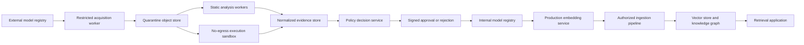
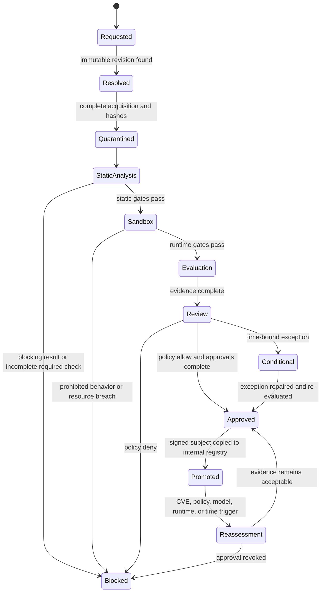

# Model Intake Security Review and Implementation Roadmap

**Status:** Core static intake and admission automation implemented; isolated model execution, packaged third-party scanners, automated benchmark execution, and corporate deployment integrations remain

**Original audit checkout:** `239f887d9f10e997b9844c916c28073fab71ee79`

**Current implementation checkout:** `a3f10d142d483395eebb33774279f3cb14e1c7b3`

**Review date:** 2026-07-28

**Implementation and automation-boundary review:** 2026-07-29

**Scope:** ShakerScan Model Intake, CodeRankEmbed, CodeSage Base v2, CodeSage Large v2, and the knowledge-graph/vector-embedding deployment path

**Audience:** Security engineering, ML platform, application security, infrastructure, legal/privacy, model owners, and release approvers

## 1. Purpose

This document defines what ShakerScan can realistically automate, what remains to be implemented in
ShakerScan, and which controls require organization-operated infrastructure or human authority. It also
provides the complete security-review
procedure for the following embedding models:

- `nomic-ai/CodeRankEmbed`
- `codesage/codesage-base-v2`
- `codesage/codesage-large-v2`

The intended use is a corporate knowledge graph whose developers want vector embeddings. Approval must
therefore cover more than the model file. It must cover the repository snapshot, executable model code,
Python and container dependencies, the isolated inference runtime, the embedding pipeline, the vector
store, knowledge-graph authorization, ongoing vulnerability monitoring, and the evidence used to make the
deployment decision.

This is all of the following:

1. A point-in-time audit of the original and current Model Intake implementations.
2. A target architecture, implementation backlog, operating procedure, and acceptance plan.
3. An automation-boundary contract that prevents product mechanisms, installed integrations, completed
   model runs, and corporate approvals from being confused with one another.

It is not an approval of any model, a replacement for legal/privacy review, or a claim that a clean scan
proves a model is safe.

## 2. Executive decision

ShakerScan provides a meaningful provider-neutral Model Intake and admission foundation. It can resolve and
pin sources, stream bounded prefixes or complete artifacts, capture complete Hugging Face snapshots, inspect
formats/code/dependencies, orchestrate built-in and external scanners, evaluate supplied model/application
observations, apply policy, preserve evidence, and issue and lifecycle-manage an admission decision.

The original audit of checkout `239f887` identified serious gaps. Most acquisition, static-analysis,
evidence, policy, admission, and lifecycle mechanisms were subsequently implemented. The remaining gap is
not “scan more file extensions.” It is automated qualification of the exact model/runtime/application
combination and reliable integration with organization-controlled tools and deployment systems.

Neither the original checkout nor the current product should be described as the sole corporate approval
authority. ShakerScan can collect evidence, run deterministic controls, enforce product policy, and issue an
admission decision. It cannot decide legal acceptability, create a representative corporate benchmark,
grant business risk acceptance, or prove that an organization actually deploys only the approved digest.

At the original checkout, the audit found these issues:

1. Remote artifacts and related metadata were fetched before a complete destination-safety decision.
2. The public download limit prevented complete hashing and inspection of the three example weight files.
3. The repository inventory excluded arbitrary Python files despite `trust_remote_code=True` requirements.
4. SBOM, malware, secrets, and evaluation evidence was primarily caller-supplied.
5. Unsafe-serialization detection was a bounded heuristic rather than semantic analysis.
6. Isolated load/inference, embedding/application evaluation, native transparency verification, signed
   admission, and lifecycle enforcement were absent.

Sections 2.1 and 2.4 identify which findings are now resolved, partially resolved, or still open.

The remaining implementation and validation order is:

1. Package and self-test the external static scanners already supported by adapters.
2. Build the disposable no-egress VM/microVM loader and telemetry contract.
3. Connect the evaluator to embeddings and measurements produced by that runner.
4. Validate the complete workflow on CodeRankEmbed.
5. Validate CodeSage Base v2, including controlled `safetensors` conversion and equivalence testing where
   policy requires it.
6. Validate CodeSage Large v2 only after the Base workflow passes and the GPU/resource tier is proven.
7. Finish the explicit control-matrix report and corporate registry/deployment enforcement examples.

For a production profile, the correct decision for any exact model revision is **block/incomplete** until
every required automated control has generated digest-bound evidence and the required corporate approvals
and deployment bindings exist. No repository is approved merely because it is one of the three examples in
this document.

### 2.1 Implementation completion addendum

ShakerScan now implements the roadmap as a model-agnostic admission framework rather than as logic tied to
CodeRankEmbed or CodeSage. The named models remain immediate validation targets, but the same contracts accept
other Hugging Face repositories, HTTPS artifacts, S3, GCS, Azure Blob, OCI registry exports, MLflow exports,
and future source adapters.

Implemented controls include:

- Every-hop SSRF policy, DNS/IP validation and pinning, redirect limits, cross-origin credential stripping,
  HTTPS/private-network policy, exact host/port allowlists, and approval-gated network exceptions.
- Complete streamed acquisition, full SHA-256, content-addressed quarantine, byte/file quotas, safe retention
  preview/execution, and complete pinned Hugging Face repository snapshots.
- Complete normalized manifests, custom-code/`auto_map` inventory, recursive ZIP/TAR analysis, and traversal,
  symlink, device, collision, archive-bomb, nested-archive, and unsafe-serialization gates.
- Generated evidence contracts for pickle semantics, Python AST, secrets, malware rules, CycloneDX SBOM,
  dependencies/SCA adapters, native binaries, and licenses. Caller assertions remain `declared`; they are not
  silently promoted to generated evidence.
- Fail-closed ModelScan, Fickling, ClamAV, Gitleaks, Syft, Trivy, OSV-Scanner, and pip-audit adapters. Missing
  binaries, bad schemas, empty output, timeout, crash, and incomplete coverage cannot satisfy a required gate.
- Atomic detached-signature trust decisions and offline DSSE/in-toto subject verification, with explicit
  transparency-log non-support where no trusted inclusion bundle verifier is configured.
- A separate non-root, read-only, capability-free, no-egress sandbox service with CPU, memory, PID, scratch,
  and wall-time limits. It performs safe-format semantic inspection and prohibits executable serialization;
  operator-provided runtime images remain required for actual custom-code model loading.
- A provider-neutral, content-free embedding/data-plane evaluator for retrieval quality, vector validity,
  dimensionality, collisions, poisoning, sensitive/ACL leakage, tenant boundaries, runtime stability,
  latency/RSS, graph authorization, deletion receipts, cache authorization context, and index/model digest
  compatibility. Raw benchmark vectors are request-transient and are not persisted in scan options.
- Canonical signed admission statements bound to artifact, snapshot, scanner, sandbox, attestation,
  evaluation, findings, and policy digests; deployment verification uses operator trust roots and exact
  expected subjects.
- A durable admission registry with active/denied/reassessment-required/revoked/expired/superseded states,
  event history, automatic worker registration, expiry, scoped trigger ingestion, immediate high-consequence
  revocation, and deploy-time active-registry enforcement.
- UI/API visibility for provider capabilities, complete acquisition, generated scanners, sandbox and
  evaluation gates, signed admission, admission age/reassessment/expiry, evaluation metrics, and redacted
  live/durable activity logs on running, completed, and failed Model Intake scans.

The framework deliberately does not fabricate external evidence. A production profile still blocks until
the operator supplies the pinned scanner binaries/rule databases, an organization-controlled signing key and
deployment trust roots, a purpose-built runtime image for the chosen model loader, a versioned corporate
synthetic benchmark, application/vector-store observations, and the required human/legal/privacy approvals.
Likewise, the CodeRankEmbed and CodeSage model-specific runbooks are not marked complete until real controlled
runs produce the required evidence. These are operational admission inputs, not missing model-specific code.

### 2.2 Automation boundary and product position

ShakerScan should automate repetitive, deterministic, evidence-producing security work. It should orchestrate
specialist tools rather than attempt to replace every model, malware, SCA, policy, and runtime-monitoring
engine. The product boundary has three classes:

| Class | Meaning | Examples | ShakerScan responsibility |
|---|---|---|---|
| **A — Product-native automation** | Deterministic controls ShakerScan can safely own | Source resolution, safe acquisition, complete hashing, manifests, archive/format checks, evidence normalization, policy evaluation, reporting, admission registry, reassessment | Implement, test, ship, and fail closed |
| **B — Orchestrated integration** | Automatable controls requiring an external engine, runtime, database, corpus, or organization trust material | ModelScan, Fickling, Syft, Trivy, ClamAV, OSV, microVM execution, eBPF telemetry, OPA, Cosign, vector-store probes | Provide a versioned plug-in contract, isolation, evidence provenance, status handling, and operator configuration; never claim coverage when the integration is absent |
| **C — Corporate/human authority** | Decisions that cannot be responsibly automated by an open-source scanner | Legal/license approval, training-data acceptability, privacy impact assessment, business owner acceptance, production credentials, representative internal corpus, exception approval, deployment change control | Collect the decision, bind it to exact subjects and policy, enforce its expiry, and expose missing evidence; do not fabricate or make the decision |

The intended product is therefore a **security orchestration and admission layer**, not another monolithic
scanner and not a universal legal or ML-quality authority.

### 2.3 Plain-language answer the report must provide

Every completed intake must answer, on its first screen and in JSON:

1. **What exact model did we inspect?** Provider, repository, immutable revision, complete snapshot digest,
   weight digest, code digest, runtime digest, and intended deployment environment.
2. **What passed?** Only controls that actually ran against those exact subjects and produced eligible
   evidence.
3. **What failed?** The failed control, evidence reference, policy consequence, and remediation.
4. **What did not run?** Missing tool, unsupported format, absent benchmark, timeout, crash, skipped control,
   or unavailable corporate input. A required non-run is never a pass.
5. **Can this exact subject be deployed?** `ALLOW`, `REVIEW`, or `BLOCK`, with a short reason and the policy
   version that made the decision.
6. **What remains outside ShakerScan?** Required corporate approvals, registry promotion, CI/CD enforcement,
   runtime monitoring, or data-plane validation.

Normalized control states must be `PASS`, `FAIL`, `WARNING`, `REVIEW_REQUIRED`, `NOT_RUN`, `UNSUPPORTED`,
`TIMEOUT`, `CRASHED`, `INCOMPLETE`, `SKIPPED_BY_POLICY`, or `NOT_APPLICABLE`. Only `PASS` and an explicitly
justified `NOT_APPLICABLE` can directly satisfy a required gate. A policy may turn a resolved `WARNING` into
an approval with recorded rationale; every other non-pass remains visible. The UI may use friendlier labels,
but the exported status must remain unambiguous.

### 2.4 Current delivery summary

| Capability | Product mechanism | Installed/operational by default | Remaining action |
|---|---:|---:|---|
| Provider-neutral source adapters and pinned identities | Implemented | Hugging Face/HTTPS paths usable; other providers need credentials/configuration | Maintain adapters and add provider contract tests |
| SSRF-resistant acquisition and complete quarantine | Implemented | Available when complete acquisition is enabled and storage is configured | Make production presets require complete snapshots |
| Repository manifests, archives, custom code, safe-format checks | Implemented | Yes for supported formats | Expand fixtures and format/operator coverage |
| Built-in semantic, source, secret, malware-rule, SBOM, binary, and license checks | Implemented | Yes | Improve detection depth and rule updates |
| ModelScan, Fickling, ClamAV, Gitleaks, Syft, Trivy, OSV-Scanner, pip-audit adapters | Implemented | **No; binaries are not in the current source worker image** | Package pinned scanner images or installable plug-in bundles; expose tool/database readiness |
| Isolated semantic sandbox | Implemented | Dedicated no-egress, read-only container | Keep as pre-execution inspection boundary |
| Actual tokenizer/model load and inference | Not implemented | No | Add disposable KVM/microVM runner and model-loader profiles |
| Runtime behavior telemetry | Not implemented | No | Integrate Tracee/Falco/auditd/eBPF or equivalent in the execution runner |
| Provider-neutral evaluation contract | Implemented | Yes when callers provide observations | Add a runner that generates embeddings and observations from the isolated model |
| Corporate benchmark and thresholds | Integration point implemented | No universal corpus can ship | Organization supplies/version-controls corpus; ShakerScan automates execution and scoring |
| Signed admission statement and lifecycle registry | Implemented | Requires signing key/trust roots | Add standard keyless/Cosign/OPA options and deployment verifiers |
| One-page control matrix and detailed evidence | Partially implemented | Overall decision and control cards exist | Add explicit non-run states, model/runtime test receipts, coverage summary, and HTML/PDF parity |
| Deployment by exact approved digest | Verification contracts implemented | Organization-dependent | Integrate with internal registry, CI/CD, Kubernetes/admission controller, or model serving platform |
| Legal, privacy, data provenance, and risk acceptance | Recorded as governance evidence | Organization-dependent | Keep human-owned; enforce required owner, approval, scope, and expiry |

The source-built remote instance checked on 2026-07-29 had none of the eight external scanner binaries
installed. That deployment must therefore show those controls as `UNSUPPORTED`; the presence of adapter code
is not operational scanner coverage.

## 3. Review principles

The implementation and operating process must follow these principles:

- **Pin before inspection.** A mutable branch or tag is not an identity.
- **Acquire once, scan many.** Every scanner must inspect the same content-addressed snapshot.
- **No executable trust by default.** Model code and serialized objects are untrusted programs or data that
  may become programs during loading.
- **No network trust by location.** Internal IP space and cloud metadata endpoints are not valid artifact
  sources.
- **Absence of findings is not proof of absence.** Coverage, tool status, truncation, crashes, and unsupported
  formats must remain visible.
- **Declared evidence is not generated evidence.** A caller saying “malware scan passed” is not equivalent
  to ShakerScan running a pinned scanner and preserving its output.
- **Production decisions require reproducibility.** The model, code, dependencies, configuration, scanner
  versions, policy version, and decision must be reconstructable.
- **The deployment system is in scope.** Security does not stop at the weight file.
- **Prefer fail-closed gates for integrity and execution risk.** Unknown is not pass.

## 4. In-scope assets and trust boundaries

### 4.1 Assets

The review protects:

- Corporate source code, documents, graph records, identities, and access-control metadata.
- Embeddings, vector indexes, retrieval results, and model caches.
- Build credentials, registry credentials, proxy credentials, and signing keys.
- Inference nodes, GPUs, container runtimes, artifact stores, and CI/CD workers.
- ShakerScan evidence, policy decisions, exceptions, and audit trails.
- Downstream applications that consume retrieved knowledge-graph content.

### 4.2 Untrusted inputs

Treat all of the following as untrusted:

- Model repositories and every file in them.
- Model cards, README files, metadata JSON, dependency files, tokenizer files, and configuration.
- Weight formats including pickle-backed PyTorch archives.
- Custom Python imported by Transformers.
- Redirects, DNS answers, HTTP response headers, filenames, archive members, and MIME types.
- Scanner output until its provenance and execution status are verified.
- User documents and source code submitted to the embedding pipeline.
- Text retrieved from the vector store or knowledge graph.

### 4.3 Trust boundaries



Only an immutable, approved artifact from the internal registry may cross into production. Production must
not download model code or weights directly from Hugging Face.

## 5. Model inventory at the reviewed revisions

Model repositories change. The following values are valid only for the named commit revisions and must be
re-resolved and re-verified at intake time.

| Model | Pinned revision | Primary artifact | Size | LFS SHA-256 | License | Important risk |
|---|---|---:|---:|---|---|---|
| CodeRankEmbed | `3c4b60807d71f79b43f3c4363786d9493691f8b1` | `model.safetensors` | 546,938,168 bytes | `827529bcd58aef0d9082e66eeff7e7d53a02f62bd005f841a26b3d3e2fb17ebe` | MIT | Custom remote code despite safer weight format |
| CodeSage Base v2 | `92eac4f44c8674638f039f1b0d8280f2539cb4c7` | `pytorch_model.bin` | 709,569,721 bytes | `4a3ec46f2ba2027c541e159b4f1598ddbc4043ad41ac2b1f704adc69b96bcbfe` | Apache-2.0 | Pickle-backed PyTorch artifact and custom code |
| CodeSage Large v2 | `6e5d6dc15db3e310c37c6dbac072409f95ffa5c5` | `pytorch_model.bin` | 2,627,013,817 bytes | `78a7ed76ffa5ca4e145100610e5541201ca0f3ecc75f1b73433303ae9348c77c` | Apache-2.0 | Same execution risks plus materially larger resource exposure |

Authoritative model records:

- [CodeRankEmbed model page](https://huggingface.co/nomic-ai/CodeRankEmbed) and
  [API record with blobs](https://huggingface.co/api/models/nomic-ai/CodeRankEmbed?blobs=true)
- [CodeSage Base v2 model page](https://huggingface.co/codesage/codesage-base-v2) and
  [API record with blobs](https://huggingface.co/api/models/codesage/codesage-base-v2?blobs=true)
- [CodeSage Large v2 model page](https://huggingface.co/codesage/codesage-large-v2) and
  [API record with blobs](https://huggingface.co/api/models/codesage/codesage-large-v2?blobs=true)

### 5.1 CodeRankEmbed observations

- The repository uses custom configuration and model code, including
  `configuration_hf_nomic_bert.py` and `modeling_hf_nomic_bert.py`.
- The model card instructs consumers to use `trust_remote_code=True`.
- The reviewed source imports PyTorch, Transformers, Safetensors, and Einops. It also contains a
  `torch.load` fallback path, so a safetensors primary artifact does not make the complete repository
  execution-free.
- The model is approximately 137 million parameters and advertises a long context. Long-context attention
  makes memory, latency, batching, and denial-of-service testing important.
- The model is based on Snowflake Arctic Embed lineage. Parent model and dataset provenance must be captured,
  not just the leaf repository.

### 5.2 CodeSage v2 observations

- Base v2 and Large v2 use custom files such as `config_codesage.py`, `modeling_codesage.py`, and
  `tokenization_codesage.py`.
- Their model cards require `trust_remote_code=True`.
- The primary artifacts are `.bin` PyTorch weights and must be treated as unsafe serialization until semantic
  scanners and an isolated load test say otherwise.
- Base v2 is approximately 356 million parameters with a 1,024-dimensional embedding.
- Large v2 is approximately 1.3 billion parameters with a 2,048-dimensional embedding.
- The model cards identify The Stack-derived training data. License, attribution, opt-out, sensitive-code,
  and corporate policy questions remain separate from an Apache-2.0 repository license.
- Base and Large share substantial code lineage. A clean source review can be reused only when file digests
  are identical; artifact and runtime results remain model-specific.

## 6. What ShakerScan Model Intake automates today

Model Intake is exposed through [`api/api.py`](../api/api.py), executed by [`api/worker.py`](../api/worker.py),
and implemented across the `model_intake*` modules in
[`scanner/scanner_tools`](../scanner/scanner_tools). The current product can automate the following sequence:

1. Resolve a model reference through a provider adapter and freeze an immutable revision where the provider
   supports it.
2. Apply every-hop URL/DNS/IP acquisition policy and stream a bounded prefix or complete artifact into
   content-addressed quarantine.
3. Build a complete pinned Hugging Face repository snapshot when requested, subject to byte and file ceilings.
4. Inventory paths, digests, formats, custom code/`auto_map`, archives, native binaries, dependencies,
   licenses, and governance material.
5. Run built-in deterministic checks and optional external scanner adapters against the quarantined subject.
6. Perform safe-format semantic inspection in a separate no-egress, read-only, non-root container. This
   stage does **not** import repository code or deserialize pickle-backed weights.
7. Evaluate caller-provided, content-free embedding and application observations against deterministic
   quality, isolation, poisoning, deletion, latency, and resource controls.
8. Apply a saved policy profile, preserve evidence provenance, create findings, display durable activity,
   and produce an `ALLOW`, `REVIEW`, or `BLOCK` decision.
9. Optionally sign the admission statement, register its lifecycle, expire/supersede/revoke it, and verify
   an exact subject at deployment time.

### 6.1 Complete acquisition versus bounded inspection

The 10 MB default `max_download_bytes` is an in-memory inspection-prefix limit, configurable up to 100 MB.
It is not a final model-size limit. Complete acquisition streams to quarantine with separate fail-closed
ceilings:

- `max_artifact_bytes`: 10 GB by default, up to 100 GB.
- `max_repository_bytes`: 50 GB by default, up to 500 GB.
- `max_repository_files`: 10,000.

All three example weight files fit within the default complete-artifact ceiling. A production review must
enable `complete_artifact_download` and `complete_repository_snapshot`, set ceilings from the pinned manifest
plus controlled headroom, and reject unexpected growth. A prefix-only result remains
`known_unverified_truncated` and cannot authorize deployment.

### 6.2 What the current sandbox proves

The sandbox proves that its own bounded semantic inspector can examine supported formats under a hardened
container boundary. It validates safetensors structure, performs bounded ONNX checks, identifies GGUF, and
blocks executable serialization formats such as `.pkl`, `.pickle`, `.joblib`, `.pt`, `.pth`, `.ckpt`, `.bin`,
and `.mar` from being loaded.

It does not prove that `transformers`, `trust_remote_code=True`, a tokenizer, custom model class, PyTorch
deserialization, native kernels, or inference behave safely. Those require the remaining disposable
VM/microVM runner.

### 6.3 What the current evaluator proves

The evaluator can score supplied documents, query embeddings, retrieval observations, ACL/tenant labels,
poisoning results, resource measurements, deletion receipts, graph-boundary outcomes, cache context, and
model/index digests. It does not create those embeddings or measurements. Until an isolated execution harness
produces and signs the inputs, evaluation coverage is integration-supplied rather than end-to-end generated.

## 7. Delivery gaps and required remediations

Sections 7.1–7.13 retain the original security requirements but now state their current delivery status.
“Implemented” means the product mechanism exists; it does not mean that a particular deployment installed
the required external tools or that a particular model passed the control.

### 7.1 P0 — Block SSRF and unsafe outbound acquisition

**Delivery status: implemented product mechanism; deployment egress is still operator-controlled.** The
current acquisition path applies every-hop URL, DNS, IP, redirect, credential, scheme, host, and port policy,
including private-network exceptions that require explicit approval. Corporate deployments should still put
the acquisition worker behind a controlled egress boundary and test the effective network policy.

**Risk:** A user able to submit an intake can make the worker contact loopback, RFC1918, link-local, IPv6
local, cloud metadata, or other internal services. DNS rebinding and redirect chains can bypass a check that
only considers the original string.

**Required design:**

- Move all acquisition into a dedicated, low-privilege worker with no route to internal application,
  database, orchestration, or metadata networks.
- Permit only `https` by default. Make `http` an explicit development-only policy exception.
- Resolve the hostname before connect and reject loopback, private, link-local, multicast, reserved,
  unspecified, documentation, carrier-grade NAT, and organization-denied address ranges for IPv4 and IPv6.
- Pin the validated resolved address for the connection or use a controlled egress proxy that enforces the
  same policy.
- Re-run URL, hostname, DNS, and IP validation for every redirect. Set a small redirect limit.
- Reject embedded credentials, ambiguous authorities, noncanonical ports, invalid IDNs, and URL parser
  disagreement.
- Maintain registry/domain allowlists per policy profile. Do not treat a domain suffix string match as an
  allowlist decision.
- Apply response-header, content-length, decompression-ratio, transfer-duration, and total-byte limits.
- Log a content-free destination decision without persisting credentials or signed query strings.

**Acceptance gate:** Automated tests must cover loopback, RFC1918, link-local, AWS/GCP/Azure metadata
addresses, IPv4-in-IPv6, decimal/octal IP forms, DNS rebinding simulation, redirect-to-private, redirect
loops, cross-scheme redirects, oversized and compressed responses, slow responses, and proxy behavior.

### 7.2 P0 — Acquire and hash complete artifacts

**Delivery status: implemented but opt-in per intake.** Complete acquisition streams to content-addressed
quarantine and computes a full digest under a separate artifact ceiling. The 10 MB default remains a bounded
inspection prefix. Production profiles must require complete artifact and repository acquisition; otherwise
the correct result is `known_unverified_truncated`, never pass or mismatch.

**Risk:** Malicious content can be placed after the inspected prefix. ZIP central directories and later
members may not be available. The artifact inspected may not be the artifact deployed.

**Required design:**

- Stream the complete artifact to quarantined object storage while calculating SHA-256 and size.
- Separate **retention cap** from **inspection memory cap**. Large files must stream without entering API or
  worker memory as one object.
- Address the object by digest and make it immutable.
- Compare registry LFS digest, caller-required digest, acquired digest, and eventual internal-registry digest.
- Reject mismatches and incomplete transfers. Never relabel incomplete as pass.
- Record exact byte count, digest algorithm, digest, HTTP validators, source URL with secrets removed,
  registry revision, acquisition time, and downloader version.
- Deduplicate scans by digest while preserving a new provenance statement for each acquisition.
- Apply per-tenant storage quotas and retention policy.

**Acceptance gate:** A real public-model E2E must completely acquire and verify each selected artifact, while
the existing capped-partial E2E must continue to report `known_unverified_truncated` rather than a false
hash mismatch.

### 7.3 P0 — Snapshot and inspect the complete repository

**Delivery status: implemented for pinned Hugging Face snapshots.** Complete repository acquisition records
all manifest files, custom code and `auto_map` surfaces under byte/file limits. Other providers use the same
normalized contract but require provider-specific proof of complete immutable snapshot semantics.

**Risk:** The most dangerous repository content may never be downloaded or analyzed. A safe weight file can
be paired with malicious model code, tokenizer code, import hooks, build scripts, or dynamic imports.

**Required design:**

- Enumerate every file at the pinned commit through the registry API.
- Acquire every file needed to reproduce loading, plus all executable and governance files. Default to a
  complete snapshot unless a policy explicitly excludes a known-safe large file class.
- Include `.py`, shell scripts, notebooks, shared libraries, wheels, archives, configuration, tokenizer,
  requirements, lockfiles, model cards, licenses, Git attributes, and registry metadata.
- Preserve the path, mode, size, digest, LFS identity, and source revision for every file.
- Reject path traversal, symlinks that escape the snapshot, device nodes, case-collision attacks, duplicate
  normalized paths, and oversized file counts.
- Detect dynamic module mappings such as `auto_map` and identify which classes require remote code.
- Produce a repository manifest before any scanner runs.

**Acceptance gate:** A fixture containing benign weights and a malicious unreferenced Python file must still
scan and block. The CodeRankEmbed and CodeSage custom-code files must appear in the produced manifest and
evidence.

### 7.4 P0 — Generate evidence; do not accept assertions as scan results

**Delivery status: provenance distinction implemented; operational evidence remains integration-dependent.**
ShakerScan separates declared, externally attested, and generated evidence and includes built-in generated
checks. External adapter evidence is eligible only when the pinned tool actually runs successfully against
the complete subject. Caller-supplied evaluation observations remain declared/integration evidence until the
planned isolated harness generates them.

**Risk:** A mistaken or malicious caller can satisfy a gate with unverified claims. Approvers cannot tell
whether a field was declared, attested by a third party, or generated by ShakerScan.

**Required design:** Every evidence item must have one of these provenance classes:

| Class | Meaning | Production-gate eligibility |
|---|---|---|
| `declared` | Supplied by the requester or model publisher | Context only unless policy explicitly allows it |
| `externally_attested` | Signed by an allowed external identity and bound to exact digest | Eligible when attestation policy passes |
| `shakerscan_generated` | Produced by a pinned ShakerScan worker/tool against a content-addressed object | Eligible |

The evidence record must include artifact digest, snapshot digest, tool and version, rules/database version,
command contract, start/end time, exit code, normalized status, raw-result digest, worker image digest, and
policy version. User-supplied metadata must never be silently promoted to generated evidence.

### 7.5 P0 — Tighten signature and attestation semantics

**Delivery status: core cryptographic and subject binding implemented; ecosystem integrations remain.**
Detached signature trust is atomic, offline DSSE/in-toto subject verification exists, and admission statements
bind complete subjects. Native online Sigstore/Cosign identity flows and trusted Rekor inclusion verification
remain integration work when corporate policy requires them.

**Required decision rule:** An artifact signature passes only when all are true:

1. The complete artifact was observed and its digest computed.
2. The signature is cryptographically valid.
3. The signer key or workload identity is allowed by policy.
4. The signed subject digest exactly equals the acquired artifact digest.
5. The signature/attestation type, algorithm, issuance time, and trust-root status meet policy.
6. Required transparency-log and inclusion-proof checks pass when the profile requires them.

Add native verification contracts for Sigstore/Cosign, Rekor inclusion, DSSE, and in-toto/SLSA provenance.
Offline verification must use a trusted bundle captured at acquisition time. Keyless identity policy must
bind issuer and subject, not merely accept any valid Fulcio certificate.

### 7.6 P0 — Add semantic unsafe-model analysis

**Delivery status: built-in semantic analysis and fail-closed adapters implemented; external engines are not
packaged in the current worker image.** CodeSage `.bin` files are conservatively blocked from sandbox loading.
ModelScan and Fickling can add independent semantic evidence only after their pinned binaries are installed
or provided through isolated scanner images.

**Required design:**

- Run [ModelScan](https://github.com/protectai/modelscan) against the complete repository and each supported
  artifact.
- Run [Fickling](https://github.com/trailofbits/fickling) and Python `pickletools` analysis for pickle-backed
  objects, including pickle members inside PyTorch ZIP containers.
- Inspect every archive member recursively within bounded depth, count, expanded size, and ratio.
- Maintain an explicit format/operator allowlist per policy. Unknown opcodes, globals, reducers, extensions,
  persistent IDs, and dynamic imports must block or require review.
- Pin scanner versions and scanner images. A scanner itself processes hostile input and is part of the attack
  surface.
- Keep multiple engines. No individual pickle scanner is a complete security boundary.
- Treat scanner timeout, crash, unsupported format, partial analysis, or database failure as non-pass.

The current Fickling release and advisories must be reviewed before pinning. A tool designed to inspect
hostile serialization must receive the same dependency, sandbox, and update discipline as the model loader.

### 7.7 P1 — Generate SBOMs and perform SCA

**Delivery status: built-in generation and normalized adapters implemented; scanner packaging, databases,
and dependency-runtime construction remain.** Syft, Trivy, OSV-Scanner, and pip-audit have fail-closed
adapters, but an operator must currently install and pin the binaries and vulnerability databases. Grype,
ScanCode/ORT, complete locked-environment construction, and recurring database-driven rescans remain target
work.

Model weights do not have CVEs in the same way as conventional packages. SCA applies to custom model code,
Python packages, native libraries, base images, GPU runtimes, model servers, and supporting services.

The recommended tool set is layered:

| Purpose | Primary tool | Complement | Required output |
|---|---|---|---|
| Repository/runtime SBOM | [Syft](https://oss.anchore.com/) | Trivy SBOM | CycloneDX JSON and SPDX JSON |
| SBOM vulnerability match | Grype | Trivy | Vulnerabilities with package evidence and DB version |
| Python dependency audit | [pip-audit](https://github.com/pypa/pip-audit) | OSV-Scanner | PyPI advisories and dependency paths |
| Source/lock/container scan | [OSV-Scanner](https://google.github.io/osv-scanner/usage/) | Trivy | OSV IDs, reachability/context where available |
| Filesystem/image scan | [Trivy](https://trivy.dev/docs/latest/target/filesystem/) | Grype | Vulnerability, secret, misconfiguration, and license results |
| License inventory | ScanCode or ORT | Trivy license scan | License expressions, files, and obligations |

Representative scanner commands for a quarantined snapshot are:

```bash
syft dir:/snapshot -o cyclonedx-json=sbom.cdx.json
syft dir:/snapshot -o spdx-json=sbom.spdx.json
grype sbom:sbom.cdx.json -o json
trivy fs --scanners vuln,secret,misconfig,license --format json /snapshot
pip-audit -r /snapshot/requirements.lock --format=json
osv-scanner scan source -r /snapshot --format json
```

These are command contracts, not instructions to run untrusted code on the ShakerScan API host. Execute them
in disposable, no-egress scanner workers with read-only input and bounded output. Do not invoke automatic
fix/remediation modes against untrusted repositories because package-manager hooks and scripts can execute.

Required SCA policy:

- Resolve an exact, hash-locked runtime environment. A repository with no lockfile is incomplete, not clean.
- Scan both source-declared and actually installed dependencies.
- Include the Transformers remote-code loader, PyTorch, Safetensors, Tokenizers, Einops, NumPy, CUDA/ROCm,
  OS packages, model server, and base image.
- Preserve dependency paths and distinguish direct from transitive dependencies.
- Define severity, exploitability, fix availability, age, and exception gates.
- Re-scan on advisory database updates even when the model digest has not changed.

### 7.8 P1 — Add malware, secrets, and native-binary scanning

**Delivery status: partially implemented.** Built-in secret, malware-rule, archive, and native-binary checks
exist, with adapters for ClamAV, Gitleaks, and Trivy. Packaged engines, YARA, optional TruffleHog/enterprise
anti-malware, Git-history scanning, and versioned organization rule distribution remain.

Run at least:

- YARA with versioned organization and community rule sets.
- ClamAV or an approved enterprise anti-malware engine.
- Gitleaks or TruffleHog against the complete snapshot and relevant Git history metadata.
- File-type identification by magic bytes, not extension.
- Native binary inventory, signature checks where available, strings/import analysis, and platform hardening
  checks for `.so`, `.dll`, `.dylib`, wheels, and executables.
- Archive bomb, recursive archive, path traversal, symlink, and polyglot detection.

[Hugging Face documents malware scanning](https://huggingface.co/docs/hub/main/en/security-malware),
[secret scanning](https://huggingface.co/docs/hub/security-secrets), and
[Protect AI scanning](https://huggingface.co/docs/hub/security-protectai). These registry signals are useful
external evidence, but corporate intake must still generate its own evidence because registry scans can be
incomplete, stale, bypassed, or governed by a different policy.

### 7.9 P1 — Execute in a hardened sandbox

**Delivery status: semantic container sandbox implemented; actual model execution is not implemented.** The
current no-egress, read-only, non-root, capability-free service safely inspects supported formats and rejects
executable serialization. The remaining feature must import custom code, load tokenizer/weights, and run
inference in a disposable KVM/microVM while collecting runtime telemetry. It must not weaken the current
static sandbox by simply enabling `trust_remote_code` inside it.

Static checks cannot prove how custom model code behaves when imported or invoked. A deterministic dynamic
stage is required.

The sandbox must have:

- A disposable microVM or equivalently isolated runtime. Prefer a microVM for untrusted custom code.
- No network route and no proxy credentials.
- No host filesystem mounts. Provide only a read-only content-addressed snapshot and scratch storage.
- No cloud metadata, Docker socket, Kubernetes service-account token, SSH agent, GPU management socket, or
  production secret.
- A non-root UID, read-only root filesystem, dropped capabilities, seccomp, AppArmor/SELinux, PID limits,
  memory limits, CPU limits, file-size limits, open-file limits, and wall-clock timeout.
- No package installation at runtime. Build the exact dependency image in a separate controlled pipeline.
- Separate import, construction, weight-load, tokenize, encode, and teardown phases with telemetry.
- System-call, file-write, process-spawn, DNS/connect, and module-import monitoring.
- Snapshot destruction after evidence collection.

Dynamic tests must detect:

- Unexpected network or DNS attempts.
- Child process, shell, compiler, or package-manager execution.
- Reads outside the model/runtime directories.
- Writes outside the approved cache/scratch directories.
- Dynamic library loading not present in the runtime manifest.
- Excessive file descriptors, threads, processes, disk, memory, GPU memory, CPU, or wall time.
- Nondeterministic or environment-sensitive loading.
- Exceptions, hangs, crashes, and malformed-input behavior.

### 7.10 P1 — Add embedding-specific security and quality evaluation

**Delivery status: evaluation contract and deterministic scoring implemented; execution harness and benchmark
content remain.** ShakerScan can score the listed controls when supplied content-free observations. It must
next generate those observations from the isolated model runner. Each corporation must supply the approved,
versioned corpus, labels, thresholds, and representative use cases.

A model can be free of malware and still be unsuitable. Build a versioned corporate evaluation corpus with
public, internal-synthetic, and access-labeled cases. Do not put production secrets in a general benchmark.

Evaluate:

- Retrieval quality on code search, documentation search, entity linking, and graph-neighbor retrieval.
- Language and framework coverage important to the organization.
- Very long, empty, binary-like, Unicode-confusable, repeated-token, and adversarial inputs.
- Prompt-injection-like strings embedded in code comments and documents. Embeddings are not instructions,
  but retrieved text can later influence an LLM.
- Poisoning: repeated attacker-controlled phrases, nearest-neighbor hijacking, trigger strings, and malicious
  documents designed to dominate search.
- Cross-tenant and cross-ACL retrieval leakage.
- Membership inference and embedding inversion risk using synthetic sensitive data.
- Stability across CPU/GPU, batching, precision, library versions, and safetensors conversion.
- Norm distribution, NaN/Inf, degenerate vectors, excessive collisions, unexpected dimensionality, and
  anomalous similarity clusters.
- Throughput, p50/p95/p99 latency, peak RSS, GPU memory, startup time, and worst-case input amplification.

Define minimum quality and maximum resource thresholds before results are known. A security exception must
not be used to waive unacceptable retrieval quality or capacity risk.

### 7.11 P1 — Test the knowledge graph and vector store

**Delivery status: control schema and observation evaluation implemented; live data-plane connectors and
organization test fixtures remain.** ShakerScan should automate bounded probes through provider-neutral
connectors. The organization must provide a non-production environment, principals/tenants, synthetic data,
expected ACLs, deletion expectations, and authorization to test it.

The data plane needs its own controls:

- Classify every source record before embedding.
- Exclude secrets, credentials, private keys, regulated fields, and unsupported data classes before chunking.
- Propagate source identity, tenant, classification, ACL, retention, and deletion metadata to every chunk,
  embedding, graph node, and edge.
- Enforce authorization before similarity search whenever supported. Post-filtering an already retrieved
  unauthorized result is insufficient when the service or logs can observe it.
- Use separate indexes or cryptographic/administrative isolation where the vector database cannot enforce
  row-level ACLs safely.
- Prevent graph traversal from crossing an authorization boundary through an allowed starting node.
- Re-authorize at retrieval time; do not assume the ACL at indexing time remains valid.
- Ensure cache keys include tenant, principal, authorization context, model digest, and index version.
- Encrypt in transit and at rest; manage keys through corporate KMS and separation of duties.
- Authenticate services with short-lived workload identity and least privilege.
- Rate-limit ingestion, embedding, query, and graph expansion. Bound `top_k`, traversal depth, result size,
  and query cost.
- Keep user text and retrieved content out of logs by default. Record identifiers and digests where possible.
- Implement source deletion, chunk deletion, vector deletion, graph-edge deletion, cache purge, backup expiry,
  and reindex receipts.
- Test index rebuild and model rollback. Embeddings from incompatible models must not silently share an index.
- Separate untrusted retrieved content from system instructions in downstream LLM applications.

### 7.12 P2 — Produce a signed decision package

**Delivery status: canonical statement, optional signing, admission registry, lifecycle, and deployment
verification contracts implemented.** Production usefulness still depends on organization-controlled keys,
trust roots, internal registry promotion, and CI/CD or serving-platform enforcement. HTML/PDF reporting needs
the same explicit control-state and coverage matrix as JSON.

The final report must be machine-verifiable and human-readable. It should include:

- Requester, business owner, technical owner, security reviewer, and approver.
- Intended use, prohibited uses, environment, data classes, and expected users.
- Repository, pinned revision, complete file manifest, snapshot digest, artifact digests, and internal-registry
  identity.
- Model lineage, model card, license evidence, training-data declarations, and legal/privacy decisions.
- Exact runtime SBOM and image digest.
- Every scanner status, version, rules/database version, findings, raw-output digest, and evidence location.
- Sandbox configuration and observed behavior.
- Embedding, performance, poisoning, and authorization evaluation results.
- Policy profile/version, input digest, decision, rationale, blocking findings, accepted risks, exceptions,
  owners, expiry, and compensating controls.
- Signature or attestation over the complete report subject and the approved artifact/runtime digests.

Produce CycloneDX and in-toto/SLSA-compatible evidence where practical, and sign the admission statement with
an organization-controlled workload identity. The deployed system must verify the admission statement before
pulling or loading the model.

### 7.13 P2 — Correct documentation and public contract mismatches

**Delivery status: substantially implemented and continuously enforced.** API, policy, UI, reports, and docs
must continue to distinguish complete from truncated acquisition, declared from generated evidence, signature
presence from trust, and sandbox inspection from actual model execution.

Recursive ZIP/TAR handling is implemented. Documentation and runtime behavior must continue to use the same
supported-format registry, and tests must prevent a future format claim from exceeding actual coverage.

The API, policy schema, UI, report, and docs must consistently distinguish:

- Signature present.
- Cryptographic signature valid.
- Signer trusted.
- Attestation subject digest matched.
- Transparency requirement satisfied.
- Complete artifact observed.

## 8. Target Model Intake architecture

### 8.1 Components

1. **Intake controller** — validates the request, resolves policy, issues a job, and never parses model bytes.
2. **Registry resolver** — resolves an immutable revision and complete repository manifest using a registry
   adapter.
3. **Acquisition worker** — performs safe egress, streams full files, hashes them, and stores immutable
   quarantine objects.
4. **Manifest service** — normalizes paths, formats, digests, provenance, dependencies, and execution mappings.
5. **Static scanner workers** — run model, serialization, SCA, malware, secret, license, and native-binary
   tools in isolated containers.
6. **Runtime builder** — creates a hash-locked internal runtime image without executing repository build hooks
   on a privileged host.
7. **Dynamic sandbox** — imports, loads, and evaluates the model under no-egress microVM isolation.
8. **Evaluation harness** — measures embeddings, abuse resistance, authorization separation, and capacity.
9. **Evidence store** — keeps immutable raw results and normalized summaries bound to digests.
10. **Policy decision point** — converts complete evidence into block, review, conditional approval, or approval.
11. **Attestation signer** — signs the decision and approved subject digests.
12. **Internal registry/promoter** — copies only approved artifacts and runtimes into production distribution.
13. **Continuous monitor** — re-evaluates CVEs, rules, policy, signatures, exceptions, and registry drift.

### 8.2 State machine



No transition may skip a required state. Retrying a failed scanner creates a new execution record; it does not
overwrite the failure.

## 9. Scanner plug-in contract

Adding tools as one-off shell commands will make policy and reporting unreliable. Every scanner should use a
versioned plug-in contract.

### 9.1 Required inputs

- `scan_id`, `intake_id`, and `execution_id`
- Snapshot and artifact digests
- Read-only local object paths
- Declared format/media type and detected format/media type
- Policy profile and limits
- Expected tool image digest and command template
- Network policy, normally `none`

### 9.2 Required normalized statuses

| Status | Meaning | May satisfy a required production control? |
|---|---|---|
| `PASS` | Tool completed and found no policy-relevant issue | Yes |
| `FAIL` | Tool completed and found a blocking issue | No |
| `WARNING` | Tool completed with reviewable concerns | Only if policy allows and reviewer resolves it |
| `REVIEW_REQUIRED` | Evidence ran successfully but requires a separate human/policy decision | No, until resolved |
| `NOT_RUN` | The integration or requested execution did not start | No |
| `NOT_APPLICABLE` | Check is provably irrelevant to this subject | Yes, with reason |
| `UNSUPPORTED` | Tool cannot analyze this subject | No |
| `TIMEOUT` | Execution exceeded a bound | No |
| `CRASHED` | Tool or worker failed | No |
| `INCOMPLETE` | Only part of the subject was analyzed | No |
| `SKIPPED_BY_POLICY` | Policy intentionally omitted the check | Only when the profile explicitly permits it |

An exit code of zero is not automatically `PASS`. The adapter must parse and validate the expected result
schema. Empty or malformed output is `CRASHED` or `INCOMPLETE`.

### 9.3 Example normalized result

```json
{
  "schema_version": "model-intake-scanner-result/v1",
  "intake_id": "uuid",
  "execution_id": "uuid",
  "scanner": {
    "name": "modelscan",
    "version": "pinned-version",
    "image_digest": "sha256:...",
    "rules_digest": "sha256:..."
  },
  "subject": {
    "kind": "repository_snapshot",
    "digest": "sha256:...",
    "complete": true
  },
  "execution": {
    "status": "PASS",
    "exit_code": 0,
    "network": "none",
    "started_at": "RFC3339",
    "finished_at": "RFC3339",
    "raw_result_digest": "sha256:..."
  },
  "coverage": {
    "files_discovered": 18,
    "files_supported": 18,
    "files_analyzed": 18,
    "bytes_discovered": 709569721,
    "bytes_analyzed": 709569721
  },
  "findings": []
}
```

## 10. End-to-end corporate model security-review procedure

### Step 1 — Open the intake and establish ownership

Record:

- Requester, business owner, model owner, platform owner, security reviewer, and approver.
- Business purpose and why an external model is needed.
- Candidate models and a simpler/safer alternative.
- Data classifications, tenants, jurisdictions, retention, and downstream systems.
- Production, development, research, or offline-only environment.
- Required quality, latency, availability, and cost targets.
- Whether custom code, GPUs, internet egress, or privileged libraries are expected.
- Authorization to download and test the model.

Reject incomplete ownership. A model without a named owner cannot receive a production exception.

### Step 2 — Resolve and freeze the source

- Resolve the full commit SHA from the named repository.
- Enumerate all files and LFS objects at that revision.
- Capture registry metadata and publisher identity information.
- Record parent-model and dataset lineage.
- Reject mutable-only identifiers for production intake.
- Place the repository on a monitoring watch for later changes, deletion, malware flags, or ownership changes.

### Step 3 — Acquire into quarantine

- Use the restricted acquisition worker.
- Stream all files to a content-addressed quarantine store.
- Compute hashes and compare registry digests.
- Normalize and validate paths.
- Do not import, deserialize, render notebooks, or run package tooling during acquisition.
- Produce and freeze the repository manifest.

### Step 4 — Verify authenticity and provenance

- Verify publisher signatures or attestations when available.
- Verify subject digest and trusted identity.
- Check transparency records and inclusion proofs when required.
- Evaluate SLSA/in-toto provenance for any produced binaries or containers.
- Record what is not signed. “Unsigned” is a factual result, not an automatic vulnerability severity; policy
  decides whether it blocks.
- Mirror approved subjects only after the decision is signed.

### Step 5 — Identify formats and executable surfaces

- Identify every file by magic bytes and structure.
- Extract archives with safe bounded logic.
- Detect pickle, PyTorch ZIP, safetensors, ONNX, GGUF, TensorFlow, Keras, joblib, native binaries, scripts,
  notebooks, and unknown formats.
- Parse Transformers `auto_map`, tokenizer mappings, entry points, imports, dynamic imports, and load paths.
- Build a load graph showing which code and data are reached by the intended API call.
- Scan the complete repository even when a file is not in the nominal load graph.

### Step 6 — Perform model and serialization scans

- Run ModelScan.
- Run Fickling and pickletools for pickle-compatible content.
- Run structural validators for safetensors and other supported formats.
- Compare results across engines; investigate disagreement.
- Block unsafe globals, reducers, executable payloads, unsupported serialization, incomplete coverage, and tool
  failures according to policy.

### Step 7 — Review custom source code

Perform automated and manual review of all custom code:

- Semgrep/Bandit rules for command execution, unsafe deserialization, temporary files, path traversal, archive
  extraction, weak crypto, and network use.
- Secret scan and high-entropy review.
- Imports, monkey-patching, metaprogramming, `eval`/`exec`, subprocess, `os.system`, `ctypes`, dynamic libraries,
  package installation, and environment-variable access.
- File access, network clients, telemetry, download helpers, and cache behavior.
- Transformers registration and remote-code entry points.
- `torch.load` call sites and whether `weights_only` is enforced where supported.
- Native extension loading and fallback paths.
- Diff against upstream parent code and prior approved revisions.

The manual reviewer must record files reviewed, commit/digest, findings, disposition, and reviewer identity.
A cursory review is not sufficient for a production gate.

### Step 8 — Resolve, lock, and scan dependencies

- Infer minimum compatible versions but produce an exact organization-approved lock.
- Download packages through the approved package proxy into quarantine.
- Verify package hashes and signatures where policy requires them.
- Generate SBOMs for the source snapshot and the actual runtime image.
- Run pip-audit, OSV-Scanner, Grype, and Trivy as applicable.
- Review licenses for direct and transitive components.
- Block prohibited packages, critical exploitable vulnerabilities, unapproved package indexes, unhashed direct
  URLs, and unresolved dependency conflicts.

### Step 9 — Scan for malware, secrets, and suspicious binaries

- Run YARA, anti-malware, and secret scanners.
- Analyze native binaries and wheels.
- Review registry-provided scan indicators as external evidence.
- Quarantine any positive result until independently resolved.
- Never publish malicious samples or raw secrets in normal findings or reports.

### Step 10 — Build the candidate runtime

- Use a minimal, digest-pinned base image.
- Install only locked packages from the approved proxy.
- Disable build network after dependencies are present.
- Do not execute arbitrary repository setup scripts.
- Generate an image SBOM and scan the completed image.
- Sign the image and bind it to the model snapshot digest.
- Store it in a non-production internal registry namespace pending approval.

### Step 11 — Run sandbox loading and inference

- Import custom modules.
- Construct tokenizer and model.
- Load weights from the quarantined subject.
- Run deterministic known-answer embeddings.
- Run malformed and boundary inputs.
- Record system calls, file writes, imports, processes, network attempts, resources, and exceptions.
- Repeat with intended precision, device, batching, and maximum input length.
- Destroy the sandbox after collecting signed evidence.

### Step 12 — Evaluate model behavior and operational safety

- Run the corporate retrieval benchmark.
- Run poisoning and nearest-neighbor hijack cases.
- Test sensitive-data and ACL-separated corpora.
- Measure capacity and worst-case resource usage.
- Confirm embeddings contain no NaN/Inf and dimensions/norms match expectations.
- Establish thresholds and compare with the approved baseline model.

### Step 13 — Test application, vector-store, and graph controls

- Trace data from source authorization through chunking, embedding, storage, graph edges, retrieval, cache, and
  downstream use.
- Execute cross-user, cross-role, and cross-tenant negative tests.
- Test ACL changes after indexing.
- Test deletion and reindex receipts.
- Verify backup, replica, analytics, and logging behavior.
- Validate injection-safe handling of retrieved text by downstream LLMs or agents.

### Step 14 — Run policy and human review

- Verify all required scanner executions are complete and current.
- Resolve findings or create time-bound exceptions with owner, approver, compensating control, and expiry.
- Obtain security, ML platform, application owner, legal/license, and privacy approval as required by data and
  use case.
- Do not allow the requester to be the sole approver.

### Step 15 — Sign, promote, and deploy

- Generate the final decision package.
- Sign the admission statement.
- Promote the exact snapshot and runtime image to the production internal registry.
- Configure deployment admission to require the signature and exact subject digests.
- Start with a canary, resource limits, no unnecessary egress, and explicit rollback.
- Create a fresh index namespace; do not mix incompatible embeddings.

### Step 16 — Continuously monitor and reassess

Trigger reassessment on:

- New model revision, changed file digest, changed runtime, or changed loader configuration.
- New CVE, malware rule, secret rule, unsafe-model rule, or scanner version.
- Policy or data-classification change.
- Exception expiry.
- Upstream repository compromise, deletion, ownership transfer, or newly reported security issue.
- Material retrieval drift, resource regression, poisoning indicator, or authorization incident.
- Scheduled review interval even without an event.

The monitor may revoke approval. Revocation must stop new deployments, alert owners, preserve evidence, and
start rollback/reindex procedures according to incident severity.

## 11. Model-specific runbooks

### 11.1 CodeRankEmbed

**Automation status:** ShakerScan can automate the pinned complete snapshot, full hash, safetensors structure,
custom-code inventory/AST checks, built-in SBOM/SCA/secret/malware/license evidence, adapter orchestration,
policy, and admission report. It cannot yet load the custom Transformers code or generate embeddings. Phase 3
must automate that in a disposable VM; the corporation must provide manual code approval, the representative
corpus/thresholds, legal/privacy decisions, and deployment enforcement.

Required evidence before a controlled pilot:

1. Complete snapshot of revision `3c4b60807d71f79b43f3c4363786d9493691f8b1`.
2. Full SHA-256 verification of `model.safetensors` against
   `827529bcd58aef0d9082e66eeff7e7d53a02f62bd005f841a26b3d3e2fb17ebe`.
3. Safetensors structural and tensor inventory validation.
4. Full static and manual review of `configuration_hf_nomic_bert.py`,
   `modeling_hf_nomic_bert.py`, and every other Python file.
5. Explicit review of all `torch.load` fallback paths and proof that the production load path uses the
   approved safetensors artifact.
6. Hash-locked runtime with exact PyTorch, Transformers, Safetensors, Tokenizers, Einops, and native runtime.
7. Complete source and image SBOM plus SCA, secret, malware, and license results.
8. No-egress import/load/encode test with syscall and resource telemetry.
9. Long-context resource tests, including maximum-length and repeated-token inputs.
10. Corporate code-search and knowledge-graph retrieval benchmark.

Recommended initial decision: **controlled pilot only**. Safetensors reduces weight-deserialization risk but
does not reduce custom remote-code risk. The production runtime should package reviewed code internally and
must not use network-based `trust_remote_code` loading.

### 11.2 CodeSage Base v2

**Automation status:** ShakerScan can automate complete snapshot/hash, conservative pickle detection,
built-in semantics, custom-code review assistance, evidence/policy/reporting, and ModelScan/Fickling
orchestration when those tools are installed. The current sandbox deliberately blocks `.bin` loading. Phase 3
must automate isolated deserialization, inference, optional conversion, and equivalence evidence; the
corporation owns manual approval, benchmark fitness, and production promotion.

Required evidence before a controlled pilot:

1. Complete snapshot of revision `92eac4f44c8674638f039f1b0d8280f2539cb4c7`.
2. Full SHA-256 verification of `pytorch_model.bin` against
   `4a3ec46f2ba2027c541e159b4f1598ddbc4043ad41ac2b1f704adc69b96bcbfe`.
3. ModelScan, Fickling, pickletools, archive-member, malware, and YARA analysis of the complete `.bin`.
4. Full static and manual review of `config_codesage.py`, `modeling_codesage.py`,
   `tokenization_codesage.py`, and every other executable file.
5. Locked runtime SBOM and all SCA/license gates.
6. No-egress sandbox load from the original artifact.
7. Controlled conversion to safetensors if the model can be loaded safely in quarantine.
8. Re-scan the converted artifact, sign it internally, and verify tensor names, shapes, dtypes, and values.
9. Compare known-answer embeddings between original and converted representations under a documented numeric
   tolerance.
10. Run the retrieval, poisoning, ACL, and resource suite.

Recommended initial decision: **evaluate before Large v2**. Base limits blast radius and operational cost while
validating the CodeSage code path. Conversion does not erase the need to review how the original artifact was
loaded or prove that conversion was isolated.

### 11.3 CodeSage Large v2

**Automation status:** The same current static controls apply without model-name-specific code. Complete
acquisition fits the product ceilings, but the ordinary PR path should not spend the storage/GPU budget.
Phase 3/4 must run this profile in scheduled GPU-capable infrastructure after Base passes. The corporation
must justify the larger model against its own quality, capacity, cost, and data requirements.

Perform every Base v2 step against revision `6e5d6dc15db3e310c37c6dbac072409f95ffa5c5` and digest
`78a7ed76ffa5ca4e145100610e5541201ca0f3ecc75f1b73433303ae9348c77c`.

Additional gates:

- Prove the custom code files are byte-identical to the already reviewed Base files or perform a fresh diff
  and review.
- Increase acquisition, scanner, sandbox, and registry quotas for a 2.6 GB artifact without relaxing global
  safety limits.
- Measure cold-start, peak host memory, GPU memory, concurrency, maximum-length input, and out-of-memory
  recovery.
- Confirm resource exhaustion cannot destabilize colocated services.
- Demonstrate a material quality benefit over Base v2 for the corporate corpus. Size alone is not a security
  or business justification.

Recommended initial decision: **hold until Base v2 succeeds**.

## 12. Policy model

ShakerScan currently uses saved Python policy profiles. Keep that path for compatibility, but make evidence
and policy inputs stable enough that an external engine such as OPA could be added later without redefining
security semantics.

### 12.1 Decision outcomes

- `BLOCK` — a mandatory control failed or required evidence is incomplete.
- `REVIEW` — a human decision, permitted warning, or exception workflow remains.
- `ALLOW` — all controls and approvals required by the selected profile pass for the exact subject and use.

The admission registry separately records lifecycle state such as active, denied, reassessment-required,
expired, superseded, or revoked. A time-bound exception can influence `REVIEW`/`ALLOW` only within its exact
scope and expiry; it is not a fourth way to hide a failed control.

Do not reduce this to a numeric score. A high score must never override an integrity mismatch, untrusted
signature, unsafe deserialization, prohibited sandbox behavior, or authorization failure.

### 12.2 Minimum production blockers

Production must block when any of the following is true:

- Revision or any required artifact is mutable or incomplete.
- Full digest does not match the required digest.
- Repository snapshot or deployed runtime differs from the reviewed subjects.
- Required signature, identity, subject digest, or transparency verification fails.
- A required scanner is unsupported, timed out, crashed, or incomplete.
- Unsafe serialization or executable model content is unresolved.
- Custom code has not received required automated and manual review.
- Critical/high vulnerabilities violate the configured exploitability/fix/exception policy.
- Malware or secret detection is unresolved.
- Sandbox shows network access, process execution, unauthorized file access, or resource-limit violation.
- License/privacy/data-provenance approval is missing.
- Cross-tenant or cross-ACL retrieval succeeds.
- Required exception is expired.
- Final attestation is absent or its subject does not match the deployed artifacts.

## 13. Implementation roadmap

The phases are ordered by risk dependency. Status refers to reusable product mechanisms, not approval of a
specific model.

### Phase 0 — Contract and immediate containment — **implemented**

Delivered: explicit partial/truncated semantics, evidence provenance, normalized scanner failures, subject
identity, decision outcomes, redaction, durable activity, and corrected signature/archive contracts.

Keep validating that no UI, API, export, or preset turns declared, truncated, skipped, crashed, unsupported,
or stale evidence into a pass.

### Phase 1 — Safe full acquisition and immutable manifests — **implemented; production preset work remains**

Delivered: every-hop acquisition policy, streamed full artifacts, content-addressed quarantine, complete
pinned Hugging Face snapshots, normalized manifests, quotas, retention controls, full digest binding, custom
code inventory, and archive/path defenses.

Remaining:

- Make a production/corporate preset require complete artifact and repository acquisition.
- Add full-snapshot contract tests for every supported provider adapter.
- Document object-store sizing, backup, tenant quotas, and cleanup for operators.
- Run scheduled real-model acquisitions outside ordinary PR jobs.

### Phase 2 — Generated static evidence — **partially implemented**

Delivered: built-in semantic/source/secret/malware/SBOM/SCA/binary/license checks; normalized fail-closed
contracts for ModelScan, Fickling, ClamAV, Gitleaks, Syft, Trivy, OSV-Scanner, and pip-audit; evidence
provenance and digest binding.

Remaining product work:

- Package pinned third-party scanners as isolated images or installable plug-in bundles.
- Publish a readiness endpoint/UI showing binary, version, image digest, rule/database version, freshness,
  and last self-test.
- Add YARA and optionally Grype, Semgrep/Bandit/CodeQL, TruffleHog, and ScanCode/ORT through the same contract.
- Isolate each hostile-file parser with read-only input, no egress where databases permit, resource limits,
  and bounded output.
- Provide a scanner expectation matrix so a required missing engine blocks instead of silently reducing
  coverage.

Operator/corporate work: approve scanner versions and licenses, host/update vulnerability and malware
databases, supply organization rules, and define severity/freshness/exception policy.

### Phase 3 — Actual model execution and runtime telemetry — **not implemented**

The existing semantic container sandbox remains valuable but is not this phase.

Remaining product work:

- Add an execution-controller contract separated from the API and static scanner workers.
- Start a fresh KVM/QEMU/Firecracker/Kata microVM per exact model/runtime subject.
- Mount only the read-only quarantined snapshot and signed runtime plus a quota-limited scratch volume.
- Disable network and credentials, collect file/process/network/syscall/import/resource telemetry, and destroy
  the VM after bounded evidence export.
- Implement loader profiles for Transformers/SentenceTransformers first, then ONNX/GGUF as separately
  versioned profiles. Profiles must be provider-neutral and selected from manifest facts, not model names.
- Separate import, tokenizer construction, model construction, weight load, warmup, inference, and teardown
  so the report identifies the failing phase.
- Add a controlled pickle-to-safetensors conversion workflow and numerical equivalence receipt.
- Produce a signed runtime-execution receipt bound to snapshot, runtime, loader, configuration, hardware,
  limits, and telemetry digests.

Exit criteria: CodeRankEmbed and CodeSage Base can be loaded and exercised without corp network, credentials,
or host access; prohibited behavior and resource breaches reliably block. CodeSage Large runs in a separate
scheduled GPU-capable tier after Base passes.

### Phase 4 — Automated model and application evaluation — **contract implemented; runner incomplete**

Delivered: provider-neutral, content-free evaluation schema and deterministic scoring for vector validity,
dimensions, retrieval, ACL/sensitive leakage, poisoning, stability, latency/RSS, tenant/graph/cache boundaries,
deletion, and model/index compatibility.

Remaining product work:

- Generate embeddings and measurements inside the Phase 3 runner rather than accepting them only from a
  caller.
- Define a versioned benchmark plug-in contract: corpus digest, query digest, expected relevance/ACL labels,
  thresholds, scoring version, and content-retention policy.
- Ship a small synthetic public smoke corpus, never a claim of corporate fitness.
- Automate deterministic, batching, malformed/Unicode/long-input, poisoning, resource, and conversion
  equivalence cases.
- Add bounded connectors for vector stores and knowledge graphs to test pre-query authorization, tenant
  isolation, deletion, reindex, rollback, and graph traversal.
- Ensure raw corporate documents, code, embeddings, and secrets are not persisted in ordinary scan results.

Corporate work: supply representative synthetic/internal corpora, relevance judgments, classification/ACL
labels, non-production services and principals, quality/capacity thresholds, data approvals, and authorization
to run the tests.

### Phase 5 — Useful report and release gate — **partially implemented**

Delivered: deployment decision/reason, control cards, findings, AIBOM, evidence, activity logs, JSON/PDF
exports, optional signed admission, lifecycle registry, reassessment, expiry, supersession, revocation, and
exact-subject verification contracts.

Remaining product work:

- Add a first-page control matrix with the normalized states from section 2.3.
- Separate `product mechanism available`, `tool ready`, `control executed`, and `control passed`.
- Display complete/prefix acquisition, repository coverage, expected-versus-observed subjects, tool/database
  freshness, execution phases, runtime telemetry summary, benchmark identity, thresholds, and corporate
  approvals.
- Make every failed/non-run required control link to evidence and a concrete remediation.
- Keep JSON, HTML, PDF, SARIF, admission statement, and UI decisions consistent.
- Add deterministic report fixtures proving the simple answer: what passed, what failed, what was not tested,
  whether deployment is allowed, and why.

### Phase 6 — Corporate supply-chain integration — **product seams exist; organization-specific**

Product work:

- Add optional OPA policy-bundle evaluation while retaining an embedded policy fallback.
- Add Cosign/Sigstore identity and Rekor bundle verification where configured.
- Publish internal-registry promotion hooks and deploy-time verification examples for common CI/CD,
  Kubernetes/admission-controller, and model-serving paths.
- Trigger reassessment on CVE/rule/policy changes and surface stale tool/database/fleet state.
- Add signed webhooks/events for admission, denial, expiry, revocation, and reassessment.

Corporate work:

- Operate the internal artifact/runtime registry and enforce exact approved digests.
- Own signing identities, trust roots, OPA/policy bundles, scanner databases, benchmark corpus, approvals,
  exceptions, incident response, rollback, runtime monitoring, data lifecycle, and audit retention.
- Verify that production cannot download mutable upstream model code or bypass ShakerScan admission.

Exit criteria: a controlled deployment test proves that an approved exact subject is admitted, a digest
variant is rejected, expiry/revocation blocks new deployment, and historical evidence remains available.

## 14. Test and acceptance strategy

### 14.1 Unit tests

- URL parsing, hostname canonicalization, IP-range classification, redirect policy, and DNS decisions.
- Streaming hashes, byte counts, interrupted transfers, resume behavior, and digest mismatch.
- Path normalization, archive limits, symlink escape, duplicate paths, and case collisions.
- Evidence provenance and status transitions.
- Policy behavior for every non-pass status.
- Signature algorithm, key trust, subject digest, identity, time, and transparency combinations.
- Result-adapter validation for malformed, empty, contradictory, and oversized scanner output.

### 14.2 Contract tests

- Every plug-in against golden tool outputs and known malicious fixtures.
- Tool upgrade comparison before changing a pinned version.
- CycloneDX/SPDX schema validation.
- Decision-package and attestation schema compatibility.
- Registry adapter behavior against recorded Hugging Face responses.

### 14.3 Security regression fixtures

Maintain content-safe fixtures for:

- Benign safetensors and malformed headers.
- Benign pickle and blocked pickle opcode/global patterns.
- PyTorch ZIP with a malicious later member.
- Nested archives, archive bombs, traversal paths, escaping symlinks, and polyglots.
- Malicious unreferenced `.py` file.
- Secret-like tokens and verified dummy test secrets.
- Native binary and unsupported format.
- Scanner timeout, crash, partial output, false exit code, and stale database.
- SSRF destinations and redirect/DNS bypasses.
- Sandbox network, subprocess, host-file, memory, disk, PID, and timeout violations.

Do not place live malware, live credentials, or uncontrolled exploit samples in the normal repository.
Use access-controlled security-fixture storage where stronger samples are necessary.

### 14.4 Integration tests

- Request through policy decision with a local registry fixture.
- Complete acquisition to object storage and fan-out to multiple scanners.
- Worker retry without duplicate or overwritten evidence.
- Exception creation, expiry, repair, and re-evaluation.
- Approval promotion to internal registry and rejection of a digest variant.
- Continuous reassessment after a synthetic CVE/rules update.

### 14.5 Real-model E2E tests

Current coverage is a pipeline E2E, not complete model qualification. `make e2e-model-intake` exercises a
real public Hugging Face capped shard and proves that partial acquisition is reported as
`known_unverified_truncated`; `make e2e-model-intake-fixture` covers deterministic offline plumbing. Neither
loads CodeRankEmbed/CodeSage, proves third-party scanners are installed, or qualifies production use.

Add these tiers:

1. **PR fixture:** local safe/malicious fixtures, policy/report contracts, no external network.
2. **Public acquisition smoke:** current bounded Hugging Face shard path; never treated as full integrity.
3. **Scheduled complete static intake:** full pinned CodeRankEmbed and CodeSage Base snapshots, all required
   scanner images ready, complete hashes, generated evidence, and report assertions.
4. **Scheduled isolated execution:** CodeRankEmbed and Base import/load/inference, telemetry, embedding tests,
   and optional Base conversion equivalence in the Phase 3 runner.
5. **Release/GPU qualification:** CodeSage Large complete snapshot, scanners, load/inference, GPU resource
   envelope, robustness, evaluation, report, and admission/deployment verification.

Every tier must stamp the expected ShakerScan worker build, model/snapshot/runtime digests, scanner image
digests, rule/database versions and freshness, loader/evaluator versions, hardware class, policy/benchmark
digests, and which controls were intentionally not applicable. Missing required stamps or controls make the
run `INCOMPLETE`.

### 14.6 Application-control tests

- User A cannot retrieve User B-only vectors or graph facts.
- Tenant A cannot influence Tenant B nearest neighbors.
- Revoking source access prevents future retrieval without waiting for a complete platform redeploy.
- Deletion removes source, chunks, vectors, graph edges, caches, replicas, and eventually backups according to
  policy.
- A changed model digest cannot write to an old incompatible index.
- Downstream LLM prompts isolate retrieved content from trusted instructions.
- Logs, traces, metrics, and failure reports do not expose source content or embeddings unnecessarily.

## 15. Observability and operations

Expose metrics and alerts for:

- Intake volume, state, age, queue time, and failure reason.
- Bytes acquired, storage quota, transfer interruption, redirect rejection, and SSRF-policy rejection.
- Scanner duration, status, coverage, crash/timeout rate, version, and rules/database age.
- Sandbox resource peaks and prohibited events.
- Decision count by outcome, policy version, model, owner, and environment.
- Exception count, age, and approaching expiry.
- Approval age, reassessment due date, revocation, and deployed-subject mismatch.
- Retrieval authorization failures, anomalous query rate, poisoning indicators, and resource saturation.

Logs must use stable IDs and digests, not raw model URLs with signed credentials, source documents, secrets,
embeddings, or scanner payloads. Access to raw evidence must be audited and limited by role.

## 16. Incident response and rollback

Prepare runbooks for:

1. Upstream model or account compromise.
2. Newly discovered unsafe serialization or custom-code vulnerability.
3. Vulnerability in the inference runtime, GPU stack, or model server.
4. Secret found in a repository snapshot or runtime.
5. Cross-tenant retrieval or graph authorization leak.
6. Poisoned corpus or index.
7. Incorrect deletion or retention.
8. Scanner compromise or materially incorrect scanner result.

Minimum response actions are: identify deployed digests, revoke the admission statement, stop new deployment,
isolate affected services, preserve evidence, rotate exposed credentials, roll back runtime/model/index, rebuild
from known-good sources, notify owners, and reassess dependent decisions. If a scanner is compromised, treat
every decision relying on the affected scanner image/rules digest as requiring reassessment.

## 17. Risk register

| Risk | Present control | Residual risk | Target treatment | Priority |
|---|---|---|---|---|
| SSRF through intake URLs | Every-hop URL/DNS/IP/redirect policy and approval-gated exceptions | Effective host egress can be weaker than application policy | Controlled acquisition network plus deployment self-test | P0 |
| Prefix-only analysis mistaken for approval | Honest truncated status and separate complete acquisition | Production preset may leave complete mode disabled | Require complete artifact and snapshot in production profile | P0 |
| External scanner adapters mistaken for installed coverage | Fail-closed `UNSUPPORTED` status | Operators may overlook missing binaries/databases | Packaged scanner images, readiness UI, expectation matrix | P0 |
| Unsafe PyTorch serialization | Built-in semantics, Fickling/ModelScan adapters, sandbox load prohibition | No actual isolated deserialization/load evidence | Multi-engine static analysis plus disposable VM load | P0 |
| Malicious custom runtime behavior | Complete custom-code inventory, AST checks, no-load semantic sandbox | Static analysis cannot prove import/inference behavior | KVM/microVM runner with runtime telemetry | P0 |
| Model evaluation evidence supplied by caller | Deterministic evaluation contract and provenance | Vectors/observations may not be generated by reviewed model | Bind runner-generated observations to exact model/runtime | P0 |
| Dependency CVEs | Generated SBOM/SCA checks and external adapters | Tools/databases not packaged; runtime may not be locked | Scanner bundles, locked runtime builder, recurring rescans | P1 |
| Malware/secrets | Built-in checks plus ClamAV/Gitleaks/Trivy adapters | Detection depth and rule freshness vary | Packaged engines, YARA/org rules, readiness/freshness gates | P1 |
| Retrieval/ACL leakage | Evaluation schema for ACL/tenant/graph/cache/deletion controls | No universal live data-plane connector or corporate fixture | Bounded connectors plus organization-provided principals/data | P1 |
| Embedding poisoning/inversion | Deterministic scoring contract | No runner-generated adversarial corpus results | Automated benchmark plug-ins in isolated runner | P1 |
| Ambiguous report coverage | Overall decision and control cards | “Not requested” can be misunderstood | Explicit first-page status/coverage/remediation matrix | P1 |
| Signed decision not enforced by deployment | Signed admission and exact-subject verification contracts | Organization may not integrate registry/CI/CD/serving gate | Promotion hooks and mandatory corporate enforcement test | P1 |
| Legal/privacy/business decision automated incorrectly | Governance evidence and approvals | Product cannot determine corporate acceptability | Keep human authority; bind owner/scope/expiry to subjects | P1 |

## 18. Required decisions and open questions

Owners must decide and record:

- Which model registries and publisher identities are allowed?
- Is unsigned upstream content prohibited, reviewable, or allowed only after internal signing?
- What formats are allowed in production? Is pickle-backed PyTorch prohibited after conversion is possible?
- Which scanner results and severities are absolute blockers?
- What scanner/rules/database freshness is required?
- Which licenses, training-data sources, and code/data provenance are prohibited?
- Which data classes may be embedded, and may embeddings leave a jurisdiction or security boundary?
- Does the chosen vector database provide sufficiently strong pre-query authorization and tenant isolation?
- What retrieval-quality benefit justifies CodeSage Large over Base?
- What is the approval duration, reassessment interval, and maximum exception duration?
- Who holds signing authority, who can approve exceptions, and who can revoke deployments?
- How long are snapshots, raw evidence, reports, embeddings, and indexes retained?

## 19. Definition of done

“Done” has three separate meanings. They must never be collapsed into one percentage.

### 19.1 Reusable ShakerScan product automation

- [x] Every-hop acquisition policy and bounded/complete streaming acquisition exist.
- [x] Complete pinned Hugging Face snapshots, content-addressed quarantine, manifests, hashes, quotas, and
  retention controls exist.
- [x] Custom code, unsafe formats, archives, source, secrets, malware rules, SBOM/SCA, native binaries, and
  licenses have built-in checks and normalized evidence.
- [x] External scanner adapters fail closed on missing, unsupported, malformed, empty, timed-out, crashed, or
  incomplete executions.
- [x] A hardened no-load semantic sandbox exists and clearly prohibits executable serialization.
- [x] Evaluation, signed admission, lifecycle, reassessment, revocation, and exact-subject verification
  contracts exist.
- [x] Durable UI/API activity and deployment decisions exist.
- [ ] Pinned external scanners are packaged as isolated, self-testing plug-ins with rule/database readiness.
- [ ] A disposable KVM/microVM model loader executes import/load/inference and produces runtime telemetry.
- [ ] The evaluator automatically consumes embeddings and measurements generated by that exact runner.
- [ ] The report has an explicit first-page passed/failed/not-run/coverage/remediation matrix across UI, JSON,
  HTML/PDF, SARIF, and the admission statement.
- [ ] Common OPA/Cosign/internal-registry/deployment enforcement integrations and examples are shipped.

### 19.2 Per-model admission-run checklist

These boxes are checked separately for every exact model revision, runtime, benchmark, environment, and
deployment. Shipping a mechanism does not check a run box.

- [ ] Complete immutable repository and artifacts were captured and fully hashed under the intended profile.
- [ ] All executable/custom code and unsafe formats received every required built-in, external, and manual
  review; all tool versions/databases were ready and fresh.
- [ ] The exact locked runtime was built, scanned, signed, and bound to the model snapshot.
- [ ] Import, tokenizer construction, load, warmup, inference, and teardown passed in the disposable no-egress
  execution environment with no prohibited runtime events.
- [ ] Embedding correctness, retrieval quality, poisoning, privacy, stability, malformed-input, and resource
  thresholds passed against the identified benchmark.
- [ ] Knowledge-graph/vector-store authorization, tenant isolation, deletion, cache, reindex, and rollback
  tests passed in the intended integration environment.
- [ ] Required signatures, attestations, scanner evidence, model/runtime/benchmark subjects, and policy digest
  are complete and consistent.
- [ ] The report contains no required `NOT_RUN`, `UNSUPPORTED`, `TIMEOUT`, `CRASHED`, `INCOMPLETE`, or
  unapproved `REVIEW_REQUIRED` control.
- [ ] The decision package is signed and active, and a digest variant is rejected by deployment verification.
- [ ] CodeRankEmbed completes its profile first; CodeSage Base completes pickle/conversion gates before
  CodeSage Large is considered for the higher-resource tier.

### 19.3 Corporate operational readiness

- [ ] Legal, license, privacy, security, platform, data-owner, and business approvals are recorded as required.
- [ ] Scanner versions/licenses, rule databases, trust roots, signing identities, policy bundles, benchmark
  corpus, thresholds, internal registry, and retention are organization-owned and operational.
- [ ] Production can load only exact active approved subjects and cannot fetch mutable upstream code/weights.
- [ ] Exceptions are scoped, owned, approved, expiring, and continuously visible.
- [ ] Continuous CVE/rule/policy/upstream-drift reassessment and admission revocation are operationally tested.
- [ ] Rollback, reindex, incident response, notification, and audit-evidence recovery are tested.

## 20. Primary security references

- [Hugging Face: Pickle scanning and security](https://huggingface.co/docs/hub/security-pickle)
- [Hugging Face Hub security overview](https://huggingface.co/docs/hub/en/security)
- [Hugging Face malware scanning](https://huggingface.co/docs/hub/main/en/security-malware)
- [Hugging Face secrets scanning](https://huggingface.co/docs/hub/security-secrets)
- [Hugging Face Protect AI integration](https://huggingface.co/docs/hub/security-protectai)
- [Protect AI ModelScan](https://github.com/protectai/modelscan)
- [Trail of Bits Fickling](https://github.com/trailofbits/fickling)
- [Python Packaging Authority pip-audit](https://github.com/pypa/pip-audit)
- [OSV-Scanner usage](https://google.github.io/osv-scanner/usage/)
- [Trivy filesystem scanning](https://trivy.dev/docs/latest/target/filesystem/)
- [Anchore Syft and Grype](https://oss.anchore.com/)
- [Sigstore Cosign verification](https://docs.sigstore.dev/cosign/verifying/verify/)
- [NIST adversarial machine learning taxonomy](https://www.nist.gov/publications/adversarial-machine-learning-taxonomy-and-terminology-attacks-and-mitigations)

These sources describe tool and ecosystem capabilities. ShakerScan acceptance must depend on locally generated,
digest-bound evidence and organization policy, not documentation claims alone.
