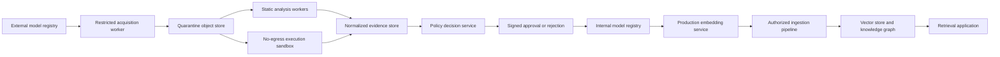
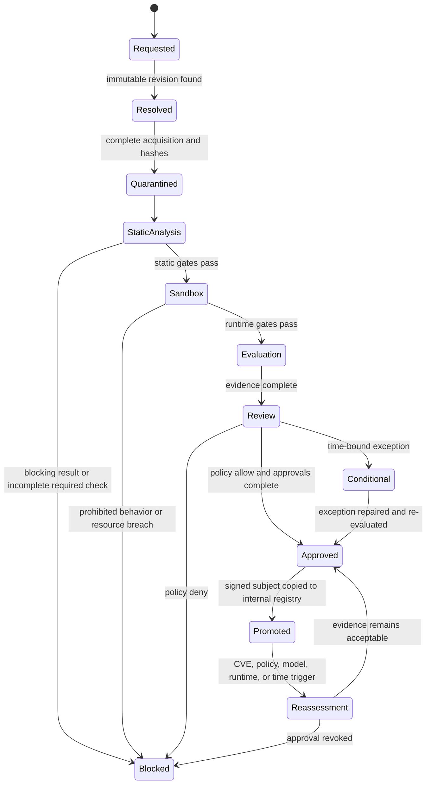

# Model Intake Security Review and Implementation Roadmap

**Status:** The admission-v2 control plane, authoritative Hugging Face acquisition, existing scanner bundle,
official safetensors inspection, signed runner-receipt contracts, signer boundary, OCI layout, and deployment
verifiers, physical-runner service/orchestration, and bounded keyless planner are implemented. Model Intake scans remain non-deployable technical evidence; only the controlled
submission/freeze/approval/policy/signing/promotion workflow may authorize deployment. The default UI path is
now a durable one-link automatic technical review; the existing phased workflow remains available as
Advanced/manual mode. Physical KVM acceptance of the three reference model paths was completed
on a nested-virtualization EC2 host on 2026-08-04; every functional runtime/conversion phase passed, while the
strict zero-network-attempt policy correctly kept all three signed receipts non-pass because the libraries
attempted local/IPv6 socket operations. Remaining production acceptance requires organization-operated
trust/KMS, registry, benchmark, and data-plane systems. Kubernetes acceptance applies only when the organization
chooses the already implemented webhook; Kubernetes is not required by ShakerScan or Firecracker.

**Original audit checkout:** `239f887d9f10e997b9844c916c28073fab71ee79`

**Scoped-roadmap baseline checkout:** `c1900af` (implementation series beginning at `8f721ce`)

**Review date:** 2026-07-30

**Implementation and automation-boundary review:** 2026-07-29

**Scope:** ShakerScan Model Intake, CodeRankEmbed, CodeSage Base v2, CodeSage Large v2, and the knowledge-graph/vector-embedding deployment path

**Audience:** Security engineering, ML platform, application security, infrastructure, legal/privacy, model owners, and release approvers

## 0.1 August 2026 usability and trust-boundary hardening

The primary user journey is now deliberately simple: paste one Hugging Face model link, choose the intended
environment, and select **Start review**. A database-backed controller then resolves and pins the provider
revision, sizes and queues complete acquisition, binds the completed static evidence to a controlled
submission, derives the exact loader and fixed embedding-test contract, runs a Firecracker calibration,
automatically converts the one supported unsafe `.bin` layout to safetensors when required, strictly rescans
the converted identity, runs calibration and the same known-answer suite, and freezes the resulting evidence. The
controller continues when the browser closes or the API restarts. It publishes the scan report, SBOM, AIBOM,
and normalized JSON/HTML/SARIF corporate report without asking the user to copy scan IDs or deployment-bundle
fields. Missing signing, Firecracker, evaluation, or approval evidence remains visible as
`NOT_RUN`/`INCOMPLETE`; automatic mode does not turn unavailable evidence into a pass and cannot create an
approval, policy exception, policy decision, admission, or promotion.

The internal static scan deliberately uses the non-admission technical profile while explicitly forcing
complete acquisition, the authoritative repository snapshot, every applicable existing scanner, and a
current uniform worker fleet. The selected production/staging environment belongs to the controlled
submission and its Firecracker/trust/approval/policy controls. This prevents missing production signatures,
human approvals, or the optional container staging adapter from being mislabeled as static-analysis defects;
those controls remain separate and fail closed in the final review.

Finishing the workflow is not displayed as passing the model. Automatic review has a separate technical
outcome: `PASS`, `REVIEW_REQUIRED`, `INCOMPLETE`, or `BLOCK`. Every non-pass generated evidence record is
named beside its next action, followed by the remaining publisher, human, production-signer, and deployed
data-plane controls. A completed workflow may therefore produce a clear `BLOCK`, which is a useful result
rather than an execution failure.

The advanced phased workflow remains available for custom sources, explicit trust material, controlled
conversion, generated evaluation, identity-separated approvals, deterministic policy, signing, and
promotion. It is no longer necessary to understand those controls before obtaining the first useful
technical review.

The following implementation defects found in the branch audit are closed:

- The UI server never returns `MODEL_INTAKE_OPERATOR_TOKEN` to browser JavaScript. Host and forwarding
  headers are not treated as proof that a request is local. An operator may retain an explicitly entered
  credential in that browser session, but credentials are distributed through an approved secret channel.
- A completed static run can be attached only when its scan type is Model Intake and its source is the
  controlled submission source (or the submission carries the exact expected artifact digest).
- Complete acquisition no longer silently widens a caller's total artifact budget. Contradictory byte
  limits are rejected at request validation, and Hugging Face resolution returns a model-sized complete
  acquisition payload through API, UI, and agent surfaces.
- Firecracker staging uses a dedicated API-only host directory that workers do not mount. A canonical
  manifest binds kernel and rootfs byte counts and SHA-256 digests; recovery and the privileged installer
  verify both artifacts and reject symlink substitution. A custom rootfs requires an explicit SHA-256.
- The rootfs builder publishes atomically. Reinstallation refreshes component identities and service
  configuration without duplicate environment keys, restarts the service, fails if API recreation fails,
  and automatically registers the exported runner public key as a `runtime_runner` trust anchor constrained
  to the builder and environment. Local PEM is the install default and may sign production-targeted technical
  evidence, but the receipt is labeled `non_production_local_pem` and forced to `INCOMPLETE`; only an
  organization-approved KMS key may satisfy the production signer control.
- Reports now lead with one plain-language result and three engineering groups: **verified**, **needs
  attention**, and **not applicable**. Later admission and organization work appears once under **deployment
  follow-up** and is excluded from technical failure counts. Licensing has one concise summary linked to the
  License BOM instead of repeated disclaimers. Technical matrices, phase logs, hashes, platform metadata,
  AIBOM, and SBOM detail are collapsed by default and remain downloadable as evidence.

The web application cannot and must not silently install a root system service. On a supported Linux/KVM
host, the Status page stages the large verified inputs and copies one explicit host command. That command
is the single privileged consent boundary: it installs the release-owned Ubuntu/Debian package manifest
(including `python3-venv`, `nftables`, `iproute2`, and `e2fsprogs`) when needed, installs or refreshes
Firecracker, wires the API, registers
the trust anchor, and returns nonzero unless the complete setup succeeds. Coding agents may present or copy
this command, but must not execute it without the operator's explicit host-level authorization.

Release packaging has three explicit dependency layers. `runner/host/system-requirements.ubuntu.txt` owns the
host packages needed for KVM orchestration and telemetry; `runner/host/requirements.lock` owns the hash-locked
Python service environment; `runner/guest/requirements.lock` owns the offline model-loading environment,
including Transformers, safetensors, PyTorch, and ONNX Runtime. The guest kernel/rootfs manifest pins the
resulting machine image. Source checkouts and the minimal hosted runtime both carry the fixed builder, guest
source, host/guest locks, provisioner, and runner service modules. Prebuilt deployments use a distinct
multi-architecture API/control-plane image containing the checksum-pinned Docker client; the scanner/worker
image remains client-free. Buildx is required on official release builders but is not embedded in runtime
images. A future binary/package release must publish the matching kernel and rootfs as signed, digest-pinned
release assets with SBOM/provenance, verify them before installation, and retain local build as an explicit
source/developer fallback. The one-click installer must never fetch an unversioned “latest” guest image or
quietly mix a guest from another ShakerScan release. Installation succeeds only after the host, service, API,
trust anchor, guest self-test, and exact component identities all report READY.

## 0. Scope freeze — harden, do not expand

This section is authoritative for future implementation. When an older section describes an optional tool,
runner, policy engine, identity system, registry platform, or orchestrator outside this boundary, treat it as
historical analysis or a rejected alternative, not backlog.

Implement and harden:

1. One authoritative admission workflow; the legacy scan path remains preflight/technical review only.
2. The existing ModelScan, Fickling, Semgrep, and Trivy adapters plus ShakerScan's current built-in archive,
   pickle, Python AST, secret/malware-rule, SBOM, dependency, native-binary, safetensors, ONNX, and GGUF checks.
3. One production execution backend: Firecracker with KVM and jailer. There is no production fallback. The
   executable host controller, fixed guest, provisioning/build scripts, and signed measured-telemetry path
   are implemented and physically exercised on KVM. Production still needs an organization-operated runner
   and trust anchor; no model receives a pass when runtime network attempts are present.
4. Controlled CodeSage `.bin` to safetensors conversion inside Firecracker, followed by tensor and embedding
   equivalence evidence and a complete rescan of the new artifact identity.
5. The existing Python policy engine, approval model, signer service, OCI promotion path, CI verifier,
   Kubernetes admission webhook, UI/reporting, reassessment, and worker/storage lifecycle. The signer now
   runs from a dedicated hash-locked image containing only the signer/control-plane modules, on an internal
   API/PostgreSQL-only network, under a separate non-superuser database role with table/column-minimal
   grants. Its production AWS KMS dependency is shipped, and audit events retain the server-derived
   initiating operator identity while identifying the signer service separately.
6. Reliability work: idempotency, leases, terminal failures, bounded retries, recovery, quotas, revocation,
   freshness, negative-path tests, and physical Firecracker/KVM end-to-end validation.
7. After the deterministic runner and evidence path are operational, one optional keyless coding-agent
   planner for bounded Model Intake investigation. It may select and interpret existing actions, but it is
   never an admission, trust, policy, exception, signing, promotion, or guest-command authority.

Do not implement:

- additional scanners or scanner plug-ins, including CodeQL, Syft, Grype, OSV-Scanner, pip-audit, ClamAV,
  Gitleaks, YARA, TruffleHog, Bandit, or ScanCode/ORT;
- OPA or another policy engine;
- Sigstore, Cosign, Rekor, or a new transparency-log service;
- gVisor, Kata Containers, QEMU as a separate backend, Docker as a production fallback, multiple runner
  backends, or a generic workflow engine;
- a general-purpose conversion service, enterprise IAM product, registry-management product, or support for
  deployment orchestrators beyond the existing CI verifier and Kubernetes webhook.
- a second AI execution framework, an agent-controlled shell, arbitrary guest commands, agent-defined trust
  or policy, or an AI-only path that the deterministic Model Intake workflow depends on to remain safe.

The design remains model-agnostic: applicability is selected from immutable repository and artifact facts,
never a three-model allowlist. A format/provider/runtime that the bounded implementation cannot fully assess
returns `INCOMPLETE`; it does not cause a new subsystem to be added.

## 1. Purpose

This document defines what ShakerScan can realistically automate, what remains to be implemented in
ShakerScan, and which controls require organization-operated infrastructure or human authority. It also
provides the complete security-review
procedure for the following embedding models:

- `nomic-ai/CodeRankEmbed`
- `codesage/codesage-base-v2`
- `codesage/codesage-large-v2`

The intended use is a corporate knowledge graph whose developers want vector embeddings. Approval must
therefore cover more than the model file. It must cover the repository snapshot, executable model code,
Python and container dependencies, the isolated inference runtime, the embedding pipeline, the vector
store, knowledge-graph authorization, ongoing vulnerability monitoring, and the evidence used to make the
deployment decision.

This is all of the following:

1. A point-in-time audit of the original and current Model Intake implementations.
2. A target architecture, implementation backlog, operating procedure, and acceptance plan.
3. An automation-boundary contract that prevents product mechanisms, installed integrations, completed
   model runs, and corporate approvals from being confused with one another.

It is not an approval of any model, a replacement for legal/privacy review, or a claim that a clean scan
proves a model is safe.

## 2. Executive decision

ShakerScan provides a meaningful provider-neutral Model Intake and admission foundation. It can resolve and
pin sources, stream bounded prefixes or complete artifacts, capture complete Hugging Face snapshots, inspect
formats/code/dependencies, orchestrate built-in and external scanners, evaluate supplied model/application
observations, apply policy, preserve evidence, and issue and lifecycle-manage an admission decision.

The original audit of checkout `239f887` identified serious gaps. Most acquisition, static-analysis,
evidence, policy, admission, lifecycle, conversion/rescan, and exact-runtime qualification mechanisms were
subsequently implemented. The remaining gap is not product code or “scan more file extensions.” It is physical
and organization-specific execution of those mechanisms against KVM, corporate benchmarks/data planes, trust
services, and whichever deployment enforcement point the corporation actually uses.

Neither the original checkout nor the current product should be described as the sole corporate approval
authority. ShakerScan can collect evidence, run deterministic controls, enforce product policy, and issue an
admission decision. It cannot decide legal acceptability, create a representative corporate benchmark,
grant business risk acceptance, or prove that an organization actually deploys only the approved digest.

At the original checkout, the audit found these issues:

1. Remote artifacts and related metadata were fetched before a complete destination-safety decision.
2. The public download limit prevented complete hashing and inspection of the three example weight files.
3. The repository inventory excluded arbitrary Python files despite `trust_remote_code=True` requirements.
4. SBOM, malware, secrets, and evaluation evidence was primarily caller-supplied.
5. Unsafe-serialization detection was a bounded heuristic rather than semantic analysis.
6. Isolated load/inference, embedding/application evaluation, native transparency verification, signed
   admission, and lifecycle enforcement were absent.

Sections 2.1 and 2.4 identify which findings are now resolved, partially resolved, or still open.

The completed implementation and remaining validation order is:

1. **Implemented:** remove ambiguity between non-deployable technical scans and the authoritative controlled
   admission workflow; enforce legal state transitions, latest-manifest authority, transactional mutation,
   durable workflow events, idempotent evidence replay, and downstream admission/deployment invalidation.
2. **Implemented and physically exercised:** deploy one disposable no-egress Firecracker/KVM loader for
   custom code, model construction, inference, known-answer embeddings, telemetry, and signed exact-bundle
   receipts. The final CodeRankEmbed run passed every functional phase and exact known-answer replay; strict
   policy then blocked the receipt on measured socket attempts. No alternate runner is in scope.
3. **Implemented and physically exercised:** use that same Firecracker path to convert CodeSage Base v2 to
   safetensors, prove tensor/embedding equivalence, register and rescan the new identity, then require a separate
   safe-loader runtime job. Base conversion achieved exact tensor/numeric/embedding equivalence, but its target
   was deliberately not registered because the strict network-attempt gate made the signed receipt non-pass.
   Do not admit the upstream pickle-capable artifact directly.
4. CodeSage Large v2 also completed exact conversion/equivalence inside a 12 GiB envelope, peaking at
   12,391,227,392 bytes. It remains a conditional higher-resource candidate and is not justified unless Base
   cannot meet the versioned retrieval requirement. Do not add a GPU runner.
5. **Implemented; corporate acceptance pending:** harden policy, approvals, signer, OCI promotion, deployment
   verification, reporting, reassessment, storage, and failure recovery, then prove configured external paths.
6. **Implemented:** the bounded keyless Codex planner is aligned across API, UI, and shipped skill without
   decision authority.

For a production profile, the correct decision for any exact model revision is **block/incomplete** until
every required automated control has generated digest-bound evidence and the required corporate approvals
and deployment bindings exist. No repository is approved merely because it is one of the three examples in
this document.

### 2.1 Implementation completion addendum

ShakerScan now implements the roadmap as a model-agnostic admission framework rather than as logic tied to
CodeRankEmbed or CodeSage. The named models remain immediate validation targets, but the same contracts accept
other Hugging Face repositories, HTTPS artifacts, S3, GCS, Azure Blob, OCI registry exports, MLflow exports,
and future source adapters.

Implemented controls include:

- Every-hop SSRF policy, DNS/IP validation and pinning, redirect limits, cross-origin credential stripping,
  HTTPS/private-network policy, exact host/port allowlists, and approval-gated network exceptions.
- Complete streamed artifact acquisition, full SHA-256, content-addressed quarantine, byte/file quotas, safe
  retention preview/execution, and repository snapshot materialization. Hugging Face snapshots now fetch and
  normalize the provider-authoritative manifest at the pinned revision; caller inventories are comparison-only.
- Manifest normalization/materialization, custom-code/`auto_map` inventory, recursive ZIP/TAR analysis, and
  traversal, symlink/device where supported, collision, archive-bomb, nested-archive, and unsafe-serialization
  gates. Section 2.5 records the re-audit findings and their repairs.
- Generated evidence contracts for pickle semantics, Python AST, secrets, malware rules, CycloneDX SBOM,
  dependencies/SCA adapters, native binaries, and licenses. Caller assertions remain `declared`; they are not
  silently promoted to generated evidence.
- Normalized ModelScan, Semgrep, Fickling, and Trivy adapters. Missing binaries, bad schemas, empty output,
  timeout, crash, incomplete execution, explicit omission, `NOT_RUN`, and `REVIEW_REQUIRED` are non-pass when
  required. ModelScan 0.8.8, Semgrep 1.172.0, Fickling 0.1.12, and Trivy 0.72.0 are bundled in isolated
  hash-locked environments; Trivy's vulnerability and policy data is captured during the image build for
  offline scans. No additional external scanner adapter will be added under this roadmap.
- The core bundle is selected from immutable repository facts, never a model-name allowlist: ModelScan for
  supported serialized artifacts, Fickling for raw pickle artifacts it can parse reliably, Semgrep for
  repository code/config, and Trivy for every complete repository snapshot. Trivy dependency/CVE evidence is
  meaningful when manifests or packages exist; its full source/text license mode still applies to a complete
  repository without a dependency manifest. Fickling is explicitly
  `NOT_APPLICABLE` to PyTorch ZIP checkpoints because extracting their ordinary tensor `data.pkl` stream
  produces high-volume reconstruction false positives; ModelScan and ShakerScan's archive-aware pickle
  opcode analysis cover that family. Every worker image build runs all four on deterministic malicious
  fixtures and fails if any tool cannot generate and normalize its expected finding.
- Atomic detached-signature trust decisions and offline DSSE/in-toto subject verification. Explicit key pins
  are enforced as an allowlist and cannot be widened by request-supplied keys. Transparency-log policy fails
  closed when no locally verified inclusion/checkpoint proof exists; native transparency integration is out
  of scope.
- A separate non-root, read-only, capability-free, no-egress sandbox service with request/nonce/subject-bound
  evidence, digest revalidation, isolation gating, seccomp verification, per-job child termination, and CPU,
  memory, PID, file, descriptor, and wall-clock limits. Static format inspection cannot produce a dynamic
  `PASS`. A built-in provider-neutral safetensors adapter re-hashes and memory-maps the exact artifact,
  validates the tensor inventory and byte ranges, and samples numeric values for non-finite data. It reports
  load level `weights` and explicitly records that custom code, model graph construction, and embeddings did
  not run. Other model loaders use the operator-controlled argv-only adapter contract. This container tier is
  not the remaining disposable KVM/microVM execution tier.
- A provider-neutral, content-free embedding/data-plane evaluator that separates security controls (digest
  binding, vector validity/dimensionality/collisions, poisoning, ACL/sensitive leakage, tenant/graph/cache
  boundaries, deletion, stability, and index/model compatibility) from organization-specific quality and
  capacity controls (recall, relevance, latency, and RSS). Quality can be required by policy, but an absent
  optional quality benchmark no longer falsifies security status. Raw benchmark vectors are request-transient
  and are not persisted in scan options.
- Canonical signed admission statements bound to artifact, snapshot, scanner, sandbox, attestation,
  evaluation, findings, and policy digests. The library and HTTP verification paths reject every signed
  non-`allow` outcome and require an active registered admission for deployment verification.
- A durable admission registry with active/denied/reassessment-required/revoked/expired/superseded states,
  event history, automatic worker registration, expiry, scoped trigger ingestion, and revocation. Remote
  verification/trust/lifecycle mutations require an operator credential; fleet-wide reassessment requires
  separate confirmation and an approval receipt. A pure CI/startup verifier, bounded OCI publisher, and
  optional namespace/object-scoped Kubernetes webhook installer are shipped; live corporate infrastructure
  acceptance remains external.
- UI/API visibility for provider capabilities, complete acquisition, generated scanners, sandbox and
  evaluation gates, signed admission, admission age/reassessment/expiry, evaluation metrics, and redacted
  live/durable activity logs on running, completed, and failed Model Intake scans.

The framework deliberately does not fabricate external evidence. The intended production profile must block
until the core adapter readiness receipt is valid and the operator supplies approved rules for the existing
scanner set, an organization-controlled signing key and deployment trust roots, a purpose-built runtime
image for the chosen model loader, a versioned corporate
synthetic benchmark, application/vector-store observations, and the required human/legal/privacy approvals.
Admission mode now uses a server-owned policy profile (`production` by default); callers cannot select a
weaker profile, cannot turn required gates off, and cannot inject inline policy exceptions. Only durable,
approved, unexpired exceptions are eligible. Policy-profile mutations require the Model Intake operator
credential. However, the public request still exposes trust material, trust-anchor selection, and
deployment-approval declarations; Section 2.6 supersedes any earlier claim that the complete admission trust
boundary is server-owned. Preflight remains non-admissible.
Active strict saved profiles impose non-weakenable minimum acquisition, full Hugging Face snapshot, scanner,
sandbox, evaluation, signed-admission, hash, governance, and deployment-approval requirements.
Real controlled CodeRankEmbed and CodeSage runs now produce the required physical evidence. Their runbooks
remain incomplete for corporate approval because strict runtime policy and organization-owned controls are
still non-pass or external; these are admission inputs, not missing model-specific code.

### 2.2 Automation boundary and product position

ShakerScan should automate repetitive, deterministic, evidence-producing security work. It should orchestrate
specialist tools rather than attempt to replace every model, malware, SCA, policy, and runtime-monitoring
engine. The product boundary has three classes:

| Class | Meaning | Examples | ShakerScan responsibility |
|---|---|---|---|
| **A — Product-native automation** | Deterministic controls ShakerScan can safely own | Source resolution, safe acquisition, complete hashing, manifests, archive/format checks, evidence normalization, policy evaluation, reporting, admission registry, reassessment | Implement, test, ship, and fail closed |
| **B — Bounded integration** | Automatable controls requiring an existing engine, Firecracker runtime, database, corpus, or organization trust material | ModelScan, Fickling, Semgrep, Trivy, Firecracker execution, runtime telemetry, signed receipts, vector/graph observations | Harden the existing contract, isolation, evidence provenance, status handling, and operator configuration; never claim coverage when the integration is absent |
| **C — Corporate/human authority** | Decisions that cannot be responsibly automated by an open-source scanner | Legal/license approval, training-data acceptability, privacy impact assessment, business owner acceptance, production credentials, representative internal corpus, exception approval, deployment change control | Collect the decision, bind it to exact subjects and policy, enforce its expiry, and expose missing evidence; do not fabricate or make the decision |

The intended product is therefore a **security orchestration and admission layer**, not another monolithic
scanner and not a universal legal or ML-quality authority.

#### 2.2.1 Frozen scanner/provider boundary

The useful default is deliberately smaller than the original ten-tool sketch:

| Capability | Default decision | Reason |
|---|---|---|
| ModelScan | **Ship and enable by applicability** | Independent model-format/serialization analysis; complements ShakerScan pickle semantics |
| Fickling | **Ship for raw pickle artifacts; declare PyTorch ZIP not applicable** | Deep raw-pickle semantics and a second engine where its parser is reliable; ordinary PyTorch state-dict reconstruction produces unusable false positives after manual member extraction |
| Semgrep | **Ship and enable for repository code/config** | Mature source-pattern engine with a narrow, versioned model-intake ruleset; complements the built-in AST analyzer |
| Trivy | **Ship for every complete repository; enable full-license mode only there** | One maintained engine provides vulnerability, secret, misconfiguration, and license evidence without shipping four overlapping defaults. Package CVE applicability and repository license applicability are reported separately. |
| Any additional external scanner | **Do not implement** | Harden the four existing engines and built-in checks; unsupported organization-specific depth remains external to ShakerScan |
| Firecracker | **Only production execution provider** | Loading/import/inference and controlled conversion require a stronger boundary than static evidence scanning; unavailable Firecracker is `INCOMPLETE` with no fallback |
| Embedding test | Separate evaluation provider | Needs an approved runner, benchmark corpus, thresholds, and data-plane observations |
| Embedded Python policy | **Only policy provider** | Harden, version, hash, and regression-test the existing engine; OPA is out of scope |
| Report | Core report provider | A normalized decision and evidence export are product behavior, not a replaceable hostile-file scanner |

The code reflects this split. `GET /model-intake/scanners/readiness` reports evidence adapters, versions,
rules/database identity, applicability, and the last deterministic functional receipt. `GET
/model-intake/providers/readiness` reports execution, evaluation, policy, and report providers separately.
Source-registry adapters remain under `GET /model-intake/capabilities`. This prevents a binary being installed
from implying that it is runnable, applicable, required, fresh, or capable of satisfying an admission gate.

Every evidence adapter must use an argv-only contract, a read-only exact subject, credential-minimized
environment, unprivileged execution, CPU/file/descriptor/process/wall limits, bounded output, a strict output
schema, explicit applicability, and normalized non-pass states. The core packaged tools live in independent
hash-locked virtual environments so their transitive dependencies cannot replace API/worker dependencies.
Trivy is checksum-pinned and runs with build-captured data and runtime update/network lookups disabled. An
image build fails unless every core adapter detects its corresponding deterministic malicious fixture.

#### 2.2.2 License evidence and policy boundary

The implemented license path deliberately uses **Trivy as the only external license scanner**. ShakerScan
adds deterministic evidence reconciliation and reporting instead of adding another overlapping engine:

1. A full/complete review invokes Trivy with `--license-full` against the immutable repository snapshot.
   Quick, partial, or artifact-only scans never claim full source/text license coverage.
2. The strict Trivy parser retains normalized package/file license name, Trivy class, severity, bounded path,
   confidence, and evidence digest. Forbidden/restricted classes fail; reciprocal/unknown classes require
   review. Raw license text is not copied into the ordinary scan result.
3. ShakerScan fingerprints common repository license files, distinguishes overlapping BSD and GNU-family
   signatures, and reconciles those facts with publisher declarations and Trivy package/source evidence.
4. The versioned policy returns exactly one automated outcome: `NO LEGAL BLOCKER DETECTED`,
   `LEGAL REVIEW REQUIRED`, or `BLOCKED BY LICENSE POLICY`. Unknown, custom, reciprocal, dataset-related,
   conflicting, or intended-use-dependent terms always route to legal review. Clearly forbidden/restricted
   prohibited terms block. “No legal blocker detected” is never rendered as an approval statement.
5. The controlled evidence manifest binds `legal_review_required`. Model-security approval cannot clear it;
   a distinct `legal_reviewer` must approve the latest frozen evidence before deterministic admission can
   allow. A new or changed snapshot, policy, scanner database, or approval invalidates that disposition through
   the existing evidence/policy lifecycle.
6. CycloneDX and SPDX exports include actual model-system and pinned dependency components, relationships,
   provenance properties, and a composition/completeness statement. SPDX intentionally retains
   `LicenseConcluded: NOASSERTION`. The License BOM records normalized terms, source paths/digests, evidence
   searches, detected attribution lines, obligations, conflicts, missing evidence, and unresolved owners.
   The Third-Party Notices file includes detected attribution and a source-search summary and is labeled
   `INCOMPLETE DRAFT` whenever required evidence is absent.

Artifact acceptance is content-based, not existence-based. A complete-review test must assert useful component
names/versions or model relationships, subject and snapshot identity, evidence completeness, license source
coverage, actionable unresolved items, and non-duplicated root identity. An empty component list plus hashes and
generic disclaimer text fails acceptance even when the JSON is schema-valid.

This is the maximum responsible automation boundary. License classification, evidence reconciliation,
approval routing, and notice drafting are product behavior. Interpretation of ambiguous terms,
jurisdiction/use-case analysis, indemnity acceptance, and final distribution approval remain human decisions.

### 2.3 Plain-language answer every report must provide

Every controlled intake report must answer, on its first screen, in JSON, and in printable HTML/PDF:

1. **What exact model did we inspect?** Provider, repository, immutable revision, complete snapshot digest,
   weight digest, code digest, runtime digest, and intended deployment environment.
2. **What passed?** Only controls that actually ran against those exact subjects and produced eligible
   evidence.
3. **What failed?** The failed control, evidence reference, policy consequence, and remediation.
4. **What did not run?** Missing tool, unsupported format, absent benchmark, timeout, crash, skipped control,
   or unavailable input. A required non-run is never a pass. The UI distinguishes this from an explicitly
   resolved `NOT_APPLICABLE` result.
5. **What is the ShakerScan decision?** `ALLOW`, `REVIEW`, `INCOMPLETE`, or `BLOCK`, with a short reason and
   the exact policy/evidence/admission identities that produced it.
6. **What is outside this run?** State the technical review boundary once, then put deployment and
   organization follow-up in a collapsed appendix. These items are not scan failures and must not inflate the
   executive failure count.
7. **Does licensing need follow-up?** Give one concise answer. Link to component terms, paths, digests,
   policy reason codes, and missing evidence in the License BOM; do not repeat legal boilerplate per control.

Normalized control states must be `PASS`, `FAIL`, `WARNING`, `REVIEW_REQUIRED`, `NOT_RUN`, `UNSUPPORTED`,
`TIMEOUT`, `CRASHED`, `INCOMPLETE`, `SKIPPED_BY_POLICY`, or `NOT_APPLICABLE`. Only `PASS` and an explicitly
justified `NOT_APPLICABLE` can directly satisfy a required gate. A policy may turn a resolved `WARNING` into
an approval with recorded rationale; every other non-pass remains visible. The UI may use friendlier labels,
but the exported status must remain unambiguous.

The normalized controlled report retains `model-intake-corporate-report/v2` for integration compatibility and has two deliberately different
layers:

- **Summary:** one plain-language headline and result, exact scope, verified/attention/not-applicable counts,
  prioritized technical findings, one review-boundary note, and one licensing note. It is short enough for an
  engineer or risk owner to understand without reading scanner payloads.
- **Detailed technical review:** the control question, status, answer, method, coverage, evidence references,
  remediation, static per-scanner summary, Firecracker phase/network/resource timeline, authority bindings,
  complete ShakerScan capability catalog, and a collapsed deployment/organization follow-up appendix.

This format follows NIST's assessment-report guidance: an executive summary should state what and when was
assessed, deficiencies, and recommendations, while the detailed report preserves assessed controls, results,
observed deficiencies, and mitigation recommendations. NIST AI RMF also requires risks that cannot be measured
to be documented and emphasizes clear language usable by executives and practitioners. See the
[NIST RMF Assess FAQ](https://csrc.nist.gov/csrc/media/projects/risk-management/documents/05-assess%20step/nist%20rmf%20assess%20step-faqs.pdf),
[NIST AI RMF Core](https://airc.nist.gov/airmf-resources/airmf/5-sec-core/), and
[AI RMF communication attributes](https://airc.nist.gov/airmf-resources/airmf/appendices/app-d-attributes-of-the-ai-rmf/).

#### 2.3.1 Exact list of checks ShakerScan performs

“Performs” means ShakerScan implements and orchestrates the check. It does **not** mean every check ran for
every model. Applicability and execution are resolved per exact subject. A required unavailable, incomplete,
timed-out, crashed, unsupported, or stale check remains visible and cannot silently become a pass.

| ID | Check ShakerScan performs | How it is checked | When it applies / what PASS means |
|---|---|---|---|
| `MI-01` | Safe source resolution and complete acquisition | Native URL/provider policy validates every redirect/DNS/IP destination, strips cross-origin credentials, streams under quotas, and records a content-free acquisition trail | All sources; approval evidence requires the complete object, not only a bounded prefix |
| `MI-02` | Artifact integrity and immutable identity | Full SHA-256, byte count, expected/provider digest comparison, content-addressed quarantine, and immutable subject registration | All artifacts; PASS binds the exact bytes evaluated and later admitted |
| `MI-03` | Complete repository and custom-code inventory | Authoritative pinned provider manifest, complete snapshot materialization, normalized paths, `auto_map`, tokenizer/configuration, and custom-code digests | Providers with authoritative snapshot semantics; non-Hugging Face sources remain artifact-only unless equivalent proof exists |
| `MI-04` | Archive and model-format safety | Recursive ZIP/TAR inventory; traversal, symlink/device, collision, nesting, ratio/size/count, truncation, polyglot indicators; official safetensors parsing plus bounded defense-in-depth inspection; ONNX and GGUF structural checks | When archives/formats are present; parser error or incomplete coverage is non-pass |
| `MI-05` | Unsafe serialization | ShakerScan `pickletools` semantic callable/opcode analysis, ModelScan for supported serialized models, and Fickling for applicable raw pickle | Pickle/serialized artifacts; expected framework reconstruction is distinguished from a proven dangerous callable but can still violate format policy |
| `MI-06` | Repository source/configuration security | Built-in Python AST analysis plus the versioned Model Intake Semgrep ruleset | Code/config present; parse failure, large-file omission, rules staleness, timeout, or unresolved findings remain visible |
| `MI-07` | Secrets, malware indicators, and native binaries | Built-in secret/malware rules, file-type facts, and native-binary inventory; Trivy adds applicable secret/misconfiguration evidence | Complete subject material exists; this is bounded detection, not a guarantee that no novel malware exists |
| `MI-08` | SBOM, dependencies, CVEs, and misconfiguration | Native CycloneDX SBOM/dependency facts plus offline Trivy vulnerability, secret, and misconfiguration results with database identity/freshness | Trivy scans every complete repository; package/CVE coverage is applicable only when package or manifest facts exist, and missing lock/runtime identity remains visible |
| `MI-09` | License evidence, policy, and notices | Trivy `--license-full`, native fingerprints, publisher/dependency/dataset/use-term reconciliation, deterministic corporate policy, SPDX declarations, License BOM, and Third-Party Notices draft | Every complete repository; PASS means no automated legal-review trigger was detected, never legal approval. Unknown/custom/reciprocal/dataset/use-dependent terms require a distinct legal review |
| `MI-10` | Provenance, signature, attestation, lineage, and AIBOM | Exact digest verification, configured signer/trust pins, offline DSSE/in-toto subject checks, model/base/dataset declarations, and CycloneDX AI/ML metadata | Required by policy or supplied by source; presence is not trust, and publisher declarations remain declared evidence |
| `MI-11` | Exact model runtime in Firecracker | Fixed no-shell guest executes import, tokenizer, model construction/load, warmup, inference, and teardown for the exact deployment bundle | Controlled admission requiring runtime qualification; KVM or loader unavailability is `INCOMPLETE`, with no fallback |
| `MI-12` | Network prevention and attempted-network observation | No virtual NIC plus guest network syscalls, phase/destination digests, interface inventories, host nft counter deltas, loss/overflow, and telemetry digest | Every runtime job; PASS requires zero attempts/drops and complete non-lossy guest/host telemetry |
| `MI-13` | Runtime resource envelope | Host cgroup limits and peaks for CPU, memory, PIDs, files, descriptors, disk, and wall time, bound into the signed receipt | Every runtime job; incomplete measurement or policy breach is non-pass |
| `MI-14` | Unsafe-format conversion and equivalence | Fixed Firecracker conversion, tensor inventory, numeric/tensor/embedding equivalence, target identity registration, complete target rescan, and separate safe-loader qualification | When policy prohibits the source serialization format; never converts in the API/static worker |
| `MI-15` | Embedding known-answer, robustness, and quality evaluation | Deterministic, content-free evaluation over trusted exact-subject observations; output shape, finiteness, collisions, stability, malformed/adversarial inputs, recall/relevance/latency/resource thresholds | An approved versioned benchmark is configured; ShakerScan runs/scores it but the corporation defines representative content and thresholds |
| `MI-16` | Vector-store and knowledge-graph security | Trusted data-plane observations cover ACL leakage, tenant/graph/cache boundaries, poisoning, deletion, and model/index compatibility | Intended integration is available; model microVM success does not imply data-plane success |
| `MI-17` | Evidence, policy, approval, and deployment admission | Freeze exact evidence; verify freshness/subject binding; identity-separated approvals; deterministic server policy; isolated signing; active-registry and exact-component parity; reassessment/revocation | Controlled workflow only; a preflight scan cannot authorize deployment |

The external scanner set remains frozen to **ModelScan, Fickling, Semgrep, and Trivy**. ShakerScan does not
claim that installing a binary proves applicability, freshness, execution, or coverage. The check catalog is
included in JSON/UI/HTML only as a capability reference; the per-submission control and scanner evidence is
the authority for what actually ran. This is consistent with [Hugging Face's pickle guidance](https://huggingface.co/docs/hub/security-pickle),
which warns that scanning is not foolproof, and with [OWASP's AI supply-chain guidance](https://genai.owasp.org/llmrisk/llm032025-supply-chain/),
which calls for verifiable sources, integrity checks, inventories, vulnerability management, and use-case
evaluation rather than one scanner result.

#### 2.3.2 Checks and decisions ShakerScan does not make

These items are usually needed for full corporate approval. They are not scanner failures and must not be
shown as if ShakerScan attempted and failed them. Reports label them `EXTERNAL_REQUIRED`, identify the typical
owner and expected evidence, and state that full corporate approval is not determined by ShakerScan.

| ID | Not determined by ShakerScan | Why it remains external | Typical owner / evidence |
|---|---|---|---|
| `CORP-01` | Intended/prohibited use, business value, affected users, impact tier, and risk tolerance | These are organizational facts and decisions | Business owner / approved use-case and risk classification |
| `CORP-02` | Legal acceptability of model, code, dataset, and dependency licenses; IP, patent, copyright, redistribution, indemnity, and terms | Automated inventory is not legal interpretation | Legal/procurement / legal opinion or license approval |
| `CORP-03` | Training/fine-tuning data rights, consent, collection quality, poisoning assurance, and contractual restrictions | Publisher declarations do not prove dataset rights or integrity | Data governance/legal/model owner / dataset lineage and rights assessment |
| `CORP-04` | Privacy impact, sensitive-data use, memorization/inference, residency, retention, and cross-border transfer | Depends on corporate data, jurisdiction, and deployment | Privacy/DPO / DPIA or PIA and approved handling controls |
| `CORP-05` | Context-specific safety, harmful bias, accessibility, explainability, human oversight, and failure impact | Requires representative people, harms, tasks, and thresholds | Responsible AI/product risk / use-case TEVV and residual-risk disposition |
| `CORP-06` | Representative quality, latency, throughput, capacity, availability, cost, and benefit thresholds | ShakerScan cannot invent a representative corporate benchmark | ML platform/application owner / versioned benchmark and capacity plan |
| `CORP-07` | Threat model and red-team coverage of the complete application, ingestion, retrieval, vector, graph, API, identity, and downstream-LLM system | The model file is only one component | Security architecture/AppSec / threat model and scoped test report |
| `CORP-08` | Production IAM, segmentation, KMS/secrets, image/host hardening, tenancy, logging access, backup, and registry architecture | These controls live in corporate infrastructure | Platform/cloud security / deployment and inherited-control assessment |
| `CORP-09` | Continuous production monitoring for drift, abuse, availability, CVEs, upstream changes, and rule/policy freshness | Intake is point-in-time evidence | MLOps/SRE/SOC / monitoring, alerts, ownership, reassessment plan |
| `CORP-10` | Tested incident response, revocation, rollback, reindex, deletion, retention, recovery, and decommissioning | Requires organization-specific dependent systems and processes | IR/MLOps/data owner / tested runbooks and recovery/deletion receipts |
| `CORP-11` | Publisher/vendor due diligence, support, disclosure, ownership changes, and contract risk | Repository metadata is not supplier assurance | Third-party risk/procurement / vendor assessment and monitoring plan |
| `CORP-12` | Applicable sector, AI, export, records, accessibility, data, and assurance regulations | Applicability depends on entity, place, use, user, and data | Compliance/legal / applicability and control mapping |
| `CORP-13` | Proof that the real production release path cannot bypass exact-digest active-admission verification | ShakerScan ships enforcement mechanisms but cannot force an organization to use them | Release/platform owner / outage, bypass, expiry, revocation, and recovery acceptance receipt |
| `CORP-14` | Final residual-risk acceptance/rejection and exception authority | A scanner must not approve its own residual risk | Authorizing official/risk owner / signed decision with owner, scope, controls, and expiry |

The external list reflects the wider AI lifecycle rather than only model-file security. The
[NIST AI RMF](https://www.nist.gov/itl/ai-risk-management-framework) calls for governance, context mapping,
measurement, and ongoing management across validity, safety, security, transparency, privacy, and fairness.
The joint [NCSC/CISA secure AI development guidance](https://www.ncsc.gov.uk/collection/guidelines-secure-ai-system-development/guidelines)
covers secure design, development, deployment, and operation/maintenance. CycloneDX similarly describes an
[AI/ML-BOM](https://cyclonedx.org/capabilities/mlbom/) as transparency for models, datasets, configurations,
provenance, security, privacy, safety, and ethical considerations; an inventory supports those reviews but
does not replace them. SLSA defines [provenance](https://slsa.dev/spec/v1.2/provenance) as verifiable origin
and production information, not as a statement that an artifact is legally or operationally acceptable.

#### 2.3.3 Report status and interpretation rules

| Report term | Exact meaning |
|---|---|
| `ALLOW` | The exact registered deployment subject satisfies the configured ShakerScan admission policy and has a current verified signed admission. It is **not** a universal or standalone corporate approval. |
| `BLOCK` | A mandatory control failed, policy blocked, or signed/current authority records contradict one another. |
| `INCOMPLETE` | Required evidence did not run, errored, expired, was partial, or could not be produced in the available environment. Incomplete is not a soft pass. |
| `REVIEW` | Determinate evidence exists, but a human disposition, policy decision, or promotion step remains. |
| `PASS` control | That exact control ran or its eligible evidence was verified against the exact subject and met its acceptance rule. |
| `FAIL` control | The control ran and produced a policy-relevant negative result. |
| `NOT_RUN` / `ERROR` / `INCOMPLETE` control | ShakerScan supports the control but lacks sufficient evidence for this submission. |
| `NOT_APPLICABLE` control | Applicability was explicitly resolved from subject facts; it does not mean the tool was forgotten. |
| `EXTERNAL_REQUIRED` | A normal corporate approval input outside ShakerScan's decision authority. |

#### 2.3.4 Format and execution truth table

Format detection is not runtime qualification. The automatic controller selects behavior from the immutable
artifact and repository facts below; it does not special-case the three reference model names.

| Subject format | Static checks | Isolated execution in the implemented guest | Automatic result when execution is required |
|---|---|---|---|
| Safetensors plus a supported Transformers repository | Official parser, exact tensor inventory and byte coverage, full finite-value scan, custom-code/source/scanner/SBOM checks | Fixed offline Transformers loader executes import, tokenizer, model load, warmup, inference, repeat known-answer, teardown, syscall/network/resource telemetry | Runs end to end when repository facts resolve a supported loader profile; otherwise `INCOMPLETE` |
| PyTorch ZIP/checkpoint `.bin` in the supported Transformers layout | Archive/member inspection, pickle opcode/global classification, ModelScan/Fickling applicability, source/scanner/SBOM checks; direct production loading is prohibited | Fixed Firecracker conversion uses `weights_only=True`, exports safetensors, proves tensor/numeric/embedding equivalence, registers a new identity, strictly rescans it, then runs the safe loader | Conversion/rescan/runtime run automatically; unsupported checkpoint layouts remain `INCOMPLETE`, never direct-loaded |
| ONNX plus a compatible tokenizer/configuration | Bounded protobuf/graph structure and external-data checks, repository/source/scanner/SBOM checks | Fixed offline ONNX Runtime CPU loader resolves the exact profile-bound artifact, tokenizes fixed inputs, executes the declared graph inputs, pools rank-2/rank-3 output, and repeats known-answer inference | Runs end to end when graph inputs/output and tokenizer are compatible; unsupported operators/layouts fail or remain `INCOMPLETE` |
| GGUF | Magic/version/header/metadata/tensor-bound structural checks and generic repository/scanner/SBOM checks | **Not implemented.** No llama.cpp/GGML runtime exists in the frozen guest | Static evidence is useful, but required runtime qualification is `INCOMPLETE`; a four-byte/header pass is never model approval |
| TensorFlow/Keras/joblib or another executable/unknown weight format | Identification, hashing, generic archive/source/secret/native/SBOM checks, and unsafe-format policy | **Not implemented** unless immutable facts resolve an existing supported profile | `INCOMPLETE` or `BLOCK` according to format policy; no opportunistic host/container load |

Network prevention and observation are separate from operation correctness for every executed format. A report
may correctly say conversion, model load, or known-answer inference `PASS` while the overall technical outcome
is `BLOCK` because network-attempt telemetry failed. Reports summarize counts by phase, operation, and address
family, distinguish local IPC from IP-family attempts, include a bounded sample, and retain the complete signed
telemetry stream by digest instead of flooding the executive report with repetitive syscalls.

### 2.4 Current delivery summary

| Capability | Product mechanism | Installed/operational by default | Remaining action |
|---|---:|---:|---|
| One-link automatic technical review | Durable API controller plus default UI mode | **Yes.** One Hugging Face link queues the complete scan only on a current, fingerprint-uniform worker fleet, performs controlled static-evidence binding, supported conversion/rescan, Firecracker calibration/runtime verification when ready, and evidence freeze. The result screen labels the pinned source and timeline and directly downloads JSON/HTML/SARIF, CycloneDX, SPDX, AIBOM, License BOM, and Third-Party Notices draft artifacts. Browser presence and operator bearer-token storage are not required. | Publisher trust, production signing, policy/promotion, application data-plane evidence, and organization-required approvals remain one consolidated deployment follow-up section. |
| Provider-neutral source adapters and pinned identities | Implemented | Hugging Face/HTTPS paths usable; cloud/OCI/MLflow contracts are tested and need credentials/configuration | Maintain provider contract tests; unsupported repository-snapshot semantics remain explicit |
| SSRF-resistant acquisition and complete quarantine | Implemented | Available when complete acquisition is enabled and storage is configured; strict saved profiles force it | Maintain provider/redirect contract tests and controlled egress |
| Repository manifests, archives, custom code, safe-format checks | Implemented mechanism | Provider-authoritative pinned HF inventory, containment, recursive archive/config inspection, and explicit truncation are enforced | Other providers remain artifact-only unless they later supply an equivalent authoritative snapshot API |
| Built-in semantic, source, secret, malware-rule, SBOM, binary, and license checks | Implemented | Yes | Improve detection depth and rule updates |
| ModelScan, Semgrep, Fickling, and Trivy core adapters | Packaged and self-testing | **Yes in a newly rebuilt source worker image.** Hash-locked Python environments, checksum-pinned Trivy, offline DB/policy cache, bounded execution, strict parsers, rule/DB digests, age limits, and malicious-fixture receipts are exposed by `/model-intake/scanners/readiness` | Operate recurring image/data refresh and reassessment within the enforced age limits |
| Corporate license evidence and policy | Implemented with existing Trivy plus native reconciliation | Complete snapshots use Trivy full-license mode; scan/report/admission surfaces expose one outcome, reason codes, SPDX declarations, License BOM, notices draft, and legal-review role gate | Legal/release owners must complete exact notices and approve custom, reciprocal, dataset, intended-use, conflicting, or unknown terms |
| Additional external scanner adapters | Out of scope | Existing unshipped compatibility contracts cannot satisfy policy | Do not package or expand them; remove them from presets and future-roadmap claims |
| Isolated semantic sandbox | Implemented container boundary | Request/subject/evidence binding, isolation/seccomp gating, broker-worker service, and per-job limits are present | Treat it as bounded staging evidence, not a substitute for host-independent execution isolation |
| Built-in safetensors weights adapter | Official parser plus fail-closed defense-in-depth inspector implemented and enabled by format | A hash-locked safetensors 0.8.0 Rust binding is authoritative for format acceptance; ShakerScan independently checks shape/range/coverage, re-hashes the exact artifact, and vector-scans every F16/F32/F64/BF16 value through bounded NumPy memmap chunks. The release image runs non-skippable valid, hostile-metadata, non-finite, and truncated self-tests. Parser identity and full-value counts survive into evidence. | It still does not instantiate the model graph, tokenize, or generate embeddings; those belong to a loader profile in the disposable runner tier. |
| Operator runtime adapter | Implemented integration contract | Can prove exact-digest model load and known-answer tests in the hardened container when an operator image/argv adapter is installed | Treat as staging evidence, not a substitute for the microVM tier |
| Actual tokenizer/model load and inference in disposable microVM | Executable Firecracker/jailer host controller and fixed guest implemented | The controller verifies pinned binaries/kernel/rootfs, authoritative manifest members, loader profile, reviewed custom code, and runtime digest; creates immutable input and bounded output ext4 drives; starts one jailed no-NIC microVM with cgroup-v2 limits; executes fixed import/load/inference phases; hard-kills on timeout; and signs an exact-subject receipt. Fixed offline Transformers/safetensors and ONNX Runtime CPU profiles are implemented; GGUF runtime is explicitly unsupported. It has no container fallback or arbitrary guest command. CodeRankEmbed and both CodeSage conversion paths were physically exercised on nested-virtualization KVM. | Operate the same digest-pinned runner with a production trust anchor and acceptance-test the ONNX profile on the release guest; the older VPS remains a valid `NOT_READY` no-KVM deployment |
| Runtime behavior telemetry | Measured guest/host producer and strict receipt verifier implemented | Root-owned `strace` streams capture network/process/file syscalls by fixed phase; destination addresses are privacy-safe digests with ports/DNS flags; guest and host interface inventories, deny-all nft counter deltas, raw-trace digest, canonical telemetry digest, overflow/loss/completeness, cgroup limits/peaks, and no-NIC configuration digest are bound into the receipt. Any attempt, loss, overflow, contradiction, missing trace, extra interface, or digest mutation makes PASS impossible. Physical reference-model runs recorded complete telemetry and blocked on 58/44/44 attempted socket operations despite no NIC and zero firewall egress. | Retain deliberate-connect, timeout, crash, telemetry-loss, and signature-negative fixtures as recurring release tests |
| Provider-neutral evaluation contract | Deterministic scorer plus automatic runner-derived embedding evaluation implemented | Public caller observations are `DECLARED` and fail closed. Every verified runtime receipt now automatically creates durable `GENERATED_EVALUATION` evidence from signed known-answer, output-shape, resource, and network measurements, without retaining vectors. Corporate retrieval/vector-store observations remain separately required `GENERATED_DATA_PLANE` evidence with connector/index/run identity. | Operate the corporate data-plane connector against the intended vector store; never infer that result from the model microVM |
| Corporate benchmark and thresholds | Integration point implemented | No universal corpus can ship | Organization supplies/version-controls corpus; ShakerScan automates execution and scoring |
| Typed non-scanner providers | Implemented and boundary-frozen | Sandbox execution, runner-derived embedding evaluation, source-bound embedded policy, and normalized report/signed-admission export are separate classes | OPA and additional provider frameworks are out of scope and are not advertised as product capabilities |
| Signed admission statement and lifecycle registry | Exact-bundle v2 control plane and isolated signer implemented | Workers emit only unsigned non-deployable candidates. The signer has a dedicated minimal hash-locked image, isolated internal network, separate least-privilege database role, shipped AWS KMS client, request idempotency lock, and initiating-operator audit identity. Frozen evidence, approvals, exact component verification, latest-manifest checks, and evidence-change invalidation are durable. | Prove production KMS rotation/failure paths and remaining revocation/recovery negative paths |
| Saved Model Intake policy profiles | Implemented server-owned admission expansion | Admission uses the operator-selected server default; caller booleans/subsets/exceptions cannot weaken it; mutations require operator auth | Add organization-specific required scanner/runtime/benchmark fields |
| Engineer-first summary and detailed report | Implemented across UI/JSON/HTML/SARIF with compatibility schema `model-intake-corporate-report/v2` | The first screen shows one result plus verified/attention/not-applicable groups. Licensing is summarized once. Admission-stage and organization items are excluded from technical failure counts and appear once in a collapsed deployment-follow-up appendix. The detailed section preserves enriched controls, scanner summaries, operation-versus-containment results, bounded Firecracker network/resource timelines, the evidence-backed 27-check catalog, and 14 owner/evidence follow-up items. Raw telemetry remains in signed evidence. | Add organization-specific policy/remediation text only when useful; it may not hide or relabel a non-pass |
| Deployment by exact approved digest | Pure v2 verifier, explicit observation endpoint, configured OCI publisher, and namespace/object-scoped Kubernetes webhook installer implemented | `oras` performs one fixed HTTPS registry copy and verifies the remote descriptor; cert-manager injects the webhook CA; immutable image configuration and rollout are validated. No live corporate registry/cluster acceptance has been run. | Run digest-variant, outage, expiry, revocation, and recovery acceptance against the organization-operated registry and cluster; add no other orchestrator |
| Legal, privacy, data provenance, and risk acceptance | Recorded as governance evidence | Organization-dependent | Keep human-owned; enforce required owner, approval, scope, and expiry |

The source-built remote instance checked before this adapter bundle was implemented had none of the external
scanner binaries installed. That historical deployment correctly returned `UNSUPPORTED`; it must be rebuilt
from `f406f55` or later before the new readiness receipt can claim operational coverage.

### 2.5 Security re-audit correction

A follow-up code re-audit of checkout `a3f10d1`, independently checked against the source and remote worker,
found correctness defects that invalidate several unqualified “implemented” claims above. These are product
code defects, not operator inputs:

| Priority | Re-audit defect | Implementation status through `2a88737` | Evidence/remaining boundary |
|---|---|---|---|
| **P0** | Signed `block` verified as `PASS` | **Fixed** in `8f721ce` | Core verifier requires exact `allow`; HTTP verification requires active registry; signed-denial regression exists |
| **P0** | Caller manifest could define a “complete” HF snapshot | **Fixed** in `6f429d2` | Pinned provider API inventory is authoritative; caller inventory is comparison-only |
| **P0** | Required scanners could disappear through `generated_scanner_names` | **Fixed** in `26c38eb` | Omitted registered scanners emit required `SKIPPED_BY_POLICY` and block |
| **P0** | Strict saved profile was a label rather than a minimum policy | **Fixed** in `26c38eb` | Server expansion forces complete acquisition/scanning/sandbox/evaluation/signing/governance/approval minima |
| **P0** | Crypto trust modules could all skip | **Fixed** in `38a00a9` | Direct dependency imports plus mandatory PR/release job; 24 focused trust tests and 159 Model Intake tests execute without skips |
| **P1** | Admission/lifecycle mutation and global reassessment were unauthenticated/overbroad | **Fixed** in `6c684dc` and UI support in `6f99fb6` | Remote operator bearer auth; global action requires explicit confirmation and approval receipt; actual prior status is audited |
| **P1** | Directory applicability, required flags, parser failure, enumeration truncation, and large-file accounting failed open | **Fixed** in `102cf94` | Pre-limit counts, explicit exclusions, required non-pass, directory pickle coverage, preserved AST findings, streaming malware scan |
| **P1** | Sandbox result was not rebound and isolation did not gate PASS | **Fixed** in `de3bbe4` | Request nonce/ID, evidence digest and exact subject binding, isolation/seccomp/credential gating |
| **P1** | Sandbox had no service-side per-job kill boundary | **Fixed for the container tier** in `de3bbe4` | Killable child with CPU/address-space/file/process/descriptor/wall limits; microVM tier remains |
| **P1** | Static parse could masquerade as dynamic model PASS | **Fixed for the container tier** in `53fc6f4` | PASS requires exact-digest model load plus known-answer evidence from an operator adapter; disposable microVM/telemetry remains |
| **P1** | Selected HF file could escape the snapshot | **Fixed** in `6f429d2` | Resolved path must remain relative to the materialized root |
| **P1** | Complete archive path lost risky config detection; truncated archives lacked a signal; generic parser could trust exit zero | **Fixed** in `e790998` | Recursive config inspection, explicit incomplete archive state, confidence-tiered pickle fallback, contract-required parsers, bounded launcher |
| **P1** | Generated SBOM/malware evidence did not satisfy its own governance gates or bind snapshot digest | **Fixed** in `102cf94` | Generated evidence is eligible and snapshot malware evidence compares to snapshot subject |
| **P1** | Attestation pins/transparency policy failed open and crypto-missing path could crash | **Fixed** in `84c5fd0` | Pin allowlist enforced, no-bundle transparency requirement blocks, imports fail cleanly |
| **P1** | Sandbox peer absent from broker workers | **Fixed** in `de3bbe4` | Broker compose includes the same no-egress service |
| **P1** | Third-party scanner binaries and databases are not shipped | **Core bundle fixed** in `f406f55` | ModelScan/Semgrep/Fickling/Trivy are pinned, packaged, offline-capable, bounded, and functionally self-tested; optional engines and recurring freshness/rebuild policy remain |
| **P0** | Caller could choose/omit the admission policy and inject inline exceptions | **Fixed** in `df8df46` | Admission uses a server-owned profile; request exceptions are discarded; only durable approved unexpired exceptions are eligible; preflight cannot issue allow |
| **P0** | Policy-profile mutations had no Model Intake operator boundary | **Fixed** in `df8df46` | Create/update/delete require operator auth; the UI supports an operator token held only in browser session storage |
| **P1** | Broad pickle opcode/global rules called ordinary PyTorch state dictionaries malicious | **Fixed** in `0ee4aed` | Semantic classes distinguish proven dangerous callables, expected framework reconstruction, unknown review, and mere executable-format capability |
| **P1** | Semgrep treated every omitted `torch.load(weights_only=...)` as a high-severity exploit | **Fixed** in `0ee4aed` | Explicit `weights_only=False` is blocking; omission is a version-dependent medium warning requiring PyTorch 2.6+ or a patch to `weights_only=True` |
| **P1** | Sandbox could not generate any useful load evidence without an operator adapter | **Fixed for safetensors weights** in `fd0e645` | Built-in digest-bound mmap/range/finiteness tests produce `load_level=weights`; custom code/model/inference remain explicitly not run |
| **P1** | Security evaluation and organization-specific retrieval quality were conflated | **Fixed** in `6d60660` | Independent scopes/statuses; policy can require either; optional absent quality does not falsify security |
| **P1** | Report did not answer whether the model could be used or distinguish malicious pickle from format capability | **Fixed** in `97cbf26` | UI/JSON corporate-use verdict, controls, evidence-backed blockers, limitations, next actions, and `malicious_primitive_proven` |
| **P0** | No complete malicious artifact test crossed acquisition, scanners, policy, and admission | **Fixed** in `8167f34` | Deterministic end-to-end malicious pickle proves `posix.system`, rejects admission, and proves caller inline exceptions cannot weaken the gate |
| **P1** | Missing evaluation specification produced a false report-digest mismatch on worker verification | **Fixed** in `2a88737` | Early-return evaluation evidence is digest-bound; missing spec is the sole intended blocker and `worker_verified=true` |
| **P1** | Custom executable model code with no dependency manifest could appear to have an empty clean SBOM | **Fixed** in `2a88737` | Production admission emits a high `runtime_dependency_inventory_missing` blocker and a concrete hash-locked runtime/SBOM/SCA action |

The critical signed-denial bypass was reproduced in the source-built remote worker before repair: a newly
generated, correctly signed admission package with `decision.outcome="block"` returned `verified: true`,
`status: PASS`, and no blockers. The repaired library test now signs that same denial legitimately and requires
`admission_decision_not_allow`; the HTTP path also requires an active registered admission.

The re-audit also correctly distinguishes the semantic container from the future microVM. Safetensors/ONNX/
GGUF parsing is static evidence only, and pickle-backed formats are refused. An installed runtime adapter can
now perform exact-digest load and known-answer tests in the no-egress container, but that receipt is staging
evidence and does not claim microVM-grade containment or independent syscall telemetry.

### 2.7 Capability-versus-contract audit correction (2026-07-29)

The latest external report was checked against this branch and is materially correct on the distinction
between schemas and working capabilities. These corrections are authoritative for the implementation plan:

| Verified condition at current HEAD | Consequence | Required scoped repair |
|---|---|---|
| Earlier `model_intake_runner_controller.py` only checked files and built a dictionary | Replaced by an executable `model_intake_firecracker_runner.py`, fixed read-only guest protocol, hash-locked CPU runtime, ext4 drive builder, jailer/KVM lifecycle, timeout/process-group kill, cgroup-v2 enforcement, output quotas, cleanup, and signed receipt issuer | Physical model-path E2E is complete on KVM; the designated older VPS still proves the intended fail-closed `NOT_READY` path |
| Loader profiles contain entrypoint strings, while the shipped images do not contain the corresponding Transformers/ONNX runtimes | A profile marked `READY` means schema resolution, not executable readiness | Make readiness contingent on a digest-pinned runner image that actually executes the selected entrypoint; otherwise return `INCOMPLETE` |
| Earlier signed runner receipts accepted isolation booleans without a producer | Receipt v2 now requires canonical measured telemetry: raw trace and telemetry digests, operation/phase/destination evidence, guest/host interfaces, nft counter deltas, no-device proof, loss/overflow flags, and cgroup evidence. The issuer itself refuses an incomplete PASS before signing. Physical reference-model runs proved that observed attempts override otherwise passing functional phases. | Operate the purpose-scoped KMS key and retain the negative fixture matrix on the production runner |
| Promotion previously created only a local OCI image layout | **Implemented mechanism:** `model_intake_push_oci.py` accepts only one configured non-local repository, copies the exact `admitted` layout through fixed `oras` argv, fetches the remote descriptor, rejects digest drift, and emits a content-bound receipt | A live corporate registry credential/retention/immutability acceptance run remains operator-owned |
| The Kubernetes webhook previously mutated deployment bindings while declaring `sideEffects: None`, was cluster-wide, and lacked certificate/install wiring | **Implemented mechanism:** verification is now pure; observation is a separate explicit endpoint; the fail-closed webhook is restricted to labeled namespaces and model objects; cert-manager CA injection, immutable image digest validation, secret creation, and rollout verification are scripted | Run outage/revocation/recovery tests in the target cluster and choose namespaces deliberately to avoid control-plane self-deadlock |
| The local operator guard trusts loopback, target rescan replays stored acquisition authority without revalidating it, and several resolver/readiness endpoints have no explicit operator boundary | Local network placement is being treated as identity and expired authority can be replayed | Require authenticated operator/deployment identity for mutations and authority-bearing replay; revalidate scope/approval receipts and strip stale acquisition grants |
| Hugging Face enrichment previously returned the original request when provider resolution failed | Provider failure could preserve caller-declared inventory in preflight | **Implemented:** both public resolution and scan enrichment now discard caller identity/inventory/custom-code authority, retain only a digest of discarded claims, and emit a server-generated `INCOMPLETE` manifest; successful resolution reasserts provider-owned fields |
| `model_intake_deployment_bindings.admission_id` had different constraints in `db/init.sql` and runtime migration code | Fresh and upgraded installations could have different integrity guarantees | **Implemented:** both paths install the same named `ON DELETE SET NULL` foreign key; upgrades null orphan references before adding it, and the idempotent migration smoke verifies the live constraint |
| The official safetensors parser previously decided only format acceptance while the independent full numeric scan used handwritten offsets | Untrusted header arithmetic reached `numpy.memmap` under an ambiguous authority label | **Implemented:** the isolated, hash-locked official parser now owns format acceptance, exact inventory cross-checking, and bounded full numeric tensor access, including BF16 through pinned `ml-dtypes`; the handwritten parser is defense-in-depth only and no longer supplies full-scan offsets or an unscoped authoritative label |
| Earlier E2E signature cases were negative controls with no durable operator-anchor positive path | Signature trust could regress while the suite remained green | **Implemented:** public preflight strips caller trust and receives only active environment/profile-scoped durable anchors selected by the server; the real-stack E2E creates expired-correct and active-wrong anchors, proves both reject, proves an operator-created active exact key verifies, deactivates it, and proves the next scan rejects again |

The report also correctly identifies weakened or misleading tests. Tests that replace the vulnerable
resolver/runner function, loosen exact booleans without a documented contract change, or catch generic
exceptions are not release evidence for that boundary. Replace them with public-boundary or real-process
tests as each repair lands.

Implementation progress after this correction: Model Intake mutation/deployment routes now require a
configured bearer credential even over loopback; localhost is accepted only as a transport. `scanner.sh`
generates and persists a strong dedicated credential, both Compose variants pass it to API processes, and
audit subjects are derived from the credential rather than a shared `local-operator` identity. Approval roles
must be explicitly configured; loopback no longer receives every reviewer role implicitly. Target rechecks
also authenticate the operator, discard cached scope/identity fields, force `preflight`, and revalidate any
authority-bearing acquisition receipt, including its action binding and expiry, before queueing.

### 2.6 Release Gate 0 — trusted control-plane separation

A second 2026-07-29 review found five remaining fail-open or confused-authority paths in the current
admission design. These findings are accepted and supersede earlier statements that production admission was
fully server-owned:

| Priority | Verified defect | Required repair |
|---|---|---|
| **P0** | Admission requests can provide trusted signature/attestation keys and select additional durable trust-anchor IDs | Reject requester trust/policy/approval fields in admission mode; resolve trust only from purpose- and environment-scoped server records or secret-manager configuration |
| **P0** | `deployment_approved` and approval-shaped metadata originate in the submission request | Accept only authenticated, exact-subject approval receipts bound to a frozen evidence manifest and policy digest |
| **P0** | Hostile-artifact scanner workers receive the admission private key and sign their own final decision | Workers emit unsigned technical decision candidates; a separate control-plane admission service verifies frozen evidence/policy/approvals and invokes a narrow KMS/HSM signer |
| **P0** | Missing actual retrieval results fall back to an internally computed ideal authorized ranking | Missing connector/runner observations are `INCOMPLETE`; declared observations cannot satisfy a mandatory production security gate |
| **P0** | Safetensors numeric sampling could pass with zero samples, unsupported dtypes, inconsistent shape spans, overlaps, or unexplained payload | **Immediate fail-closed repair implemented:** all three parsing paths enforce exact structure/coverage, BF16-aware sampling, and `NOT_MEASURED`/`UNSUPPORTED` non-pass states. Still replace the handwritten parser with a bounded official-library/Rust inspector and add explicit full numeric coverage |
| **P0** | Version 1 admissions were issued under the old authority model | Stop producing deployable v1 packages, mark active v1 records `reassessment_required`, and reject them by default during deployment verification |

Gate 0 exit criteria:

1. A requester cannot supply or select production trust roots, policy, exceptions, or approval state.
2. Scanner and runtime workers contain no admission private key or generic signing capability.
3. Production approval comes only from authenticated or signed exact-bound receipts.
4. Missing actual retrieval observations and zero numeric coverage cannot pass.
5. Existing version 1 admissions cannot authorize a new production deployment.
6. Adversarial regression tests exercise every path with no skipped cryptographic modules.

After Gate 0, implementation proceeds through: a submission/evidence/approval API split; immutable evidence
records and frozen manifests; purpose/environment trust; admission v2 and a dedicated signer; strict
safetensors inspection; one Firecracker/KVM execution service; fact-selected loader profiles; isolated
CodeSage conversion; runner-generated benchmark observations; exact OCI promotion; existing CI/Kubernetes
deployment enforcement; and event-driven reassessment. Models that cannot run inside the approved
Firecracker resource envelope remain `INCOMPLETE`; this roadmap does not add a GPU or alternate runner.

Not every leaf result needs an independent signature. Content-addressed raw evidence may be grouped into a
canonical signed producer receipt and frozen evidence manifest. Policy serialization remains Python-backed;
the invariant is a stable server-built facts document, a versioned policy digest, and a reproducible
decision.

## 3. Review principles

The implementation and operating process must follow these principles:

- **Pin before inspection.** A mutable branch or tag is not an identity.
- **Acquire once, scan many.** Every scanner must inspect the same content-addressed snapshot.
- **No executable trust by default.** Model code and serialized objects are untrusted programs or data that
  may become programs during loading.
- **No network trust by location.** Internal IP space and cloud metadata endpoints are not valid artifact
  sources.
- **Absence of findings is not proof of absence.** Coverage, tool status, truncation, crashes, and unsupported
  formats must remain visible.
- **Declared evidence is not generated evidence.** A caller saying “malware scan passed” is not equivalent
  to ShakerScan running a pinned scanner and preserving its output.
- **Production decisions require reproducibility.** The model, code, dependencies, configuration, scanner
  versions, policy version, and decision must be reconstructable.
- **The deployment system is in scope.** Security does not stop at the weight file.
- **Prefer fail-closed gates for integrity and execution risk.** Unknown is not pass.

## 4. In-scope assets and trust boundaries

### 4.1 Assets

The review protects:

- Corporate source code, documents, graph records, identities, and access-control metadata.
- Embeddings, vector indexes, retrieval results, and model caches.
- Build credentials, registry credentials, proxy credentials, and signing keys.
- Inference nodes, GPUs, container runtimes, artifact stores, and CI/CD workers.
- ShakerScan evidence, policy decisions, exceptions, and audit trails.
- Downstream applications that consume retrieved knowledge-graph content.

### 4.2 Untrusted inputs

Treat all of the following as untrusted:

- Model repositories and every file in them.
- Model cards, README files, metadata JSON, dependency files, tokenizer files, and configuration.
- Weight formats including pickle-backed PyTorch archives.
- Custom Python imported by Transformers.
- Redirects, DNS answers, HTTP response headers, filenames, archive members, and MIME types.
- Scanner output until its provenance and execution status are verified.
- User documents and source code submitted to the embedding pipeline.
- Text retrieved from the vector store or knowledge graph.

### 4.3 Trust boundaries



Only an immutable, approved artifact from the internal registry may cross into production. Production must
not download model code or weights directly from Hugging Face.

## 5. Model inventory at the reviewed revisions

Model repositories change. The following values are valid only for the named commit revisions and must be
re-resolved and re-verified at intake time.

| Model | Pinned revision | Primary artifact | Size | LFS SHA-256 | License | Important risk |
|---|---|---:|---:|---|---|---|
| CodeRankEmbed | `3c4b60807d71f79b43f3c4363786d9493691f8b1` | `model.safetensors` | 546,938,168 bytes | `827529bcd58aef0d9082e66eeff7e7d53a02f62bd005f841a26b3d3e2fb17ebe` | MIT | Custom remote code despite safer weight format |
| CodeSage Base v2 | `92eac4f44c8674638f039f1b0d8280f2539cb4c7` | `pytorch_model.bin` | 709,569,721 bytes | `4a3ec46f2ba2027c541e159b4f1598ddbc4043ad41ac2b1f704adc69b96bcbfe` | Apache-2.0 | Pickle-backed PyTorch artifact and custom code |
| CodeSage Large v2 | `6e5d6dc15db3e310c37c6dbac072409f95ffa5c5` | `pytorch_model.bin` | 2,627,013,817 bytes | `78a7ed76ffa5ca4e145100610e5541201ca0f3ecc75f1b73433303ae9348c77c` | Apache-2.0 | Same execution risks plus materially larger resource exposure |

Authoritative model records:

- [CodeRankEmbed model page](https://huggingface.co/nomic-ai/CodeRankEmbed) and
  [API record with blobs](https://huggingface.co/api/models/nomic-ai/CodeRankEmbed?blobs=true)
- [CodeSage Base v2 model page](https://huggingface.co/codesage/codesage-base-v2) and
  [API record with blobs](https://huggingface.co/api/models/codesage/codesage-base-v2?blobs=true)
- [CodeSage Large v2 model page](https://huggingface.co/codesage/codesage-large-v2) and
  [API record with blobs](https://huggingface.co/api/models/codesage/codesage-large-v2?blobs=true)

### 5.1 CodeRankEmbed observations

- The repository uses custom configuration and model code, including
  `configuration_hf_nomic_bert.py` and `modeling_hf_nomic_bert.py`.
- The model card instructs consumers to use `trust_remote_code=True`.
- The reviewed source imports PyTorch, Transformers, Safetensors, and Einops. It also contains a
  `torch.load` fallback path, so a safetensors primary artifact does not make the complete repository
  execution-free.
- The model is approximately 137 million parameters and advertises a long context. Long-context attention
  makes memory, latency, batching, and denial-of-service testing important.
- The model is based on Snowflake Arctic Embed lineage. Parent model and dataset provenance must be captured,
  not just the leaf repository.

### 5.2 CodeSage v2 observations

- Base v2 and Large v2 use custom files such as `config_codesage.py`, `modeling_codesage.py`, and
  `tokenization_codesage.py`.
- Their model cards require `trust_remote_code=True`.
- The primary artifacts are `.bin` PyTorch weights and must be treated as unsafe serialization until semantic
  scanners and an isolated load test say otherwise.
- Base v2 is approximately 356 million parameters with a 1,024-dimensional embedding.
- Large v2 is approximately 1.3 billion parameters with a 2,048-dimensional embedding.
- The model cards identify The Stack-derived training data. License, attribution, opt-out, sensitive-code,
  and corporate policy questions remain separate from an Apache-2.0 repository license.
- Base and Large share substantial code lineage. A clean source review can be reused only when file digests
  are identical; artifact and runtime results remain model-specific.

## 6. What ShakerScan Model Intake automates today

Model Intake is exposed through [`api/api.py`](../api/api.py), executed by [`api/worker.py`](../api/worker.py),
and implemented across the `model_intake*` modules in
[`scanner/scanner_tools`](../scanner/scanner_tools). The current product can automate the following sequence:

1. Resolve a model reference through a provider adapter and freeze an immutable revision where the provider
   supports it.
2. Apply every-hop URL/DNS/IP acquisition policy and stream a bounded prefix or complete artifact into
   content-addressed quarantine.
3. Build a pinned Hugging Face repository snapshot when requested, subject to byte and file ceilings. The
   acquisition worker independently resolves the authoritative manifest at the pinned revision; caller
   manifests are comparison input only and cannot define completeness.
4. Inventory paths, digests, formats, custom code/`auto_map`, archives, native binaries, dependencies,
   licenses, and governance material.
5. Run built-in deterministic checks and the four existing external scanner adapters against the quarantined
   subject according to applicability. Saved strict profiles expand non-weakenable requirements; unavailable
   required adapters fail closed.
6. Perform safe-format semantic inspection in a separate no-egress, read-only, non-root container. An
   operator-configured, digest-pinned runtime adapter can additionally load an exact subject and run
   deterministic known-answer cases; the core worker never imports model code itself.
7. Evaluate content-free embedding and application observations against deterministic quality, isolation,
   poisoning, deletion, latency, and resource controls. Public caller observations are declaration/debug input
   only and cannot pass admission. Production evidence must be generated by a trusted isolated runner and
   include actual result IDs/scores plus connector, index, principal, tenant, run, and timestamp identity.
8. Apply a saved policy profile, preserve evidence provenance, create findings, display durable activity,
   and produce an `ALLOW`, `REVIEW`, or `BLOCK` decision.
9. Emit an unsigned, explicitly non-deployable technical decision candidate. The controlled workflow freezes
   exact evidence and approvals, evaluates the embedded policy, invokes the separate v2 signer by stored
   decision ID, records lifecycle state, builds the OCI promotion subject, and exposes CI/Kubernetes
   deployment verification. Production KMS, registry, Firecracker, and cluster configuration remain
   deployment responsibilities and hardening targets.

### 6.1 Authoritative check catalog and result meaning

`GET /model-intake/checks` is the authoritative product catalog used by the UI information dialog, coding-agent
workflow, and corporate report. Catalog membership is not proof of execution. Every per-model report must state
`PASS`, `FAIL`, `REVIEW`, `INCOMPLETE`, `ERROR`, `NOT_RUN`, or `NOT_APPLICABLE`, identify the evidence basis,
summarize the result, and link the digest-bound evidence. The implemented checks are:

1. **Source resolution and revision pinning** — resolve the provider repository and bind the review to an immutable revision.
2. **Complete acquisition** — stream the complete selected artifact within explicit limits; detect truncation and oversize responses.
3. **SHA-256 integrity** — hash the acquired bytes and compare registry or supplied digests.
4. **Repository completeness** — compare every authoritative manifest member by safe path, size, and SHA-256.
5. **Format identification** — recognize safetensors, PyTorch/pickle, ONNX, GGUF, archives, and supported formats.
6. **Safetensors validation** — validate header JSON, tensor metadata, offsets, bounds, overlap, and payload structure.
7. **Pickle analysis** — inspect opcodes and callable references without deserializing the model.
8. **Archive safety** — recursively inspect ZIP/TAR paths, links/devices, nesting, expansion limits, and bombs.
9. **ModelScan** — report the adapter's actual applicability, version, coverage, findings, and result.
10. **Fickling** — report semantic pickle analysis only when the adapter supports the artifact.
11. **Semgrep** — review repository code for unsafe deserialization, execution, networking, imports, and file access.
12. **Trivy** — scan the complete repository offline for dependencies, vulnerabilities, configuration, and full-license evidence.
13. **Native Python AST analysis** — inventory executable custom code and suspicious load-time constructs.
14. **Dependency inventory** — parse declared runtime manifests and identify unpinned or unreproducible custom-code dependencies.
15. **SBOM and AIBOM generation** — compose CycloneDX, SPDX, and AI inventories with explicit completeness and relationships.
16. **License and governance metadata** — reconcile model, repository, dependency, dataset, and use terms under deterministic policy.
17. **Signature and attestation verification** — verify configured trust anchors, exact subjects, DSSE/in-toto statements, and bindings.
18. **Unsafe-format conversion** — convert eligible pickle weights to safetensors only inside Firecracker.
19. **Conversion equivalence** — compare tensor names, shapes, dtypes, values, and embeddings before registering the converted subject.
20. **Isolated model loading** — import the fixed loader, tokenizer, and model inside a no-NIC Firecracker microVM.
21. **Warmup and inference** — execute bounded inference through the fixed embedding harness.
22. **Known-answer repeatability** — calibrate an embedding digest, then verify it in a separate microVM execution.
23. **Network monitoring** — prevent egress and separately classify local IPC, socket creation, bind/listen, DNS, and outbound destinations.
24. **Resource enforcement** — enforce and measure CPU, memory, PIDs, output/file size, and wall-clock time; report cgroup OOM explicitly.
25. **Evidence integrity** — bind snapshot, scanners, runtime observations, components, and limits into signed receipts.
26. **Deterministic policy decision** — return `ALLOW`, `BLOCK`, `INCOMPLETE`, or `REVIEW` without caller or AI override.
27. **Corporate-approval gap analysis** — list the human, legal, privacy, publisher, production, and deployed-system checks still external.

The UI exposes this list through **What ShakerScan checks**. The report is the authority for what actually ran.
Adapter-backed rows use the adapter result rather than inheriting a broad static-analysis status.

### 6.2 Complete acquisition versus bounded inspection

The 10 MB default `max_download_bytes` is an in-memory inspection-prefix limit, configurable up to 100 MB.
It is not a final model-size limit. Complete acquisition streams to quarantine with separate fail-closed
ceilings:

- `max_artifact_bytes`: 10 GB by default, up to 500 GB for one artifact.
- `max_repository_bytes`: 50 GB by default, up to 2 TB for sharded repositories.
- `max_repository_files`: 10,000.

Automatic Hugging Face review derives both byte ceilings from the authoritative pinned manifest with controlled
headroom. The downloader checks declared length against both the review limit and available quarantine storage
before reading the body, and stops unknown-length transfers before exhausting the filesystem. Raising a ceiling
does not reserve storage or turn an incomplete acquisition into a pass.

All three example weight files fit within the default complete-artifact ceiling. A production review must
enable `complete_artifact_download` and `complete_repository_snapshot`, use a server-resolved authoritative
pinned manifest, set ceilings from that manifest plus controlled headroom, and reject unexpected growth. A prefix-only result remains
`known_unverified_truncated` and cannot authorize deployment.

### 6.3 What the current sandbox proves

The sandbox proves that its bounded inspector ran in a non-root, no-egress, read-only, capability-free,
seccomp-filtered container and returned request/nonce/evidence/subject-bound output under service-side limits.
It validates safetensors structure, performs bounded ONNX checks, identifies GGUF, and refuses executable
serialization such as `.pkl`, `.pickle`, `.joblib`, `.pt`, `.pth`, `.ckpt`, `.bin`, and `.mar`. A static parse
returns `UNSUPPORTED`, not `PASS`, when no runtime adapter exists.

When an operator installs a trusted argv-only runtime adapter, `PASS` additionally proves that the adapter
reported loading the exact SHA-256 subject and passed at least one known-answer test without reported network
attempts or excess child processes. It still does not prove that hostile custom code is contained as strongly
as a disposable microVM, nor does it independently collect syscall/file/import telemetry. Production handling
of untrusted `trust_remote_code`, native kernels, or unsafe deserialization requires the remaining disposable
KVM/microVM runner.

### 6.4 What the current evaluator proves

The evaluator can score supplied documents, query embeddings, retrieval observations, ACL/tenant labels,
poisoning results, resource measurements, deletion receipts, graph-boundary outcomes, cache context, and
model/index digests. It does not create those embeddings or measurements. Until an isolated execution harness
produces and signs the inputs, evaluation coverage is integration-supplied rather than end-to-end generated.

## 7. Delivery gaps and required remediations

Sections 7.1–7.13 retain the original security requirements but now state their current delivery status.
“Implemented” means the product mechanism exists; it does not mean that a particular deployment installed
the required external tools or that a particular model passed the control.

### 7.1 P0 — Block SSRF and unsafe outbound acquisition

**Delivery status: implemented product mechanism; deployment egress is still operator-controlled.** The
current acquisition path applies every-hop URL, DNS, IP, redirect, credential, scheme, host, and port policy,
including private-network exceptions that require explicit approval. Corporate deployments should still put
the acquisition worker behind a controlled egress boundary and test the effective network policy.

**Risk:** A user able to submit an intake can make the worker contact loopback, RFC1918, link-local, IPv6
local, cloud metadata, or other internal services. DNS rebinding and redirect chains can bypass a check that
only considers the original string.

**Required design:**

- Move all acquisition into a dedicated, low-privilege worker with no route to internal application,
  database, orchestration, or metadata networks.
- Permit only `https` by default. Make `http` an explicit development-only policy exception.
- Resolve the hostname before connect and reject loopback, private, link-local, multicast, reserved,
  unspecified, documentation, carrier-grade NAT, and organization-denied address ranges for IPv4 and IPv6.
- Pin the validated resolved address for the connection or use a controlled egress proxy that enforces the
  same policy.
- Re-run URL, hostname, DNS, and IP validation for every redirect. Set a small redirect limit.
- Reject embedded credentials, ambiguous authorities, noncanonical ports, invalid IDNs, and URL parser
  disagreement.
- Maintain registry/domain allowlists per policy profile. Do not treat a domain suffix string match as an
  allowlist decision.
- Apply response-header, content-length, decompression-ratio, transfer-duration, and total-byte limits.
- Log a content-free destination decision without persisting credentials or signed query strings.

**Acceptance gate:** Automated tests must cover loopback, RFC1918, link-local, AWS/GCP/Azure metadata
addresses, IPv4-in-IPv6, decimal/octal IP forms, DNS rebinding simulation, redirect-to-private, redirect
loops, cross-scheme redirects, oversized and compressed responses, slow responses, and proxy behavior.

### 7.2 P0 — Acquire and hash complete artifacts

**Delivery status: implemented but opt-in per intake.** Complete acquisition streams to content-addressed
quarantine and computes a full digest under a separate artifact ceiling. The 10 MB default remains a bounded
inspection prefix. Production profiles must require complete artifact and repository acquisition; otherwise
the correct result is `known_unverified_truncated`, never pass or mismatch.

**Risk:** Malicious content can be placed after the inspected prefix. ZIP central directories and later
members may not be available. The artifact inspected may not be the artifact deployed.

**Required design:**

- Stream the complete artifact to quarantined object storage while calculating SHA-256 and size.
- Separate **retention cap** from **inspection memory cap**. Large files must stream without entering API or
  worker memory as one object.
- Address the object by digest and make it immutable.
- Compare registry LFS digest, caller-required digest, acquired digest, and eventual internal-registry digest.
- Reject mismatches and incomplete transfers. Never relabel incomplete as pass.
- Record exact byte count, digest algorithm, digest, HTTP validators, source URL with secrets removed,
  registry revision, acquisition time, and downloader version.
- Deduplicate scans by digest while preserving a new provenance statement for each acquisition.
- Apply per-tenant storage quotas and retention policy.

**Acceptance gate:** A real public-model E2E must completely acquire and verify each selected artifact, while
the existing capped-partial E2E must continue to report `known_unverified_truncated` rather than a false
hash mismatch.

### 7.3 P0 — Snapshot and inspect the complete repository

**Delivery status: implemented for Hugging Face; provider-adapter expansion remains.** Complete repository
acquisition independently resolves and records the authoritative pinned manifest, files, custom code and
`auto_map` surfaces under byte/file limits. Caller declarations are compare-only. Other providers require the
same provider-specific proof of complete immutable snapshot semantics before they can claim complete coverage.

**Risk:** The most dangerous repository content may never be downloaded or analyzed. A safe weight file can
be paired with malicious model code, tokenizer code, import hooks, build scripts, or dynamic imports.

**Required design:**

- Enumerate every file at the pinned commit through the registry API.
- Acquire every file needed to reproduce loading, plus all executable and governance files. Default to a
  complete snapshot unless a policy explicitly excludes a known-safe large file class.
- Include `.py`, shell scripts, notebooks, shared libraries, wheels, archives, configuration, tokenizer,
  requirements, lockfiles, model cards, licenses, Git attributes, and registry metadata.
- Preserve the path, mode, size, digest, LFS identity, and source revision for every file.
- Reject path traversal, symlinks that escape the snapshot, device nodes, case-collision attacks, duplicate
  normalized paths, and oversized file counts.
- Detect dynamic module mappings such as `auto_map` and identify which classes require remote code.
- Produce a repository manifest before any scanner runs.

**Acceptance gate:** A fixture containing benign weights and a malicious unreferenced Python file must still
scan and block. The CodeRankEmbed and CodeSage custom-code files must appear in the produced manifest and
evidence.

### 7.4 P0 — Generate evidence; do not accept assertions as scan results

**Delivery status: provenance, requiredness, and bounded coverage enforcement implemented.**
ShakerScan separates declared, externally attested, and generated evidence and includes built-in generated
checks. External adapter evidence is eligible only when the pinned tool actually runs successfully against
the complete subject. Strict saved profiles expand requirements server-side, parser/coverage failures remain
visible, and incomplete evidence cannot satisfy a required gate. Caller-supplied evaluation observations
remain declared/integration evidence unless produced by the isolated runtime adapter.

**Risk:** A mistaken or malicious caller can satisfy a gate with unverified claims. Approvers cannot tell
whether a field was declared, attested by a third party, or generated by ShakerScan.

**Required design:** Every evidence item must have one of these provenance classes:

| Class | Meaning | Production-gate eligibility |
|---|---|---|
| `declared` | Supplied by the requester or model publisher | Context only unless policy explicitly allows it |
| `externally_attested` | Signed by an allowed external identity and bound to exact digest | Eligible when attestation policy passes |
| `shakerscan_generated` | Produced by a pinned ShakerScan worker/tool against a content-addressed object | Eligible |

The evidence record must include artifact digest, snapshot digest, tool and version, rules/database version,
command contract, start/end time, exit code, normalized status, raw-result digest, worker image digest, and
policy version. User-supplied metadata must never be silently promoted to generated evidence.

### 7.5 P0 — Tighten signature and attestation semantics

**Delivery status: core cryptographic, subject, pin, and required-transparency semantics implemented.**
Detached signature trust is atomic and offline DSSE/in-toto subject verification enforces configured key
fingerprint pins. A profile requiring transparency evidence fails closed when it is absent. Native online
Sigstore/Cosign/Rekor integration is out of scope; deployments that require it remain `INCOMPLETE` rather
than causing ShakerScan to implement another signing ecosystem.

**Required decision rule:** An artifact signature passes only when all are true:

1. The complete artifact was observed and its digest computed.
2. The signature is cryptographically valid.
3. The signer key or workload identity is allowed by policy.
4. The signed subject digest exactly equals the acquired artifact digest.
5. The signature/attestation type, algorithm, issuance time, and trust-root status meet policy.
6. Required transparency-log and inclusion-proof checks pass when the profile requires them.

Continue to support the existing offline DSSE/in-toto exact-subject contracts. A deployment requiring a
different signing or transparency ecosystem remains `INCOMPLETE`; do not add another verifier under this
roadmap.

### 7.6 P0 — Add semantic unsafe-model analysis

**Delivery status: built-in semantic analysis plus packaged ModelScan and Fickling are implemented.**
ModelScan 0.8.8 and Fickling 0.1.12 live in separate hash-locked environments and must detect a deterministic
malicious pickle during the image build. CodeSage `.bin` files remain conservatively blocked from dynamic
container loading. Applicability, required flags, parser failures, enumeration limits, and caller-selected
adapter sets fail closed. Fickling returns `PASS` only for its documented successful exit, returns
`INCOMPLETE` for parse/tool failures, and is `NOT_APPLICABLE` to PyTorch ZIP checkpoints; it must not turn a
tool error or ordinary tensor-reconstruction false positives into a malicious-model verdict. A future
microVM loader is still required for genuinely isolated deserialization.

The built-in pickle analyzer emits semantic classes rather than treating every `GLOBAL`, `REDUCE`, or
`BINPERSID` as malware:

- `dangerous_callable` — a resolved callable such as `posix.system`, `os.system`, `subprocess.*`, `eval`, or
  `exec`; this proves a malicious primitive and is a blocking failure.
- `expected_framework_pickle` — only allowlisted PyTorch/NumPy tensor reconstruction globals plus expected
  reconstruction opcodes; this is not proof of malware, but the artifact remains executable-capable and can
  still fail corporate serialization policy.
- `unknown_callable_review` — unresolved or non-allowlisted globals/reducers; this requires review and cannot
  silently pass a required gate.
- `no_executable_serialization` — no executable serialization stream was found.

**Required design:**

- Run [ModelScan](https://github.com/protectai/modelscan) against the complete repository and each supported
  artifact.
- Run [Fickling](https://github.com/trailofbits/fickling) for supported raw pickle objects. Run ShakerScan
  `pickletools` analysis and ModelScan for pickle members inside PyTorch ZIP containers; preserve Fickling's
  explicit `NOT_APPLICABLE` result rather than extracting a state dict into a known high-false-positive path.
- Inspect every archive member recursively within bounded depth, count, expanded size, and ratio.
- Maintain an explicit format/operator allowlist per policy. Unknown opcodes, globals, reducers, extensions,
  persistent IDs, and dynamic imports must block or require review.
- Pin scanner versions and scanner images. A scanner itself processes hostile input and is part of the attack
  surface.
- Keep multiple engines. No individual pickle scanner is a complete security boundary.
- Treat scanner timeout, crash, unsupported format, partial analysis, or database failure as non-pass.

The Fickling and ModelScan pins and their transitive hashes must be reviewed on every upgrade. A tool designed
to inspect hostile serialization receives the same hostile-input, bounded-execution, upgrade, and regression
discipline as the model loader.

### 7.7 P1 — Generate SBOMs and perform SCA

**Delivery status: built-in generation and packaged Trivy filesystem SCA are implemented; complete runtime
construction and freshness enforcement remain.** Trivy 0.72.0 is checksum-pinned, its vulnerability and
misconfiguration data is captured at image build, and runtime scans disable updates and external dependency
lookups. No complementary SCA engine will be added. Complete locked-environment construction, freshness
policy, and recurring database-driven Trivy rescans remain target work.

Model weights do not have CVEs in the same way as conventional packages. SCA applies to custom model code,
Python packages, native libraries, base images, GPU runtimes, model servers, and supporting services.

The frozen tool set is:

| Purpose | Primary tool | Complement | Required output |
|---|---|---|---|
| Repository/runtime SBOM | ShakerScan built-in generator | Trivy SBOM | CycloneDX JSON, subject digest, and generator identity |
| Package vulnerability match | Trivy | ShakerScan dependency facts | Vulnerabilities with package evidence and DB identity/freshness |
| Source/lock/container scan | Trivy | ShakerScan source/config checks | Vulnerability, secret, misconfiguration, and license results |
| License inventory | ShakerScan built-in inventory | Trivy license scan | License expressions, files, and obligations |

The representative external scanner command for a quarantined snapshot is:

```bash
trivy fs --scanners vuln,secret,misconfig,license --format json /snapshot
trivy fs --scanners vuln,secret,misconfig,license --license-full --format json /complete-snapshot
```

These are command contracts, not instructions to run untrusted code on the ShakerScan API host. Execute them
in disposable, no-egress scanner workers with read-only input and bounded output. Do not invoke automatic
fix/remediation modes against untrusted repositories because package-manager hooks and scripts can execute.

Required SCA policy:

- Resolve an exact, hash-locked runtime environment. A repository with no lockfile is incomplete, not clean.
- Use `--license-full` only for a complete immutable repository snapshot. A prefix, selected artifact, or
  incomplete tree cannot satisfy source/text license coverage.
- Preserve Trivy's license classification and normalized component/file evidence. Reconcile it with declared
  model terms, native license files, datasets, and intended-use restrictions; do not collapse disagreement
  into one publisher-authored string.
- Require legal review for unknown, custom, reciprocal, dataset-related, conflicting, or use-case-dependent
  terms. A model-security reviewer cannot clear the distinct legal gate.
- Export a License BOM and draft Third-Party Notices file, but retain SPDX `LicenseConcluded: NOASSERTION` and
  require legal/release owners to verify exact notice and license text before distribution.
- Scan both source-declared and actually installed dependencies.
- Include the Transformers remote-code loader, PyTorch, Safetensors, Tokenizers, Einops, NumPy, CUDA/ROCm,
  OS packages, model server, and base image.
- Preserve dependency paths and distinguish direct from transitive dependencies.
- Define severity, exploitability, fix availability, age, and exception gates.
- Re-scan on advisory database updates even when the model digest has not changed.

### 7.8 P1 — Add malware, secrets, and native-binary scanning

**Delivery status: implemented with rule/freshness hardening remaining.** Built-in secret, malware-rule,
archive, and native-binary checks exist, and packaged Semgrep/Trivy add source, secret, misconfiguration, and
license evidence. No additional malware or secret scanner will be added.

Run at least:

- The existing ShakerScan malware/secret rules, Semgrep rules, and Trivy checks with versioned rule/database
  identity and freshness.
- File-type identification by magic bytes, not extension.
- Native binary inventory, signature checks where available, strings/import analysis, and platform hardening
  checks for `.so`, `.dll`, `.dylib`, wheels, and executables.
- Archive bomb, recursive archive, path traversal, symlink, and polyglot detection.

[Hugging Face documents malware scanning](https://huggingface.co/docs/hub/main/en/security-malware),
[secret scanning](https://huggingface.co/docs/hub/security-secrets), and
[Protect AI scanning](https://huggingface.co/docs/hub/security-protectai). These registry signals are useful
external evidence, but corporate intake must still generate its own evidence because registry scans can be
incomplete, stale, bypassed, or governed by a different policy.

### 7.9 P1 — Execute in a hardened sandbox

**Delivery status: container staging tier and disposable Firecracker/KVM production tier implemented and
physically exercised against all three reference models.** The container service re-binds exact subjects and requests, gates
PASS on isolation, applies per-job kill/resource limits, and refuses to promote header parsing to dynamic
success. For safetensors, the built-in adapter re-hashes and memory-maps the exact file, validates tensor
inventory/ranges, scans numeric finiteness, and reports `load_level=weights`. It explicitly reports
`model_loaded=false` plus `custom_model_code_not_imported`, `model_graph_not_instantiated`, and
`embedding_known_answers_not_executed`.

The separate production tier is now a fixed no-shell Firecracker/jailer host controller and fixed guest. It
binds the artifact, repository, custom code, tokenizer, configuration, runtime image, loader profile, and
benchmark digests; executes fixed import/tokenizer/load/warmup/inference/teardown or conversion phases; has no
virtual NIC and no production fallback; applies cgroup-v2 and wall-time enforcement; measures guest syscalls,
host firewall counters/interfaces, and resource peaks; and emits a signed exact-subject receipt. The current
VPS correctly reports `NOT_READY` because it has no `/dev/kvm`. A nested-virtualization EC2 host subsequently
proved all three real model paths, signed telemetry, cgroup accounting, and strict blocking on observed socket
attempts. Organization-operated KMS and recurring negative fixtures remain production requirements.

Static checks cannot prove how custom model code behaves when imported or invoked. A deterministic dynamic
stage is required.

The Firecracker acceptance contract requires:

- A disposable microVM or equivalently isolated runtime. Prefer a microVM for untrusted custom code.
- No network route and no proxy credentials.
- No host filesystem mounts. Provide only a read-only content-addressed snapshot and scratch storage.
- No cloud metadata, Docker socket, Kubernetes service-account token, SSH agent, GPU management socket, or
  production secret.
- A non-root UID, read-only root filesystem, dropped capabilities, seccomp, AppArmor/SELinux, PID limits,
  memory limits, CPU limits, file-size limits, open-file limits, and wall-clock timeout.
- No package installation at runtime. Build the exact dependency image in a separate controlled pipeline.
- Separate import, construction, weight-load, tokenize, encode, and teardown phases with telemetry.
- System-call, file-write, process-spawn, DNS/connect, and module-import monitoring.
- Snapshot destruction after evidence collection.

Dynamic tests must detect:

- Unexpected network or DNS attempts.
- Child process, shell, compiler, or package-manager execution.
- Reads outside the model/runtime directories.
- Writes outside the approved cache/scratch directories.
- Dynamic library loading not present in the runtime manifest.
- Excessive file descriptors, threads, processes, disk, memory, GPU memory, CPU, or wall time.
- Nondeterministic or environment-sensitive loading.
- Exceptions, hangs, crashes, and malformed-input behavior.

Stronger operator runtime-adapter contract for model/inference phases:

```json
{
  "safetensors": {
    "name": "corp-transformers-runner",
    "version": "2026.07.1",
    "argv": ["/opt/model-intake-runners/embedding-runner", "--artifact", "{artifact}", "--digest", "{digest}"],
    "max_spawned_processes": 0
  }
}
```

The operator supplies this JSON through `MODEL_INTAKE_SANDBOX_RUNTIME_ADAPTERS_JSON` in the container staging service,
not in the scan request. The command is argv-only; no shell is used. Supported exact placeholders are
`{artifact}`, `{filename}`, and `{digest}`. The runner receives a credential-stripped, proxy-disabled
environment in the no-egress container and must emit a bounded JSON object on stdout containing:

- `status: "PASS"`;
- `artifact_sha256` equal to the exact quarantined subject;
- `model_loaded: true`;
- a non-empty `known_answer_tests` list whose entries all have `status: "PASS"`;
- `spawned_processes` within the operator-declared allowance; and
- no reported `network_attempts`.

Non-zero exit, malformed/oversized output, timeout, digest drift, missing load proof, absent/failing known
answers, process excess, or network attempts fail. The normalized evidence records adapter identity/version,
argv-contract digest, report digest, timing, imports reported by the adapter, process count, and stderr. The
container adapter report is not independent syscall telemetry and cannot satisfy the separately implemented
Firecracker runtime/network/resource controls by itself.

### 7.10 P1 — Add embedding-specific security and quality evaluation

**Delivery status: evaluation contract, deterministic scoring, and trusted Firecracker runtime producer
implemented; corporate benchmark and data-plane producer remain external.** ShakerScan can score content-free observations, but requester-supplied observations
are explicitly `DECLARED` and cannot satisfy an admission gate. The scorer no longer synthesizes an ideal
ranking when actual retrieval results are absent. Every scored query requires actual returned IDs and scores
plus connector, index, principal, tenant, run, and timestamp identity. The Firecracker runner generates and
binds model-runtime observations; a separate corporate connector must generate the intended vector/graph
observations. Each corporation must supply the approved,
versioned corpus, labels, thresholds, and representative use cases.

A model can be free of malware and still be unsuitable. Build a versioned corporate evaluation corpus with
public, internal-synthetic, and access-labeled cases. Do not put production secrets in a general benchmark.

Evaluate:

- Retrieval quality on code search, documentation search, entity linking, and graph-neighbor retrieval.
- Language and framework coverage important to the organization.
- Very long, empty, binary-like, Unicode-confusable, repeated-token, and adversarial inputs.
- Prompt-injection-like strings embedded in code comments and documents. Embeddings are not instructions,
  but retrieved text can later influence an LLM.
- Poisoning: repeated attacker-controlled phrases, nearest-neighbor hijacking, trigger strings, and malicious
  documents designed to dominate search.
- Cross-tenant and cross-ACL retrieval leakage.
- Membership inference and embedding inversion risk using synthetic sensitive data.
- Stability across CPU/GPU, batching, precision, library versions, and safetensors conversion.
- Norm distribution, NaN/Inf, degenerate vectors, excessive collisions, unexpected dimensionality, and
  anomalous similarity clusters.
- Throughput, p50/p95/p99 latency, peak RSS, GPU memory, startup time, and worst-case input amplification.

Define minimum quality and maximum resource thresholds before results are known. A security exception must
not be used to waive unacceptable retrieval quality or capacity risk.

### 7.11 P1 — Test the knowledge graph and vector store

**Delivery status: control schema and observation evaluation implemented; live data-plane connectors and
organization test fixtures remain.** ShakerScan should automate bounded probes through provider-neutral
connectors. The organization must provide a non-production environment, principals/tenants, synthetic data,
expected ACLs, deletion expectations, and authorization to test it.

The data plane needs its own controls:

- Classify every source record before embedding.
- Exclude secrets, credentials, private keys, regulated fields, and unsupported data classes before chunking.
- Propagate source identity, tenant, classification, ACL, retention, and deletion metadata to every chunk,
  embedding, graph node, and edge.
- Enforce authorization before similarity search whenever supported. Post-filtering an already retrieved
  unauthorized result is insufficient when the service or logs can observe it.
- Use separate indexes or cryptographic/administrative isolation where the vector database cannot enforce
  row-level ACLs safely.
- Prevent graph traversal from crossing an authorization boundary through an allowed starting node.
- Re-authorize at retrieval time; do not assume the ACL at indexing time remains valid.
- Ensure cache keys include tenant, principal, authorization context, model digest, and index version.
- Encrypt in transit and at rest; manage keys through corporate KMS and separation of duties.
- Authenticate services with short-lived workload identity and least privilege.
- Rate-limit ingestion, embedding, query, and graph expansion. Bound `top_k`, traversal depth, result size,
  and query cost.
- Keep user text and retrieved content out of logs by default. Record identifiers and digests where possible.
- Implement source deletion, chunk deletion, vector deletion, graph-edge deletion, cache purge, backup expiry,
  and reindex receipts.
- Test index rebuild and model rollback. Embeddings from incompatible models must not silently share an index.
- Separate untrusted retrieved content from system instructions in downstream LLM applications.

### 7.12 P2 — Produce a signed decision package

**Delivery status: legacy v1 quarantined; exact-bundle admission-v2 library, durable control plane, isolated
signer, OCI publisher, CI verifier, and optional Kubernetes verifier implemented; corporate trust/registry/
deployment acceptance remains.** Workers
now emit only unsigned, non-deployable technical candidates and have no admission private key. Both library
and HTTP legacy verification reject a signed non-`allow` decision, and v1 itself is rejected by default even
when its signature and subject are valid. Schema migration marks active v1 registry rows
`reassessment_required`. An explicit compatibility flag exists only for audit/recovery and still cannot make
a migrated registry row active. The v2 library now canonicalizes a deployment bundle binding the artifact,
snapshot, custom code, tokenizer, configuration, immutable runtime image, loader, embedding configuration,
retrieval application, index schema, and environment. It freezes content-addressed evidence manifests,
requires exact-bound separated approvals, builds deterministic policy facts, refuses to sign a non-`allow`,
wraps the statement in a DSSE-style envelope, and verifies every component plus builder identity. Revocation,
reassessment, and quarantine deletion retain the authenticated operator boundary. The durable control plane
persists and freezes those records and invokes a narrow isolated signer with an organization-controlled KMS
path. The shipped enforcement clients still require live acceptance in the organization's actual release path.

The final report must be machine-verifiable and human-readable. It should include:

- Requester, business owner, technical owner, security reviewer, and approver.
- Intended use, prohibited uses, environment, data classes, and expected users.
- Repository, pinned revision, complete file manifest, snapshot digest, artifact digests, and internal-registry
  identity.
- Model lineage, model card, license evidence, training-data declarations, and legal/privacy decisions.
- Exact runtime SBOM and image digest.
- Every scanner status, version, rules/database version, findings, raw-output digest, and evidence location.
- Sandbox configuration and observed behavior.
- Embedding, performance, poisoning, and authorization evaluation results.
- Policy profile/version, input digest, decision, rationale, blocking findings, accepted risks, exceptions,
  owners, expiry, and compensating controls.
- Signature or attestation over the complete report subject and the approved artifact/runtime digests.

Produce CycloneDX and in-toto/SLSA-compatible evidence where practical. The separate control-plane signer
must use an organization-controlled workload identity; workers must never sign. The deployed system must verify
the v2 admission and active lifecycle state before pulling or loading the model.

### 7.13 P2 — Correct documentation and public contract mismatches

**Delivery status: substantially implemented and continuously enforced.** API, policy, UI, reports, and docs
must continue to distinguish complete from truncated acquisition, declared from generated evidence, signature
presence from trust, and sandbox inspection from actual model execution.

Recursive ZIP/TAR handling is implemented. Documentation and runtime behavior must continue to use the same
supported-format registry, and tests must prevent a future format claim from exceeding actual coverage.

The API, policy schema, UI, report, and docs must consistently distinguish:

- Signature present.
- Cryptographic signature valid.
- Signer trusted.
- Attestation subject digest matched.
- Transparency requirement satisfied.
- Complete artifact observed.

## 8. Target Model Intake architecture

### 8.1 Components

1. **Intake controller** — validates the request, resolves policy, issues a job, and never parses model bytes.
2. **Registry resolver** — resolves an immutable revision and complete repository manifest using a registry
   adapter.
3. **Acquisition worker** — performs safe egress, streams full files, hashes them, and stores immutable
   quarantine objects.
4. **Manifest service** — normalizes paths, formats, digests, provenance, dependencies, and execution mappings.
5. **Static scanner workers** — run model, serialization, SCA, malware, secret, license, and native-binary
   tools in isolated containers.
6. **Runtime builder** — creates a hash-locked internal runtime image without executing repository build hooks
   on a privileged host.
7. **Dynamic sandbox** — imports, loads, and evaluates the model under no-egress microVM isolation.
8. **Evaluation harness** — measures embeddings, abuse resistance, authorization separation, and capacity.
9. **Evidence store** — keeps immutable raw results and normalized summaries bound to digests.
10. **Policy decision point** — converts complete evidence into block, review, conditional approval, or approval.
11. **Attestation signer** — signs the decision and approved subject digests.
12. **Internal registry/promoter** — copies only approved artifacts and runtimes into production distribution.
13. **Continuous monitor** — re-evaluates CVEs, rules, policy, signatures, exceptions, and registry drift.
14. **Optional keyless agent planner** — proposes bounded follow-up actions and explains evidence while the
    controller continues to own scope, authorization, budgets, execution, evidence, policy, and decisions.

### 8.2 State machine



No transition may skip a required state. Retrying a failed scanner creates a new execution record; it does not
overwrite the failure.

## 9. Scanner plug-in contract

Adding tools as one-off shell commands will make policy and reporting unreliable. Every scanner should use a
versioned plug-in contract.

### 9.1 Required inputs

- `scan_id`, `intake_id`, and `execution_id`
- Snapshot and artifact digests
- Read-only local object paths
- Declared format/media type and detected format/media type
- Policy profile and limits
- Expected tool image digest and command template
- Network policy, normally `none`

### 9.2 Required normalized statuses

| Status | Meaning | May satisfy a required production control? |
|---|---|---|
| `PASS` | Tool completed and found no policy-relevant issue | Yes |
| `FAIL` | Tool completed and found a blocking issue | No |
| `WARNING` | Tool completed with reviewable concerns | Only if policy allows and reviewer resolves it |
| `REVIEW_REQUIRED` | Evidence ran successfully but requires a separate human/policy decision | No, until resolved |
| `NOT_RUN` | The integration or requested execution did not start | No |
| `NOT_APPLICABLE` | Check is provably irrelevant to this subject | Yes, with reason |
| `UNSUPPORTED` | Tool cannot analyze this subject | No |
| `TIMEOUT` | Execution exceeded a bound | No |
| `CRASHED` | Tool or worker failed | No |
| `INCOMPLETE` | Only part of the subject was analyzed | No |
| `SKIPPED_BY_POLICY` | Policy intentionally omitted the check | Only when the profile explicitly permits it |

An exit code of zero is not automatically `PASS`. The adapter must parse and validate the expected result
schema. Empty or malformed output is `CRASHED` or `INCOMPLETE`.

### 9.3 Example normalized result

```json
{
  "schema_version": "model-intake-scanner-result/v1",
  "intake_id": "uuid",
  "execution_id": "uuid",
  "scanner": {
    "name": "modelscan",
    "version": "pinned-version",
    "image_digest": "sha256:...",
    "rules_digest": "sha256:..."
  },
  "subject": {
    "kind": "repository_snapshot",
    "digest": "sha256:...",
    "complete": true
  },
  "execution": {
    "status": "PASS",
    "exit_code": 0,
    "network": "none",
    "started_at": "RFC3339",
    "finished_at": "RFC3339",
    "raw_result_digest": "sha256:..."
  },
  "coverage": {
    "files_discovered": 18,
    "files_supported": 18,
    "files_analyzed": 18,
    "bytes_discovered": 709569721,
    "bytes_analyzed": 709569721
  },
  "findings": []
}
```

## 10. End-to-end corporate model security-review procedure

### Step 1 — Open the intake and establish ownership

Record:

- Requester, business owner, model owner, platform owner, security reviewer, and approver.
- Business purpose and why an external model is needed.
- Candidate models and a simpler/safer alternative.
- Data classifications, tenants, jurisdictions, retention, and downstream systems.
- Production, development, research, or offline-only environment.
- Required quality, latency, availability, and cost targets.
- Whether custom code, GPUs, internet egress, or privileged libraries are expected.
- Authorization to download and test the model.

Reject incomplete ownership. A model without a named owner cannot receive a production exception.

### Step 2 — Resolve and freeze the source

- Resolve the full commit SHA from the named repository.
- Enumerate all files and LFS objects at that revision.
- Capture registry metadata and publisher identity information.
- Record parent-model and dataset lineage.
- Reject mutable-only identifiers for production intake.
- Place the repository on a monitoring watch for later changes, deletion, malware flags, or ownership changes.

### Step 3 — Acquire into quarantine

- Use the restricted acquisition worker.
- Stream all files to a content-addressed quarantine store.
- Compute hashes and compare registry digests.
- Normalize and validate paths.
- Do not import, deserialize, render notebooks, or run package tooling during acquisition.
- Produce and freeze the repository manifest.

### Step 4 — Verify authenticity and provenance

- Verify publisher signatures or attestations when available.
- Verify subject digest and trusted identity.
- Check transparency records and inclusion proofs when required.
- Evaluate SLSA/in-toto provenance for any produced binaries or containers.
- Record what is not signed. “Unsigned” is a factual result, not an automatic vulnerability severity; policy
  decides whether it blocks.
- Mirror approved subjects only after the decision is signed.

### Step 5 — Identify formats and executable surfaces

- Identify every file by magic bytes and structure.
- Extract archives with safe bounded logic.
- Detect pickle, PyTorch ZIP, safetensors, ONNX, GGUF, TensorFlow, Keras, joblib, native binaries, scripts,
  notebooks, and unknown formats.
- Parse Transformers `auto_map`, tokenizer mappings, entry points, imports, dynamic imports, and load paths.
- Build a load graph showing which code and data are reached by the intended API call.
- Scan the complete repository even when a file is not in the nominal load graph.

### Step 6 — Perform model and serialization scans

- Run ModelScan.
- Run Fickling and pickletools for pickle-compatible content.
- Run structural validators for safetensors and other supported formats.
- Compare results across engines; investigate disagreement.
- Block unsafe globals, reducers, executable payloads, unsupported serialization, incomplete coverage, and tool
  failures according to policy.

### Step 7 — Review custom source code

Perform automated and manual review of all custom code:

- Semgrep/Bandit rules for command execution, unsafe deserialization, temporary files, path traversal, archive
  extraction, weak crypto, and network use.
- Secret scan and high-entropy review.
- Imports, monkey-patching, metaprogramming, `eval`/`exec`, subprocess, `os.system`, `ctypes`, dynamic libraries,
  package installation, and environment-variable access.
- File access, network clients, telemetry, download helpers, and cache behavior.
- Transformers registration and remote-code entry points.
- `torch.load` call sites and whether `weights_only` is enforced where supported. The shipped Semgrep policy
  treats explicit `weights_only=False` as an error. An omitted argument is a medium version-dependent warning:
  require PyTorch 2.6+ (whose default is weights-only) or patch the call to `weights_only=True`. A call-site
  warning is not by itself proof that the selected safetensors artifact reaches unsafe pickle loading.
- Native extension loading and fallback paths.
- Diff against upstream parent code and prior approved revisions.

The manual reviewer must record files reviewed, commit/digest, findings, disposition, and reviewer identity.
A cursory review is not sufficient for a production gate.

### Step 8 — Resolve, lock, and scan dependencies

- Infer minimum compatible versions but produce an exact organization-approved lock.
- Download packages through the approved package proxy into quarantine.
- Verify package hashes and signatures where policy requires them.
- Generate SBOMs for the source snapshot and the actual runtime image.
- Run the existing built-in dependency checks and Trivy as applicable.
- Review licenses for direct and transitive components.
- Block prohibited packages, critical exploitable vulnerabilities, unapproved package indexes, unhashed direct
  URLs, and unresolved dependency conflicts.

### Step 9 — Scan for malware, secrets, and suspicious binaries

- Run ShakerScan's existing malware-rule, secret, native-binary, Semgrep, and Trivy checks.
- Analyze native binaries and wheels.
- Review registry-provided scan indicators as external evidence.
- Quarantine any positive result until independently resolved.
- Never publish malicious samples or raw secrets in normal findings or reports.

### Step 10 — Build the candidate runtime

- Use a minimal, digest-pinned base image.
- Install only locked packages from the approved proxy.
- Disable build network after dependencies are present.
- Do not execute arbitrary repository setup scripts.
- Generate an image SBOM and scan the completed image.
- Sign the image and bind it to the model snapshot digest.
- Store it in a non-production internal registry namespace pending approval.

### Step 11 — Run sandbox loading and inference

- Import custom modules.
- Construct tokenizer and model.
- Load weights from the quarantined subject.
- Run deterministic known-answer embeddings.
- Run malformed and boundary inputs.
- Record system calls, file writes, imports, processes, network attempts, resources, and exceptions.
- Repeat with intended precision, device, batching, and maximum input length.
- Destroy the sandbox after collecting signed evidence.

### Step 12 — Evaluate model behavior and operational safety

- Run the corporate retrieval benchmark.
- Run poisoning and nearest-neighbor hijack cases.
- Test sensitive-data and ACL-separated corpora.
- Measure capacity and worst-case resource usage.
- Confirm embeddings contain no NaN/Inf and dimensions/norms match expectations.
- Establish thresholds and compare with the approved baseline model.

### Step 13 — Test application, vector-store, and graph controls

- Trace data from source authorization through chunking, embedding, storage, graph edges, retrieval, cache, and
  downstream use.
- Execute cross-user, cross-role, and cross-tenant negative tests.
- Test ACL changes after indexing.
- Test deletion and reindex receipts.
- Verify backup, replica, analytics, and logging behavior.
- Validate injection-safe handling of retrieved text by downstream LLMs or agents.

### Step 14 — Run policy and human review

- Verify all required scanner executions are complete and current.
- Resolve findings or create time-bound exceptions with owner, approver, compensating control, and expiry.
- Obtain security, ML platform, application owner, legal/license, and privacy approval as required by data and
  use case.
- Do not allow the requester to be the sole approver.

### Step 15 — Sign, promote, and deploy

- Generate the final decision package.
- Sign the admission statement.
- Promote the exact snapshot and runtime image to the production internal registry.
- Configure deployment admission to require the signature and exact subject digests.
- Start with a canary, resource limits, no unnecessary egress, and explicit rollback.
- Create a fresh index namespace; do not mix incompatible embeddings.

### Step 16 — Continuously monitor and reassess

Trigger reassessment on:

- New model revision, changed file digest, changed runtime, or changed loader configuration.
- New CVE, malware rule, secret rule, unsafe-model rule, or scanner version.
- Policy or data-classification change.
- Exception expiry.
- Upstream repository compromise, deletion, ownership transfer, or newly reported security issue.
- Material retrieval drift, resource regression, poisoning indicator, or authorization incident.
- Scheduled review interval even without an event.

The monitor may revoke approval. Revocation must stop new deployments, alert owners, preserve evidence, and
start rollback/reindex procedures according to incident severity.

## 11. Model-specific runbooks

### 11.1 CodeRankEmbed

**Automation status:** ShakerScan can automate the pinned complete snapshot, full hash, safetensors structure,
custom-code inventory/AST/Semgrep checks, built-in SBOM/secret/malware/license evidence, adapter orchestration,
policy, and admission report. The built-in no-egress safetensors adapter proves exact-digest weight
readability, tensor inventory/ranges, and sampled numeric finiteness. It does **not** import CodeRank's custom
code, instantiate the model graph, or generate an embedding; that statement applies only to static/preflight
inspection. The Firecracker tier physically proved the
exact import, tokenizer, model load, warmup, inference, known-answer replay, and teardown path for the pinned
revision. Its signed receipt remained non-pass because 58 socket-related attempts were observed under the
strict zero-attempt rule; no egress succeeded. A disposable microVM with independent telemetry remains
required for the highest-risk custom-code tier. The corporation
must provide the exact runtime dependency inventory, manual code approval, representative corpus/thresholds,
legal/privacy decisions, and deployment enforcement.

Required evidence before a controlled pilot:

1. Complete snapshot of revision `3c4b60807d71f79b43f3c4363786d9493691f8b1`.
2. Full SHA-256 verification of `model.safetensors` against
   `827529bcd58aef0d9082e66eeff7e7d53a02f62bd005f841a26b3d3e2fb17ebe`.
3. Safetensors structural and tensor inventory validation.
4. Full static and manual review of `configuration_hf_nomic_bert.py`,
   `modeling_hf_nomic_bert.py`, and every other Python file.
5. Explicit review of all `torch.load` fallback paths and proof that the production load path uses the
   approved safetensors artifact.
6. Hash-locked runtime with exact PyTorch, Transformers, Safetensors, Tokenizers, Einops, and native runtime.
7. Complete source and image SBOM plus SCA, secret, malware, and license results.
8. No-egress import/load/encode test with syscall and resource telemetry.
9. Long-context resource tests, including maximum-length and repeated-token inputs.
10. Corporate code-search and knowledge-graph retrieval benchmark.

Recommended initial decision: **controlled pilot only**. Safetensors reduces weight-deserialization risk but
does not reduce custom remote-code risk. The production runtime should package reviewed code internally and
must not use network-based `trust_remote_code` loading.

### 11.2 CodeSage Base v2

**Automation status:** ShakerScan can automate complete snapshot/hash, semantic pickle classification,
custom-code AST/Semgrep review assistance, evidence/policy/reporting, and bundled ModelScan/Fickling
orchestration. Ordinary PyTorch tensor reconstruction is reported as `expected_framework_pickle`, not as a
proven malicious callable; executable-format capability is a separate corporate policy failure. The semantic
sandbox deliberately blocks `.bin` loading. The fixed Firecracker guest now implements isolated
`weights_only=True` deserialization, safetensors export, exact tensor comparison, and source/target embedding
equivalence; the ordinary runtime path still prohibits pickle. A verified conversion now creates separate
source/target receipt bindings, registers and fully rescans the target snapshot, and returns the exact safe
runtime bundle. The designated VPS lacks `/dev/kvm`, so the real CodeSage conversion/runtime run remains
unavailable there; a supported nested-virtualization KVM host is required. A KVM run subsequently proved exact 292-tensor, numeric, and embedding
equivalence and produced target artifact digest `8ec9c4a138b2959d507303952c1c1fe04ef38cb31869f4d4efe90b7910958e24`.
The equivalent target is registered only as a new quarantined identity so it can be strictly rescanned and
runtime-tested; that registration is not approval. Forty-four measured socket attempts still made the
separate containment control and overall admission non-pass.
The corporation owns manual approval, benchmark fitness, and production promotion.

Required evidence before a controlled pilot:

1. Complete snapshot of revision `92eac4f44c8674638f039f1b0d8280f2539cb4c7`.
2. Full SHA-256 verification of `pytorch_model.bin` against
   `4a3ec46f2ba2027c541e159b4f1598ddbc4043ad41ac2b1f704adc69b96bcbfe`.
3. ModelScan, pickletools, archive-member, built-in malware/secret, Semgrep, and Trivy analysis of the complete
   `.bin`; record Fickling as `NOT_APPLICABLE` when the artifact is a PyTorch ZIP checkpoint.
4. Full static and manual review of `config_codesage.py`, `modeling_codesage.py`,
   `tokenization_codesage.py`, and every other executable file.
5. Locked runtime SBOM and all SCA/license gates.
6. No-egress sandbox load from the original artifact.
7. Controlled conversion to safetensors if the model can be loaded safely in quarantine.
8. Re-scan the converted artifact, sign it internally, and verify tensor names, shapes, dtypes, and values.
9. Compare known-answer embeddings between original and converted representations under a documented numeric
   tolerance.
10. Run the retrieval, poisoning, ACL, and resource suite.

Recommended initial decision: **evaluate before Large v2**. Base limits blast radius and operational cost while
validating the CodeSage code path. Conversion does not erase the need to review how the original artifact was
loaded or prove that conversion was isolated.

### 11.3 CodeSage Large v2

**Automation status:** The same current static controls apply without model-name-specific code. Complete
acquisition fits the product ceilings, but the ordinary PR path should not spend the storage/memory budget.
Phase 3/4 may run this profile only after Base passes and only when the same Firecracker runner has an
approved resource envelope large enough for it. Otherwise the result remains `INCOMPLETE`; a GPU-specific
runner is outside this roadmap. The physical acceptance run completed exact conversion/equivalence in
351.222 seconds and peaked at 12,391,227,392 of 12,884,901,888 allowed bytes, with no cgroup OOM event. Its
44 observed socket attempts still made the signed receipt non-pass. The corporation must justify the larger model against its own quality,
capacity, cost, and data requirements.

Perform every Base v2 step against revision `6e5d6dc15db3e310c37c6dbac072409f95ffa5c5` and digest
`78a7ed76ffa5ca4e145100610e5541201ca0f3ecc75f1b73433303ae9348c77c`.

Additional gates:

- Prove the custom code files are byte-identical to the already reviewed Base files or perform a fresh diff
  and review.
- Increase acquisition, scanner, sandbox, and registry quotas for a 2.6 GB artifact without relaxing global
  safety limits.
- Measure cold-start, peak Firecracker guest/host memory, concurrency, maximum-length input, and out-of-memory
  recovery.
- Confirm resource exhaustion cannot destabilize colocated services.
- Demonstrate a material quality benefit over Base v2 for the corporate corpus. Size alone is not a security
  or business justification.

Recommended initial decision: **hold until Base v2 succeeds**.

## 12. Policy model

ShakerScan uses saved Python policy profiles. This is the only policy engine in scope. Keep evidence and
policy inputs stable, canonical, versioned, hashed, and regression-tested so policy decisions are
reproducible without adding an external policy service.

### 12.1 Decision outcomes

- `BLOCK` — a mandatory control failed or required evidence is incomplete.
- `REVIEW` — a human decision, permitted warning, or exception workflow remains.
- `ALLOW` — all controls and approvals required by the selected profile pass for the exact subject and use.

The admission registry separately records lifecycle state such as active, denied, reassessment-required,
expired, superseded, or revoked. A time-bound exception can influence `REVIEW`/`ALLOW` only within its exact
scope and expiry; it is not a fourth way to hide a failed control.

Do not reduce this to a numeric score. A high score must never override an integrity mismatch, untrusted
signature, unsafe deserialization, prohibited sandbox behavior, or authorization failure.

### 12.2 Minimum production blockers

Production separation of duties uses server-owned identities. For multi-reviewer deployments, configure
`MODEL_INTAKE_OPERATOR_CREDENTIALS_JSON` as a non-empty JSON list whose records contain a SHA-256 digest
of a bearer token, a stable subject, and that subject's allowed approval roles. Raw bearer secrets are not
stored in the map. The API derives both submission and approval identity from the matched record, rejects
unknown roles, rejects duplicate token digests, and fails closed on malformed configuration. The legacy
single operator token remains a development/migration path, but it cannot satisfy production's distinct
security, platform, and release-manager subject requirement by itself.

Production must block when any of the following is true:

- Revision or any required artifact is mutable or incomplete.
- Full digest does not match the required digest.
- Repository snapshot or deployed runtime differs from the reviewed subjects.
- Required signature, identity, subject digest, or transparency verification fails.
- A required scanner is unsupported, timed out, crashed, or incomplete.
- Unsafe serialization or executable model content is unresolved.
- Custom code has not received required automated and manual review.
- Critical/high vulnerabilities violate the configured exploitability/fix/exception policy.
- Malware or secret detection is unresolved.
- Sandbox shows network access, process execution, unauthorized file access, or resource-limit violation.
- License/privacy/data-provenance approval is missing.
- Cross-tenant or cross-ACL retrieval succeeds.
- Required exception is expired.
- Final attestation is absent or its subject does not match the deployed artifacts.

## 13. Implementation roadmap

The phases are ordered by risk dependency. Status refers to reusable product mechanisms, not approval of a
specific model.

### 13.0 Scoped delivery order

Each increment must be independently committed and leave required controls fail closed:

1. **Authoritative workflow — implemented:** technical scans are structurally preflight-only; the controlled
   workflow enforces legal state transitions, immutable/latest frozen inputs, transactional mutations,
   downstream admission/binding invalidation, replay idempotency, and unambiguous UI/API terminology. A real
   PostgreSQL smoke rolls back after proving the invalidation chain.
2. **Existing evidence hardening — implemented:** enforce ModelScan/Fickling/Semgrep/Trivy applicability and freshness,
   improve Semgrep rules and safe fixtures, remove optional-tool claims, and make all unexpected worker/tool
   failures durable terminal non-pass states.
3. **Physical Firecracker runner — implemented and model-path acceptance complete:** the controller uses Linux/KVM with jailer,
   exact read-only subjects, no egress/credentials, approved runtime/loader digests, resource limits,
   phase telemetry, known-answer embeddings, signed receipts, teardown, and no fallback.
4. **CodeSage conversion — implemented and physically exercised:** the narrowly scoped `.bin` to safetensors
   profile uses `torch.load(weights_only=True)` only inside Firecracker, proves exact tensor inventory/dtype/
   shape/value equality plus source/target embedding equivalence, and exports a new content-addressed artifact
   and complete manifest. Verified output is registered and strictly rescanned under its target identity;
   both CodeSage sizes completed these phases on KVM. Strict network-attempt evidence still blocks promotion.
5. **Control-plane and deployment hardening — implemented; external acceptance pending:** strengthen embedded policy tests, role separation, signer/KMS
   isolation, OCI push verification, CI/Kubernetes denial paths, revocation/cache behavior, storage quotas,
   restart/replay recovery, and first-screen reporting.
6. **Bounded agent guidance — implemented:** the keyless coding-agent turn contract exposes a fixed Model
   Intake action catalog, durable transcripts, strict iteration/action budgets, authenticated resume/cancel,
   and matching API/UI/shipped-skill semantics while keeping all AI output advisory.

Physical model-path acceptance is complete. Release acceptance still requires the controlled deployment,
production trust, and recurring negative-fixture tests; mocked or caller-signed receipts cannot close those gates.

Release acceptance also requires surface parity. The controlled workflow must be usable through the API,
the web UI, and the shipped `shakerscan` agent skill without changing its security meaning. Every surface
must expose the same authoritative submission, evidence, approval, admission, promotion, verification,
reassessment, and revocation states; show the same non-pass reasons and evidence provenance; require the
same operator/deployment authorization; and reject the same attempts to weaken policy or substitute caller
claims. A surface may offer fewer administrative operations, but it may not silently route a user into the
legacy preflight scan when they requested admission or describe preflight evidence as deployable approval.

The final release candidate must be rebuilt from the exact branch on the designated Linux/KVM VPS and tested
through all three surfaces. Acceptance includes physical Firecracker execution and complete pinned intake of:

- `nomic-ai/CodeRankEmbed`
- `codesage/codesage-base-v2`
- `codesage/codesage-large-v2`

These models are conformance fixtures, not hard-coded product targets. CodeRankEmbed must exercise the
custom-code/safetensors loader path; CodeSage Base must exercise quarantined executable serialization,
Firecracker conversion, and equivalence; Large must exercise the same controls plus the approved resource
envelope and must remain explicitly `INCOMPLETE` rather than bypassing limits if the VPS cannot qualify it.
For every model, retain the scan/submission IDs, immutable revision and artifact digests, phase logs, runner
receipt and telemetry digests, policy/admission result, UI evidence, API response evidence, and agent-skill
transcript. A technically successful scan may correctly end in `BLOCK`, `INCOMPLETE`, or `REVIEW_REQUIRED`;
acceptance means the result is accurate, complete, consistent across surfaces, and cannot be promoted when
non-pass gates remain.

### Phase -1 — Admission correctness — **closed; retained as Release Gate 0**

Maintain these invariants before any further model-execution or hardening feature:

- Reject any signed admission whose decision is not exactly `allow` in the core library verifier.
- Make active admission-registry verification mandatory for production integrations.
- Generate the complete provider manifest inside the trusted acquisition path and prevent caller override.
- Resolve the required scanner/control set from server-side policy; a requester cannot remove it.
- Make production policy profiles expand into non-weakenable acquisition, scanner, sandbox, evaluation,
  attestation, signing, and approval requirements.
- Fix attestation trusted-key fingerprint filtering and make transparency requirements fail closed even when
  no bundle is supplied.
- Protect admission verify/revoke/reassessment/retention operations with authenticated operator/deployment
  identities; require additional authorization for `all_active` actions.
- Contain the selected Hugging Face artifact path to the materialized snapshot.
- Make every applicable built-in scanner’s requiredness, full discovery count, truncation, parse failure, and
  directory coverage explicit.
- Require crypto dependencies in security-test jobs and fail if signed-admission/signature/DSSE modules skip.
- Select the production admission profile on the server, reject request-supplied inline exceptions, and make
  preflight structurally unable to issue a signed allow.
- Require Model Intake operator authentication for policy-profile mutations.
- Reject requester-provided trust roots, trust-anchor selection, builder constraints, approval state, and
  approval-shaped metadata from admission requests.
- Remove admission signing material and final signing from hostile evidence-producing workers.
- Require actual connector/runner retrieval results; never substitute an internally ideal ranking.
- **Implemented:** fail safetensors coverage closed for unsupported dtype, zero values, inconsistent spans,
  overlap, gaps, incomplete payload coverage, and non-finite values across intake, sandbox, and runtime paths.
  The hash-locked official safetensors Rust binding is authoritative, with independent structural checks and
  full bounded numeric coverage retained as defense in depth.
- **Implemented quarantine:** version 1 verification rejects by default and migration marks active v1 rows
  `reassessment_required`. Introduce an exact-bundle admission v2 through a dedicated signer.

Exit evidence: a correctly signed `block` is rejected by the core verifier used by both library and HTTP
paths; HTTP verification additionally requires an active registry record; a one-file caller manifest cannot
become complete; required scanners cannot disappear; a requester cannot self-trust or self-approve; workers
have no admission signing key; missing actual observations and zero sampling cannot pass; version 1 cannot
authorize a new deployment; and all trust-surface modules execute without skips.

### Phase 0 — Contract and immediate containment — **implemented**

Delivered: explicit partial/truncated semantics, evidence provenance, normalized scanner failures, subject
identity, decision outcomes, redaction, durable activity, and corrected signature/archive contracts.

Keep validating that no UI, API, export, or preset turns declared, truncated, skipped, crashed, unsupported,
or stale evidence into a pass.

### Phase 1 — Safe full acquisition and immutable manifests — **implemented within the frozen provider boundary**

Delivered: every-hop acquisition policy, streamed full artifacts, content-addressed quarantine, snapshot
materialization, normalized manifests, quotas, retention controls, full digest binding, custom-code inventory,
and archive/path defenses. The Hugging Face acquisition path now fetches the authoritative pinned provider
manifest and treats caller lists as declared comparison evidence.

Remaining operations:

- Preserve provider contract tests: Hugging Face is the only repository-snapshot provider; other configured
  providers are complete artifact sources and must return explicit `UNSUPPORTED` for snapshot semantics.
- Document object-store sizing, backup, tenant quotas, and cleanup for operators.
- Run scheduled real-model acquisitions outside ordinary PR jobs.

### Phase 2 — Generated static evidence — **scanner set frozen and product hardening complete**

Delivered: built-in semantic/source/secret/malware/SBOM/SCA/binary/license checks; normalized fail-closed
contracts and packaged execution for ModelScan, Semgrep, Fickling, and Trivy; evidence provenance and digest
binding; hash-locked/checksum-pinned
installation; offline Trivy data; bounded execution; readiness API/UI; and image-build malicious-fixture tests.

Implemented hardening:

- **Implemented scanner-material freshness:** Semgrep rule-file age and Trivy database `UpdatedAt` are measured
  against bounded server configuration (90/14-day defaults), exposed in API/UI, and checked again immediately
  before execution. Missing, malformed, future-dated, or stale required material returns `INCOMPLETE` before
  the tool starts and identifies the `scanner_data_stale` admission-reassessment trigger.
- **Implemented Semgrep calibration:** explicit unsafe deserialization/command/network/hub-fetch capabilities
  are blocking, while version-dependent `torch.load`, dynamic import, `trust_remote_code`, environment access,
  native library loading, and bounded file writes are review-required rather than mislabeled malicious.
  Image-build conformance now requires prohibited=`FAIL`, review-only=`WARNING`, and safe
  `weights_only=True`/safetensors=`PASS` fixtures.
- **Implemented bounded warning resolution:** a strict required `WARNING` yields generated
  `REVIEW_REQUIRED` and durable static `WARNING` evidence, never `PASS`. It can satisfy policy only when an
  independently authenticated `model_security_reviewer` approves the exact deployment bundle, frozen
  evidence manifest, policy bundle, environment, and expiry. High/critical findings, errors, unsupported or
  missing tools, timeouts, crashes, incomplete coverage, and prohibited capabilities remain non-waivable.
- **Implemented converted-snapshot identity:** conversion receipts bind the exact source bundle, source
  artifact, and source snapshot separately from the converted artifact and canonical converted snapshot.
  The host independently proves that every non-weight repository member is byte-identical, recomputes
  custom-code/tokenizer/configuration identities, and exports by the target snapshot digest so identical
  weights from different repositories cannot collide.
- **Implemented converted-snapshot registration and rescan:** after a signature-verified conversion proves
  every conversion phase plus exact tensor, numeric, and embedding equivalence, the API
  independently rehashes the exported tree, registers its artifact/snapshot/code/tokenizer/configuration
  subjects, and reruns the existing strict built-ins plus applicable ModelScan, Fickling, Semgrep, and Trivy
  adapters against that target identity. The resulting exact-bound static evidence is `PASS`, `WARNING`,
  `FAIL`, or `INCOMPLETE`; high/critical findings remain blocking. Network attempts or local-PEM trust keep
  the conversion receipt non-pass and still block admission, but no longer discard a content-addressed,
  equivalence-proven target that is needed for subsequent strict rescan/runtime evidence. Conversion evidence
  is frozen with the target manifest but remains outside the policy's required-evidence set; a separate
  safe-loader runtime job is still mandatory.
- **Implemented UI/API/agent conversion handoff:** the refresh response returns the exact converted subjects
  and server-resolved safe-loader profile for the next runtime bundle; the UI seeds them and shows the target
  rescan status, and the bounded planner validates either the source or converted snapshot. Runner submission
  rejects any bundle whose loader-profile digest differs from the authoritative resolution.
- **Implemented per-parser isolation:** every external adapter executes through the existing argv-only
  unprivileged launcher over a copied read-only subject, bounded scratch/output, CPU/file/fd/process limits,
  worker-cgroup memory, no-new-privileges, and an exec-persistent libseccomp filter denying external-capable
  socket families plus `io_uring_setup` while preserving Unix-domain IPC required by scanner runtimes. Filter
  installation is fail-closed. Trivy remains offline; no tool gets credentials or inherited network sockets.
- **Implemented scanner expectation matrix:** generated evidence records every scanner's applicability,
  requirement, acceptable statuses, actual status, and satisfaction state. Missing/unsupported, crashed,
  timed-out, incomplete, skipped, review-required, and warning results cannot satisfy a required scanner;
  a fact-derived `NOT_APPLICABLE` remains explicit and justified instead of becoming a fabricated pass.
- **Implemented scanner-boundary freeze:** catalog, readiness, planning, and parsers expose only ModelScan,
  Semgrep, Fickling, and Trivy. Legacy optional names are unknown required adapters and fail as `UNSUPPORTED`;
  they cannot look installed or silently reduce coverage.

Operator/corporate work: approve the four scanner versions and licenses, update the existing vulnerability
and rule data, supply organization Semgrep rules where needed, and define severity/freshness/exception policy.

### Phase 3 — Disposable model execution and runtime telemetry — **implementation and reference-model KVM acceptance complete**

The semantic container now includes a built-in exact-digest safetensors weights adapter and supports an
operator runtime adapter. The built-in adapter only returns PASS after official Rust parser acceptance,
exact independent-inventory cross-checking, and bounded official-slice finiteness checks over every supported
floating value, and reports `load_level=weights`; the operator adapter must produce stronger phase-specific
known-answer evidence before claiming model load or inference. Both remain staging/integration tiers, not the
disposable microVM required here.

The executable runner now invokes a digest-pinned Firecracker/jailer pair, creates a fresh network namespace
with deny-all nft policy, attaches no virtual NIC, enforces cgroup-v2 and rlimits, builds fresh ext4 input and
output drives, boots a fixed read-only hash-locked guest, and runs only the import/load/inference action
catalog. Before execution it independently validates the complete authoritative repository manifest, every
member digest/size, selected artifact digest, runtime rootfs digest, loader-profile digest, and reviewed
custom-code digest. Pickle-capable loading is prohibited in this runtime path.

Reviewed custom code is now usable without caller authority over its identity: the controlled workflow derives
one canonical Python-file digest from the complete provider-authoritative snapshot, persists it as an immutable
submission subject and static-evidence binding, seeds the UI deployment bundle, requires exact bundle equality,
and then makes the Firecracker host independently recompute the same digest before enabling
`trust_remote_code`. A missing, extra, duplicated, unsafe, or changed Python file fails before boot.

Tokenizer and configuration identities use the same exact-subject rule. ShakerScan derives canonical,
order-independent component-set digests from the complete snapshot, persists and exposes both subjects, seeds
them into the UI bundle, rejects mismatches before queueing, and makes the Firecracker host recompute them from
the verified manifest. Signed runner receipt v4 and derived evaluation evidence carry both digests, closing the
earlier gap where required bundle labels were not independently matched to repository members.

The policy engine now also compares every required evidence record's own subject bindings against the exact
deployment bundle. Static, runtime, and embedding evidence must match artifact/snapshot/custom-code/tokenizer/
configuration and applicable runtime/loader identities; data-plane evidence must additionally match the
retrieval application and index schema. A correctly signed receipt from a different runtime, model, application,
or index is therefore a blocker rather than reusable evidence.

The guest captures root-owned syscall traces while model code runs as an unprivileged identity. The host
independently parses and digests the bounded stream, records interface/firewall/cgroup observations, refuses
incomplete or internally inconsistent PASS claims before signing, kills the whole process group on timeout,
and tears down the network namespace, cgroup, and jail. No local-container fallback or arbitrary guest
command exists.

The designated rebuild VPS is x86_64 with cgroup v2 but does not expose `/dev/kvm` or nested-virtualization
flags, so ShakerScan correctly reports `NOT_READY` there. Physical reference-model validation was instead
completed on a nested-virtualization KVM host without QEMU emulation or a Docker fallback.

Remaining production infrastructure and recurring acceptance work:

- Operate at least one Linux host that exposes `/dev/kvm` and keep the benign, deliberate-connect, timeout,
  crash, manifest-mismatch, telemetry-truncation, and signature-negative acceptance fixtures in the release gate.
- Verify that physical interface/firewall/cgroup observations agree with the implemented guest trace and
  no-device evidence for both quiet and deliberate-network-attempt fixtures.
- Add only loader profiles needed by formats already supported by the current product and executable in the
  single Firecracker boundary; unsupported runtimes remain `INCOMPLETE`.
- Verify phase-specific failure reporting for import, tokenizer construction, model construction/weight load,
  warmup, inference, and teardown against physical fixtures.
- **Implemented conversion producer and evidence contract:** the fixed guest binds source/target digests,
  converter image, tensor inventory, exact numeric equivalence, embedding equivalence, resource evidence,
  and complete network telemetry into the signed receipt. Unsafe source serialization never executes in the
  API/static worker. Target registration and strict full rescan are automatic after verified refresh;
  physical Base and Large conversion execution is now recorded below; production fleet operation remains external.
- Prove the purpose-scoped KMS signer and trust-anchor rotation path on the physical runner host.

Reference-model exit evidence: CodeRankEmbed and CodeSage Base were exercised without corporate network,
credentials, or guest host access; prohibited socket attempts reliably blocked. CodeSage Large completed in
the same Firecracker implementation within a 12 GiB cgroup, so no GPU-specific backend was added. Production
admission remains blocked until an approved runtime produces zero prohibited attempts or policy explicitly
disposes them without weakening evidence integrity.

### Phase 3.1 — Measured network isolation acceptance contract

Network acceptance requires both prevention and observation. `network_egress_blocked=true` by itself is not
sufficient. The trusted runner producer must derive the claim from measured host configuration and complete
guest telemetry; the receipt verifier must recompute the decision from signed fields rather than trust that
boolean. Tests must cover successful denied `connect`, DNS, bind/listen, child-process attempts, telemetry
tampering, wrong phase, collector crash, output truncation, event overflow, interface appearance, host-counter
drift, and a clean zero-attempt run. Physical acceptance must additionally prove that the microVM has no
network device and cannot reach a VPS-local service, metadata address, public address, or corporate route.

The report must distinguish:

- **No attempt observed and collection complete** — eligible to pass this control.
- **Attempt observed but blocked** — isolation worked, behavior control failed.
- **Communication succeeded** — critical isolation failure.
- **Telemetry incomplete or contradictory** — `INCOMPLETE`; absence of evidence is not evidence of absence.

### Phase 4 — Automated model and application evaluation — **runtime producer implemented; corporate data-plane producer is external**

Delivered: provider-neutral, content-free evaluation schema and deterministic scoring for vector validity,
dimensions, retrieval, ACL/sensitive leakage, poisoning, stability, latency/RSS, tenant/graph/cache boundaries,
deletion, and model/index compatibility. Security and organization-specific retrieval quality are independent
scopes so the report does not confuse “no quality corpus supplied” with “security failed”; policy may still
require both for admission.

Delivered additionally: runtime, embedding-evaluation, and data-plane result verifiers accept only canonical
signed receipts from environment- and purpose-scoped runner trust anchors. The verifier rejects a signed
`PASS` unless exact bindings, freshness, builder identity, isolation/load fields, benchmark identity, and
multi-principal data-plane controls are present. The Firecracker runner measures and signs runtime telemetry,
and the API deterministically derives embedding-evaluation evidence from its verified receipt. The separate
data-plane receipt still requires an organization-operated connector because ShakerScan cannot invent vector-
store principals, ACL expectations, deletion behavior, or a corporate relevance corpus. Evidence freeze
selects the newest unexpired required record per type and rejects subject drift.

Remaining infrastructure/organization work:

- Deploy the Phase 3 runner fleet to generate signed observations; caller-provided benchmark payloads remain
  non-authoritative.
- Supply the organization-owned benchmark contract: corpus/query digests, expected relevance/ACL labels,
  thresholds, scoring version, and content-retention policy.
- **Implemented fixed embedding smoke suite:** every calibration/runtime/conversion job adds a versioned,
  digest-bound mandatory corpus covering ordinary retrieval text, empty input, Unicode, control characters,
  and a long-input boundary. Operator cases are additive and bounded by count, per-item UTF-8 bytes, and total
  bytes at API, runner-service, and Firecracker boundaries. This proves deterministic loader robustness and
  known-answer behavior; it is not a claim of corporate retrieval fitness.
- Conversion tensor/numeric/embedding equivalence and resource/network cases are automated. Organization-
  specific poisoning, ACL, deletion, retrieval-quality, and live index cases remain data-plane evidence.
- Exercise vector-store and knowledge-graph observations through the existing signed data-plane receipt
  contract; do not build a general connector platform.
- Ensure raw corporate documents, code, embeddings, and secrets are not persisted in ordinary scan results.

Corporate work: supply representative synthetic/internal corpora, relevance judgments, classification/ACL
labels, non-production services and principals, quality/capacity thresholds, data approvals, and authorization
to run the tests.

### Phase 4.1 — Bounded keyless Codex guidance — **core controller and UI implemented**

Model Intake may use the current coding-agent session as an optional planner, following the same suspend/reply
shape as Deep Hunt but with a separate, smaller action catalog. The deterministic intake runs normally when
no agent is present. Agent refusal, timeout, malformed output, or absence cannot weaken a gate or prevent the
baseline review from reaching its evidence-based result.

The implemented action catalog is deliberately smaller: inspect the authoritative submission and redacted
evidence; inspect scanner/provider/runner readiness; validate (but never execute) an exact deployment-bundle
runner plan; draft a bounded embedding test plan; recommend one catalogued operator follow-up; and finish or
abstain. Runner and scanner execution remain explicit operator/API actions so the planner cannot create new
evidence merely by requesting it. The controller resolves action IDs to fixed implementations and enforces
submission binding, iteration and action-count budgets, strict schemas, and durable transcript/action rows.
There is no shell, arbitrary argv, arbitrary Python, arbitrary guest entrypoint, direct admission/evidence
mutation, or caller/agent-selected evidence signer.

Agent outputs are untrusted advisory records. They cannot declare approval; override policy or required
gates; suppress findings; trust keys/builders; modify authoritative manifests or evidence; approve exceptions;
sign, promote, verify, revoke, or reassess admissions; turn a non-pass state into pass; or create post-hoc
thresholds after observing results. Only generated evidence from the existing workers and trusted Firecracker
runner can satisfy controls. The deterministic policy engine alone calculates the decision, and human roles
retain required review and risk authority.

Repository text, model cards, source comments, scanner output, and runtime strings are prompt-injection-capable
data. The planner receives bounded redacted/context-labeled records, never secrets or raw credentials. Every
turn, proposal, validation rejection, dispatched action, resulting evidence ID/digest, budget change, and
abstention is durably recorded. Replays are idempotent and bind the session to one submission and frozen
manifest generation; new evidence or reassessment invalidates stale planner conclusions.

The API exposes authenticated list/start/read/reply/cancel operations and typed action/result schemas. Cancellation
is durable and idempotent for an open session; a completed session cannot be rewritten as cancelled. The UI exposes
durable session resume/inspect/cancel, controller prompts, bounded replies, resulting observations, limitations,
budgets, and a prominent “advisory only” label alongside—but separate from—the operator's runner and admission
actions. The shipped `shakerscan` skill routes corporate admission away from legacy preflight, documents the
same fixed action catalog and lifecycle endpoints, preserves Firecracker no-fallback and reviewer-separation
rules, and uses the same `ALLOW`/`BLOCK`/`INCOMPLETE`/`REVIEW` vocabulary. Cross-surface tests prove the API,
UI, and skill carry the same permissions and cannot reach privileged admission mutations indirectly.

### Phase 5 — Useful report and release gate — **product mechanisms complete; deployment acceptance pending**

Delivered: a first-screen summary with one plain-language result, exact scope, verified/attention/not-applicable
counts, key technical deficiencies, one licensing note, and concrete next actions. Deployment and organization
follow-up is listed once in a collapsed appendix and excluded from technical failure counts;
plus a detailed technical section with enriched control questions/methods/evidence/remediation, per-scanner
content-free static summaries, Firecracker timelines, the complete check catalog, and explicitly external
follow-up requirements. Malicious-primitive proof remains separate from format capability. Findings, AIBOM,
evidence, activity logs, JSON/PDF
exports, optional signed statements, lifecycle registry, reassessment, expiry, supersession, and revocation.
The exact-subject verifier authorizes only signed `allow` decisions, and the HTTP path additionally requires
an active matching registry record. Lifecycle mutation endpoints require an operator bearer token; global
actions require explicit confirmation and a change receipt.

Deployment-enforcement code includes a fail-closed CI/startup verifier and an optional Kubernetes
`ValidatingAdmissionWebhook`. The webhook uses the pure side-effect-free v2 verification endpoint, fails
closed, is selected by namespace and workload labels, uses cert-manager CA injection, requires a digest-pinned
image through the installer, and validates rollout. It is not required for Model Intake or Firecracker and
must be installed only by organizations that deploy models through Kubernetes. A live corporate cluster is
still required to prove outage, mismatch, expiry, revocation, certificate rotation, and recovery behavior.

Remaining organization-specific enrichment and acceptance:

- Operate the implemented tool/rules freshness and independent microVM telemetry columns with real evidence.
- **Implemented bounded OCI promotion mechanism:** build the content-addressed layout, copy its exact admitted
  manifest to one configured non-local registry repository with `oras`, fetch and compare the remote descriptor,
  and emit a content-bound receipt. Live registry policy/credential/retention acceptance remains corporate work.
- Add organization-specific remediation catalogs beyond the shipped per-control evidence references and
  plain-language failure reason. This is enrichment, not an admission dependency.

Implemented normalized export parity: authenticated `model-intake-corporate-report/v2` JSON, printable
HTML/browser-PDF, SARIF, and the UI are
built from the same authoritative controlled-workflow records and stable report digest. They share
`PASS`/`FAIL`/`REVIEW`/`INCOMPLETE`/`ERROR`/`NOT_RUN`/`NOT_APPLICABLE`, Firecracker phase/network/resource
timelines, evidence references, expiry handling, and signed-admission/current-manifest parity. An active
admission is cryptographically reverified against current server-owned signer trust on every report request;
signature, statement, or current-record mismatch is an explicit `BLOCK`. Deterministic fixtures cover allow,
missing execution, required conversion, network attempts, expiry, stale-manifest approvals/policy, untrusted
signatures, statement mismatch, stable digesting, escaped HTML, and SARIF.

### Phase 6 — Harden existing supply-chain integration — **bounded scope**

Product work:

- **Implemented embedded-policy identity:** the admission policy exposes a versioned canonical manifest bound
  to the exact shipped policy source hash, facts/decision schemas, production evidence classes, and reviewer
  roles. Decisions bind its computed bundle digest; an operator-configured digest is a pin and causes a
  fail-closed service error when invalid or different, rather than replacing the measured identity. Regression
  tests prove stability and pin rejection.
- **Implemented signer boundary:** a dedicated minimal hash-locked image contains no worker/scanner code;
  only the API and PostgreSQL share its internal network; workers cannot resolve it; a separate
  `model_intake_signer` role is non-superuser and receives only required SELECT/INSERT plus two-column
  submission UPDATE authority; AWS KMS dependencies ship; digest-scoped advisory locking protects
  idempotency; and events preserve both the server-derived initiating operator and signer-service identity.
  Remaining corporate acceptance is live KMS rotation/outage/recovery testing; do not add another signing
  ecosystem.
- Operate and acceptance-test the implemented digest-preserving push/post-push verification against one internal
  registry; do not build registry administration.
- Acceptance-test the pure fail-closed CI/startup verifier and scoped/certified Kubernetes admission webhook,
  including outage, expiry, revocation, cache invalidation, and component substitution; add no other orchestrator.
- **Implemented authority-change invalidation:** active trust-anchor and Model Intake policy-profile create,
  update, deactivation, or deletion paths run under database transactions, move affected active admissions to
  `reassessment_required`, append actor/trigger audit events, and stale deployment observations. The trigger
  vocabulary also covers scanner/rule/database freshness, policy bundle, signer/trust keys, approval changes
  and expiry, runtime/loader changes, CVEs, upstream subjects, and incidents; generated evidence changes
  already invalidate the exact submission automatically.

Corporate work:

- Operate the internal artifact/runtime registry and enforce exact approved digests.
- Own signing identities, trust roots, embedded policy configuration, existing scanner databases, benchmark corpus, approvals,
  exceptions, incident response, rollback, runtime monitoring, data lifecycle, and audit retention.
- Verify that production cannot download mutable upstream model code or bypass ShakerScan admission.

Exit criteria: a controlled deployment test proves that an approved exact subject is admitted, a digest
variant is rejected, expiry/revocation blocks new deployment, and historical evidence remains available.

## 14. Test and acceptance strategy

### 14.1 Unit tests

- URL parsing, hostname canonicalization, IP-range classification, redirect policy, and DNS decisions.
- Streaming hashes, byte counts, interrupted transfers, resume behavior, and digest mismatch.
- Path normalization, archive limits, symlink escape, duplicate paths, and case collisions.
- Evidence provenance and status transitions.
- Policy behavior for every non-pass status.
- Signature algorithm, key trust, subject digest, identity, time, and transparency combinations.
- Result-adapter validation for malformed, empty, contradictory, and oversized scanner output.

### 14.2 Contract tests

- Every plug-in against golden tool outputs and known malicious fixtures.
- Tool upgrade comparison before changing a pinned version.
- CycloneDX/SPDX schema validation.
- Decision-package and attestation schema compatibility.
- Registry adapter behavior against recorded Hugging Face responses.

### 14.3 Security regression fixtures

Maintain content-safe fixtures for:

- Benign safetensors and malformed headers.
- Benign pickle and blocked pickle opcode/global patterns.
- PyTorch ZIP with a malicious later member.
- Nested archives, archive bombs, traversal paths, escaping symlinks, and polyglots.
- Malicious unreferenced `.py` file.
- Secret-like tokens and verified dummy test secrets.
- Native binary and unsupported format.
- Scanner timeout, crash, partial output, false exit code, and stale database.
- SSRF destinations and redirect/DNS bypasses.
- Sandbox network, subprocess, host-file, memory, disk, PID, and timeout violations.
- Complete malicious pickle acquisition whose `posix.system` callable must be found by semantic analysis,
  rejected by production policy, rendered as `REJECT`, and remain rejected when the caller submits an inline
  exception.

Do not place live malware, live credentials, or uncontrolled exploit samples in the normal repository.
Use access-controlled security-fixture storage where stronger samples are necessary.

### 14.4 Integration tests

- Request through policy decision with a local registry fixture.
- Complete acquisition to object storage and fan-out to multiple scanners.
- Worker retry without duplicate or overwritten evidence.
- Exception creation, expiry, repair, and re-evaluation.
- Approval promotion to internal registry and rejection of a digest variant.
- Continuous reassessment after a synthetic CVE/rules update.

### 14.5 Real-model E2E tests

The repeatable Make targets remain pipeline E2Es, not complete model qualification. `make e2e-model-intake`
exercises a real public Hugging Face capped shard and proves that partial acquisition is reported as
`known_unverified_truncated`; `make e2e-model-intake-fixture` covers deterministic offline plumbing. The
real-stack suite rejects a forged `intake_mode=admission` request at the compatibility scan endpoint before
acquisition or queueing and directs callers to the controlled submission workflow. This prevents the legacy
endpoint from becoming a second admission-authority path. Its signature control proves that an inline caller
key cannot become a trust anchor; positive trust is exercised only through durable, operator-owned anchors
selected by server policy. Controlled-workflow E2E must separately exercise frozen evidence, approvals,
policy decision, signer promotion, and verification; preflight scan success is never a substitute.
The
2026-07-29 remote validation below proves complete acquisition and the installed scanner bundle against the
three exact public revisions. For CodeRank it also proves bounded safetensors weight loading, while clearly
recording that custom code, model construction, and embeddings did not run. It does not exercise a corporate
data plane, verify organization signatures/approvals, or qualify production use.

Maintain these tiers:

1. **PR fixture:** local safe/malicious fixtures, policy/report contracts, no external network.
2. **Public acquisition smoke:** current bounded Hugging Face shard path; never treated as full integrity.
3. **Scheduled complete admission-mechanism intake:** full pinned CodeRankEmbed and CodeSage Base snapshots,
   all fact-applicable scanner images ready, complete hashes, semantic serialization evidence, safetensors
   weight-load evidence where applicable, and corporate-use report assertions.
4. **Scheduled isolated execution:** CodeRankEmbed and Base import/load/inference, telemetry, embedding tests,
   and optional Base conversion equivalence in the Phase 3 runner.
5. **Conditional Large qualification:** CodeSage Large complete snapshot, scanners, Firecracker
   load/inference, CPU/memory envelope, robustness, evaluation, report, and admission/deployment verification;
   if it does not fit, report `INCOMPLETE` without adding a backend.

Every tier must stamp the expected ShakerScan worker build, model/snapshot/runtime digests, scanner image
digests, rule/database versions and freshness, loader/evaluator versions, hardware class, policy/benchmark
digests, and which controls were intentionally not applicable. Missing required stamps or controls make the
run `INCOMPLETE`.

#### 14.5.0 Release-candidate UI and format acceptance matrix

This is a release gate, not an optional demo. It must be performed in the real browser against the exact
rebuilt branch on a Linux/KVM host; direct API calls and mocked browser tests do not substitute for it.

| UI path | Public model/format | Required proof |
|---|---|---|
| Automatic | `nomic-ai/CodeRankEmbed` / safetensors plus custom Python | Paste only the Hugging Face link, start once, observe durable progress through complete static acquisition and Firecracker runtime, then open the executive/detailed report and download JSON, HTML, SARIF, CycloneDX, SPDX, AIBOM, License BOM, and Third-Party Notices draft. Verify custom-code findings, known-answer result, network/resource result, license outcome, and remaining corporate controls are distinct. |
| Automatic | `codesage/codesage-base-v2` / PyTorch `.bin` | Paste only the link. Verify unsafe serialization triggers the fixed conversion, exact target identity, tensor/numeric/embedding equivalence, strict target rescan, safe-loader runtime, and report wording that separates conversion correctness from containment. |
| Automatic | `codesage/codesage-large-v2` / large PyTorch `.bin` | Exercise the same path under the 12 GiB envelope; verify complete 2.6 GB acquisition, conversion/runtime resource measurements, no hidden truncation, and an honest non-pass if the host cannot qualify it. |
| Automatic | `typeof/all-MiniLM-L6-v2-onnx` / ONNX | Verify the exact `model.onnx` is selected and the fixed offline CPU ONNX Runtime profile—not Transformers weight loading—performs tokenizer, graph execution, pooled embedding, repeat known-answer, and telemetry phases. |
| Automatic | A small pinned public GGUF repository | Verify static GGUF structure and generic scanner/SBOM artifacts are useful, while runtime qualification is clearly `INCOMPLETE` because no GGUF loader is implemented. No four-byte/header check may appear as end-to-end approval. |
| Advanced/manual | At least one safetensors/custom-code model and one `.bin` model | Select Source, Full preflight, bind that exact scan with **Use in admission**, inspect seeded immutable bundle facts, exercise applicable runner/conversion controls, freeze evidence, and open the same normalized report/artifact set. No scan UUID or digest should need manual copying when the UI already generated it. |

For every row, inspect the report as a corporate reviewer would: the first screen must answer what was tested,
what passed, what failed, what did not run, whether the exact subject is deployable under ShakerScan policy,
and what ShakerScan cannot decide. Scanner warnings must cite file/rule/action; serialization findings must not
call ordinary framework reconstruction “malware”; SBOMs must identify real components and dependency-evidence
limits without repeating the entire evidence graph; and download links must return schema-valid, non-empty,
subject-consistent artifacts. Refresh/restart the API during at least one automatic review to prove durable
continuation, and reject submission if workers are stale or their build fingerprints are not uniform.

#### 14.5.1 Remote technical-preflight validation — 2026-07-30

The source branch was rebuilt on `root@2.28.1.228` after the final report-semantics repair. The deployment ran
checkout `58dd30d`; both workers reported build fingerprint `d5c556d7c43f3784` as current with zero stale
workers. The image-build malicious/safe/review fixture receipt reported `PASS` for ModelScan 0.8.8, Semgrep
1.172.0, Fickling 0.1.12, and Trivy 0.72.0. The API and Model Intake UI returned HTTP 200 and scanner
readiness reported 4/4 ready with fresh Semgrep rules and Trivy data.

These requests intentionally used the public `intake_mode=preflight` path. That path produces useful,
content-addressed technical evidence but cannot authorize deployment. The obsolete admission mode on
`POST /model-intake/scan` is rejected; corporate authorization requires a controlled submission, frozen
evidence, identity-separated approvals, deterministic policy, isolated signing, and promotion. The VPS had
no `/dev/kvm` or configured Firecracker binary, kernel, rootfs, builder identity, signer, or egress policy, so
runner readiness correctly returned `NOT_READY` with `fallback_execution:false`. No Docker, QEMU, host-process,
or self-authored-receipt substitution was used.

| Exact subject | Final preflight scan | What ShakerScan proved | Corporate-use answer |
|---|---|---|---|
| `nomic-ai/CodeRankEmbed@3c4b60807d71f79b43f3c4363786d9493691f8b1` | `7dc7b8d7-0bed-4ca6-984f-7ad25066d25f` | Complete 546,938,168-byte artifact and 14/14-file repository snapshot; expected digest verified; safetensors inventory contained 112 tensors and all 136,731,648 numeric values were checked. The bounded no-egress/seccomp/non-root sandbox passed with `load_level=weights`. The malicious-primitive control passed. Semgrep produced one calibrated review warning at `modeling_hf_nomic_bert.py:332` because `torch.load` omits `weights_only`; it was not presented as proven exploitation. | **PREFLIGHT_ONLY / REVIEW; not proven malicious.** The report provides actionable custom-code review, exact scanner finding disposition, signing, evaluation, restrictions, and monitoring steps. Do not deploy until those controls, hash-locked runtime dependency SCA, exact Firecracker import/load/inference and embedding tests, and identity-separated approval are complete. |
| `codesage/codesage-base-v2@92eac4f44c8674638f039f1b0d8280f2539cb4c7` | `f03d8570-e941-496b-a1af-43d3faebd754` | Complete 709,569,721-byte artifact and 16/16-file snapshot; expected digest verified; all 294 archive members and 709,514,499 expanded bytes inspected. ModelScan and semantic pickletools passed; only expected framework globals were present and `malicious_primitive_proven=false`. Semgrep produced two writable-file review warnings in `tokenization_codesage.py`. | **PREFLIGHT_ONLY / BLOCK; not proven malicious.** The malicious-primitive control passes, while the separate executable-serialization policy fails and the sandbox correctly returns `BLOCKED_BY_POLICY`. The report emits one useful next action: controlled safetensors conversion, tensor/numeric/embedding equivalence, target rescan, then an exact Firecracker runtime run. |
| `codesage/codesage-large-v2@6e5d6dc15db3e310c37c6dbac072409f95ffa5c5` | `b90e25e7-e1ba-470e-a0d5-5a1a999359ad` | Complete 2,627,013,817-byte artifact and 16/16-file snapshot; expected digest verified; all 294 archive members and 2,626,958,595 expanded bytes inspected without truncation. ModelScan and pickletools passed with the same expected framework classification; Semgrep findings matched Base. | **PREFLIGHT_ONLY / BLOCK; not proven malicious.** The same conversion and corporate controls as Base remain, plus materially greater storage, memory, and accelerator exposure. Do not qualify Large unless Base first fails a versioned retrieval benchmark and Large proves a justified benefit inside a separately approved resource envelope. |

The first rebuilt runs exposed three normalized-report defects: unrelated review warnings kept the
malicious-primitive control indeterminate even after both relevant scanners passed, a policy-refused pickle
artifact was told to rerun the unchanged sandbox, and review-only results either omitted next actions or told
operators to reinstall healthy warning-producing scanners. Commits `de7adb9`, `53184c4`, and `58dd30d`
corrected those issues without weakening the serialization block. The final reruns above prove the correction
through the public API path.
They contain no acquisition, worker, adapter-execution, model-card, hash, repository/archive completeness, or
evidence-integrity error.

These are successful ShakerScan executions and unsuccessful corporate admissions of the upstream subjects.
That distinction is intentional: “the scanner worked” does not mean “the model passed.” Local release
validation at checkout `2612f05` reported **2,862 passed, 0 failed** for the complete Python suite; the final
report repairs added **106 passing focused Model Intake tests** before the final remote rebuild and rerun.

#### 14.5.2 Physical Firecracker/KVM acceptance — 2026-08-04

The branch was rebuilt from source on an AWS `m8i.xlarge` host with 4 vCPU, 16 GiB RAM, nested virtualization
enabled, CPU VMX visible, and `/dev/kvm` available. The final model runs used Firecracker 1.16.1 and these
integrity-bound components:

- Firecracker: `2fd0171309af7e24cf8dafc8a6f921c1434c49b5f9349bb996b7ed0a4deb8aa7`
- Jailer: `1f3a0c1fe86212d0001819bfe0819071c01208b3ccc9398c3b3bc1b84cf21edd`
- Kernel: `27a8310b9a727517e9eb02044524b6ceb77de5728e3491b6974d5c846227ecc8`
- Guest rootfs: `a6a52886252b8e1d70958165fc295813df21ebd7626a0eb7d4b69c223ff8943e`

The acceptance environment intentionally used the installer's default local PEM signer for
development/test/staging. This proves signing and verification but is not a production trust anchor. KMS
remains an explicit non-default production configuration and was not impersonated in this run.

| Exact subject/path | Controlled submission and runner job | Functional result inside guest | Isolation/resource result | Signed admission evidence result |
|---|---|---|---|---|
| CodeRankEmbed runtime | submission `51cd2947-855b-4a44-8984-68b679d79725`; job `a2cd05d8-0635-4af3-91c6-22e68ee3c505` | Import, tokenizer, model load, warmup, inference, exact known-answer replay, and teardown all `PASS`. Embedding digest `a33dac258af0413e460b4d282de6f265dd51746385df3ac0251819b09535b728`; duration 75.806 s. | Peak memory 1,905,639,424/8,589,934,592 bytes; peak pids 6/64. Complete telemetry recorded 58 attempts. Guest and host interfaces were only `lo`; no NIC/tap existed; no egress succeeded. | `FAIL`, correctly: the zero-attempt control treats the measured AF_UNIX socket/connect activity and failed AF_INET6 socket/bind activity as prohibited attempts even though prevention worked. |
| CodeSage Base conversion | submission `c3509007-7cea-45b8-ab19-4ee02c2c3551`; job `07898a04-2e2b-4ca8-99b6-4e360478580d` | Import, restricted deserialization/conversion, tensor equivalence, embedding equivalence, and teardown all `PASS`. All 292 tensors matched with zero numeric and embedding drift. Target artifact `8ec9c4a138b2959d507303952c1c1fe04ef38cb31869f4d4efe90b7910958e24`; target snapshot `d2721b3c5994e577b78295a63c4089d94c25706e844b019ea4be9eec7d7d6268`; duration 109.281 s. | Peak memory 4,114,026,496/8,589,934,592 bytes; peak pids 6/64. Complete telemetry recorded 44 attempts with no NIC/tap or successful egress. | Conversion equivalence `PASS`; containment and the overall result `FAIL` under the zero-attempt rule. The equivalent target may be registered only as quarantined evidence for strict rescan/runtime qualification; it is not promoted. |
| CodeSage Large conversion | submission `b6f0a2cb-f42f-4231-820f-533608e1afcb`; job `f58b9941-9933-4469-b587-76ab6136a47e` | The same five phases all `PASS`; 292 tensors matched with zero numeric and embedding drift. Target artifact `d7cf192c14e0301ad9003efc7f2e40a6dfb0b3065b6be99f4b201af7c31c2f41`; target snapshot `48286dc1b725c398b4cbfef6503a69046ee91249a3158450b593a1add7f983e5`; duration 351.222 s. | Peak memory 12,391,227,392/12,884,901,888 bytes; peak pids 6/64; no cgroup OOM event. Complete telemetry recorded 44 attempts with no NIC/tap or successful egress. | Conversion equivalence `PASS`; containment and the overall result `FAIL` under the same zero-attempt rule. This proves technical fit only narrowly inside the 12 GiB envelope; it does not justify choosing Large over Base. |

The physical runs exposed defects that mocked tests did not: duplicate guest mounts, missing guest scratch
space, shutdown semantics, jailer/VM PID lifetime, cache placement, non-traversable subject roots, missing
legacy Transformers import compatibility, missing teardown evidence after failure, a failed-conversion
receipt key error, restrictive nested-directory permissions, nondeterministic parallel inference comparison,
and a fixed 1 GiB jailer file-size limit that killed valid large conversions. These were fixed as small,
separate commits and then retested against the exact public artifacts. No security gate was weakened to make
the models pass; the final receipts remain non-pass on the policy-relevant network attempts.

This closes the physical implementation/model-path proof. It does **not** close production KMS operation,
corporate retrieval/authorization benchmarks, legal/privacy approval, registry immutability, deployment
enforcement, exception authority, or continuous reassessment. Those remain the external corporate controls
listed in Sections 3.2 and 19.3.

### 14.6 Application-control tests

- User A cannot retrieve User B-only vectors or graph facts.
- Tenant A cannot influence Tenant B nearest neighbors.
- Revoking source access prevents future retrieval without waiting for a complete platform redeploy.
- Deletion removes source, chunks, vectors, graph edges, caches, replicas, and eventually backups according to
  policy.
- A changed model digest cannot write to an old incompatible index.
- Downstream LLM prompts isolate retrieved content from trusted instructions.
- Logs, traces, metrics, and failure reports do not expose source content or embeddings unnecessarily.

### 14.7 Trust-surface test integrity

At the 2026-07-29 re-audit, the local command reported `116 passed, 3 skipped`; those module skips suppressed
22 signature/admission/DSSE tests. This is repaired. The three trust modules now import the required
`cryptography` dependency directly, so absence fails collection. The PR workflow runs them inside the locked
scanner image, and the release workflow runs the full suite in that image.

Post-repair evidence at `e790998`/later:

- Focused cryptographic trust contracts: **24 passed, 0 skipped** in the scanner image.
- All `test_model_intake*.py` modules: **159 passed, 0 skipped** in the scanner image.
- The signed-denial test creates and signs a real `block` statement before verification.
- Focused API lifecycle/policy tests: **6 passed**; local Model Intake static/archive/scanner tests: **84 passed**.

Release evidence should continue publishing passed/failed/skipped counts and dependency/tool versions. Any
future skip or collection omission in the trust modules is a release failure.

## 15. Observability and operations

Expose metrics and alerts for:

- Intake volume, state, age, queue time, and failure reason.
- Bytes acquired, storage quota, transfer interruption, redirect rejection, and SSRF-policy rejection.
- Scanner duration, status, coverage, crash/timeout rate, version, and rules/database age.
- Sandbox resource peaks and prohibited events.
- Decision count by outcome, policy version, model, owner, and environment.
- Exception count, age, and approaching expiry.
- Approval age, reassessment due date, revocation, and deployed-subject mismatch.
- Retrieval authorization failures, anomalous query rate, poisoning indicators, and resource saturation.

Logs must use stable IDs and digests, not raw model URLs with signed credentials, source documents, secrets,
embeddings, or scanner payloads. Access to raw evidence must be audited and limited by role.

## 16. Incident response and rollback

Prepare runbooks for:

1. Upstream model or account compromise.
2. Newly discovered unsafe serialization or custom-code vulnerability.
3. Vulnerability in the inference runtime, GPU stack, or model server.
4. Secret found in a repository snapshot or runtime.
5. Cross-tenant retrieval or graph authorization leak.
6. Poisoned corpus or index.
7. Incorrect deletion or retention.
8. Scanner compromise or materially incorrect scanner result.

Minimum response actions are: identify deployed digests, revoke the admission statement, stop new deployment,
isolate affected services, preserve evidence, rotate exposed credentials, roll back runtime/model/index, rebuild
from known-good sources, notify owners, and reassess dependent decisions. If a scanner is compromised, treat
every decision relying on the affected scanner image/rules digest as requiring reassessment.

## 17. Risk register

| Risk | Present control | Residual risk | Target treatment | Priority |
|---|---|---|---|---|
| SSRF through intake URLs | Every-hop URL/DNS/IP/redirect policy and approval-gated exceptions | Effective host egress can be weaker than application policy | Controlled acquisition network plus deployment self-test | P0 |
| Prefix-only analysis mistaken for approval | Honest truncated status, separate complete acquisition, and controlled-workflow complete-subject gate | Preflight remains intentionally usable for partial inspection | Keep preflight non-deployable and production admission fail-closed | P0 |
| Caller-defined “complete” repository | Authoritative pinned Hugging Face manifest; caller manifest compare-only | Non-HF providers are artifact-only, not repository-snapshot providers | Preserve explicit unsupported snapshot status unless a provider supplies immutable authoritative inventory | P1 |
| Signed denial accepted as authorization | Exact signed `allow`, active-registry enforcement, pure CI/webhook verification, and regression tests | A deployment can omit every enforcement integration | Operate at least one shipped exact-digest enforcement point and test bypasses | P0 |
| Caller weakens required gates | Server-side strict-profile expansion and expectation matrix | Custom profiles can intentionally be less strict | Govern profile creation/activation and bind production environments to approved profiles | P1 |
| External scanner adapters mistaken for installed coverage | Fail-closed status plus frozen packaged core bundle, rules/DB identity, readiness UI, and functional receipt | Legacy compatibility names can still be confused with supported coverage; bundled DB can age | Remove unshipped tools from presets/claims, enforce freshness, and preserve explicit `UNSUPPORTED` | P0 |
| Unsafe PyTorch serialization | Built-in semantics, Fickling/ModelScan, sandbox load prohibition, and fixed Firecracker conversion/equivalence/rescan | Physical conversion proof requires KVM and only the fixed supported `.bin` shape is eligible | Run the implemented conversion on KVM; unsupported layouts remain incomplete | P0 |
| Malicious custom runtime behavior | Exact custom-code identity, AST/Semgrep, no-NIC Firecracker execution, independent syscall/network/resource telemetry | Current designated VPS cannot physically execute KVM acceptance | Operate and acceptance-test the implemented KVM runner | P0 |
| Model evaluation evidence supplied by caller | Declared observations cannot pass; Firecracker runtime generates signed evidence and derived embedding evaluation | Corporate vector-store/data-plane evidence remains organization-specific | Use the signed data-plane contract with real principals/index/application or remain incomplete | P0 |
| Dependency CVEs | Generated SBOM/SCA plus packaged offline Trivy | Runtime may not be locked; DB ages between image rebuilds | Locked runtime builder, freshness gate, recurring rescans | P1 |
| Malware/secrets | Built-in checks plus packaged Semgrep/Trivy | Detection depth and rule freshness vary | Improve existing rules and enforce freshness/reassessment gates | P1 |
| Retrieval/ACL leakage | Evaluation schema for ACL/tenant/graph/cache/deletion controls | No universal live data-plane connector or corporate fixture | Bounded connectors plus organization-provided principals/data | P1 |
| Embedding poisoning/inversion | Mandatory bounded smoke suite plus deterministic organization-benchmark contract | Shipped smoke inputs are not a corporate adversarial/relevance corpus | Supply a versioned corporate corpus through the existing bounded contract | P1 |
| Ambiguous report coverage | Shared-digest UI/JSON/HTML/SARIF control matrix, freshness, phase, network, and resource timelines | Operators still need organization-specific interpretation | Add local remediation/profile content without changing admission semantics | P1 |
| Signed decision not enforced by deployment | Library/HTTP verifier, bounded OCI publisher, CI verifier, and optional Kubernetes webhook | Deployment may bypass every integration | Mandate and negative-test one shipped enforcement point in the corporate release path | P0 |
| Security tests silently skipped | Mandatory crypto dependencies and focused no-skip CI job | CI images can still be misconfigured outside the supported pipeline | Preserve focused trust job and release evidence | P1 |
| Unauthenticated admission lifecycle mutation | Operator bearer auth; confirmation/change receipt for global actions | Static shared token lacks enterprise identity/RBAC | Integrate OIDC/mTLS workload identities and scoped authorization | P1 |
| Legal/privacy/business decision automated incorrectly | Governance evidence and approvals | Product cannot determine corporate acceptability | Keep human authority; bind owner/scope/expiry to subjects | P1 |

## 18. Required decisions and open questions

Owners must decide and record:

- Which model registries and publisher identities are allowed?
- Is unsigned upstream content prohibited, reviewable, or allowed only after internal signing?
- What formats are allowed in production? Is pickle-backed PyTorch prohibited after conversion is possible?
- Which scanner results and severities are absolute blockers?
- What scanner/rules/database freshness is required?
- Which licenses, training-data sources, and code/data provenance are prohibited?
- Which data classes may be embedded, and may embeddings leave a jurisdiction or security boundary?
- Does the chosen vector database provide sufficiently strong pre-query authorization and tenant isolation?
- What retrieval-quality benefit justifies CodeSage Large over Base?
- What is the approval duration, reassessment interval, and maximum exception duration?
- Who holds signing authority, who can approve exceptions, and who can revoke deployments?
- How long are snapshots, raw evidence, reports, embeddings, and indexes retained?

## 19. Definition of done

“Done” has three separate meanings. They must never be collapsed into one percentage.

### 19.1 Reusable ShakerScan product automation

- [x] Every-hop acquisition policy and bounded/complete streaming acquisition exist.
- [x] Content-addressed quarantine, full artifact hashes, quotas, retention, and snapshot materialization exist.
- [x] Complete pinned provider manifests are generated authoritatively inside acquisition and cannot be
  replaced or weakened by requester metadata.
- [x] Custom code, unsafe formats, archives, source, secrets, malware rules, SBOM/SCA, native binaries, and
  licenses have built-in checks and normalized evidence.
- [x] Policy-required built-in/external scanners cannot be omitted; requiredness, directory applicability,
  pre-limit discovery, truncation, parse failure, and large-file exclusions all fail closed.
- [x] The hardened semantic sandbox re-binds responses to request/subject/isolation and
  terminates each job under service-side limits.
- [x] Evaluation, admission lifecycle, reassessment, revocation, and subject-verification data contracts exist.
- [x] The core signed-admission verifier rejects every non-`allow` decision and production verification
  requires an active registry entry.
- [x] Active server-side policy profiles impose non-weakenable minimum acquisition, scanner, sandbox,
  evaluation, attestation, signing, and approval gates.
- [x] Admission verification and lifecycle mutations require authenticated, scoped deployment/operator
  identities; fleet-wide actions require separate authorization.
- [x] All signature, signed-admission, and DSSE tests execute in mandatory CI without module-level skips.
- [x] Durable UI/API activity and deployment decisions exist.
- [x] The default UI mode accepts one Hugging Face link and a deployment target, then a durable controller
  performs every technically automatable step through optional controlled conversion, strict target rescan,
  Firecracker calibration/repeat inference, and evidence freeze. It reports workflow completion separately
  from the technical `PASS`/`REVIEW_REQUIRED`/`INCOMPLETE`/`BLOCK` outcome. Advanced/manual mode retains every
  source, trust, conversion, approval, policy, and promotion control. Automatic mode has no authority to
  approve, except, sign an admission, or promote a model.
- [x] The core ModelScan/Semgrep/Fickling/Trivy adapters are pinned, isolated, packaged, functionally
  self-tested, and expose rule/database/readiness identity.
- [x] The external scanner set is frozen to ModelScan/Semgrep/Fickling/Trivy; unsupported optional adapter
  contracts do not count as installed coverage and are not future implementation work.
- [x] The disposable Firecracker/KVM+jailer implementation executes fixed import/tokenizer/load/warmup/
  inference/teardown and conversion/equivalence phases and produces signed runtime telemetry, with no
  production fallback. Fixed offline Transformers/safetensors and CPU ONNX Runtime profiles are implemented;
  GGUF remains explicitly static-only. All three reference-model paths were physically exercised on
  nested-virtualization KVM, and ONNX physical/UI acceptance is required by Section 14.5.0.
- [x] Receipt v2 requires independently measured, complete guest/host network-attempt telemetry; any
  prohibited attempt, telemetry loss, overflow, contradiction, missing no-device proof, or digest mutation
  is non-pass. The physical reference-model receipts proved that attempted operations override otherwise
  passing functional phases; explicit negative fixtures remain part of every release gate.
- [x] A verified exact-subject runtime receipt automatically produces separate durable embedding-evaluation
  evidence from its signed known-answer digest, output shape, resource limits, and network telemetry. Raw
  vectors are not retained, and this does not impersonate the separately required corporate data-plane run.
- [x] The UI/JSON report has an executive decision/scope/coverage/action section and a separate detailed
  control/scanner/evidence section; it explicitly says full corporate approval is not determined by
  ShakerScan, lists 17 implemented check capabilities and 14 external requirements, and preserves normalized
  status, coverage, evidence references, remediation, and phase timelines. Printable HTML/browser-PDF, SARIF,
  stable digest parity, expiry handling, and active-admission/current-record parity use the same authoritative
  `model-intake-corporate-report/v2` builder.
- [x] Complete reviews run Trivy full-license mode and reconcile publisher, repository, dependency, dataset,
  and intended-use terms under a versioned deterministic policy. License-driven warnings remain bound through
  frozen evidence and require a distinct legal reviewer. UI/API/agent flows export SPDX declarations, a
  License BOM, and a Third-Party Notices draft without claiming legal approval.
- [ ] The embedded Python policy, production KMS rotation/outage path, and live configured registry/Kubernetes
  deployments pass their complete negative-path and recovery gates. OCI remote-digest verification and pure,
  scoped/certified webhook mechanisms are implemented and unit-tested.
- [x] API, UI, and the shipped `shakerscan` agent skill expose the same controlled Model Intake workflow,
  authorization requirements, evidence, state transitions, and fail-closed decision semantics.
- [x] Firecracker release prerequisites are explicit and machine-readable: a source-owned Ubuntu/Debian host
  package manifest, hash-locked host and guest Python environments, and a pinned guest kernel/rootfs manifest. The
  confirmed installer repairs missing host packages before provisioning and then requires READY from the
  service/API/trust-anchor chain.
- [ ] Binary/package releases publish the matching kernel/rootfs as signed, digest-pinned, SBOM/provenance-
  accompanied assets. The installer verifies exact release compatibility and keeps local guest construction
  only as an explicit source/developer fallback. This is release-distribution work, not a scanner or runner
  expansion.
- [x] The optional keyless Codex planner exposes only five typed bounded advisory actions, has no admission,
  promotion, evidence-writing, or arbitrary-execution authority, and durably enforces iteration/action budgets.
  Physical and UI cross-surface acceptance remains part of the release run below.
- [x] The exact release branch is rebuilt on the designated VPS and complete public preflight runs for
  CodeRankEmbed, CodeSage Base v2, and CodeSage Large v2 retain accurate API/UI evidence and outcomes.
- [x] Physical Firecracker import/load/inference/conversion runs completed for those exact subjects on a
  designated Linux/KVM runner. Every functional phase passed; each signed outer receipt correctly remained
  non-pass because strict policy recorded prohibited socket attempts. The older VPS still correctly reports
  `NOT_READY` without fallback.

### 19.2 Per-model admission-run checklist

These boxes are checked separately for every exact model revision, runtime, benchmark, environment, and
deployment. Shipping a mechanism does not check a run box.

- [ ] Complete immutable repository and artifacts were captured and fully hashed under the intended profile.
- [ ] All executable/custom code and unsafe formats received every required built-in, external, and manual
  review; all tool versions/databases were ready and fresh.
- [ ] The exact locked runtime was built, scanned, signed, and bound to the model snapshot.
- [ ] Import, tokenizer construction, load, warmup, inference, and teardown passed in the disposable no-egress
  execution environment with no prohibited runtime events.
- [ ] Embedding correctness, retrieval quality, poisoning, privacy, stability, malformed-input, and resource
  thresholds passed against the identified benchmark.
- [ ] Knowledge-graph/vector-store authorization, tenant isolation, deletion, cache, reindex, and rollback
  tests passed in the intended integration environment.
- [ ] Required signatures, attestations, scanner evidence, model/runtime/benchmark subjects, and policy digest
  are complete and consistent.
- [ ] The report contains no required `NOT_RUN`, `UNSUPPORTED`, `TIMEOUT`, `CRASHED`, `INCOMPLETE`, or
  unapproved `REVIEW_REQUIRED` control.
- [ ] The decision package is signed and active, and a digest variant is rejected by deployment verification.
- [ ] CodeRankEmbed completes its profile first; CodeSage Base completes pickle/conversion gates before
  CodeSage Large is considered for the higher-resource tier.

### 19.3 Corporate operational readiness

- [ ] Legal, license, privacy, security, platform, data-owner, and business approvals are recorded as required.
- [ ] Scanner versions/licenses, rule databases, trust roots, signing identities, policy bundles, benchmark
  corpus, thresholds, internal registry, and retention are organization-owned and operational.
- [ ] Production can load only exact active approved subjects and cannot fetch mutable upstream code/weights.
- [ ] Exceptions are scoped, owned, approved, expiring, and continuously visible.
- [ ] Continuous CVE/rule/policy/upstream-drift reassessment and admission revocation are operationally tested.
- [ ] Rollback, reindex, incident response, notification, and audit-evidence recovery are tested.

## 20. Primary security references

- [Hugging Face: Pickle scanning and security](https://huggingface.co/docs/hub/security-pickle)
- [Hugging Face Hub security overview](https://huggingface.co/docs/hub/en/security)
- [Hugging Face malware scanning](https://huggingface.co/docs/hub/main/en/security-malware)
- [Hugging Face secrets scanning](https://huggingface.co/docs/hub/security-secrets)
- [Hugging Face Protect AI integration](https://huggingface.co/docs/hub/security-protectai)
- [Protect AI ModelScan](https://github.com/protectai/modelscan)
- [Trail of Bits Fickling](https://github.com/trailofbits/fickling)
- [Trivy filesystem scanning](https://trivy.dev/docs/latest/target/filesystem/)
- [Trivy license scanning and `--license-full`](https://www.trivy.dev/docs/latest/scanner/license/)
- [SPDX license expressions](https://spdx.github.io/spdx-spec/v3.0.1/annexes/spdx-license-expressions/)
- [Apache NOTICE guidance](https://infra.apache.org/licensing-howto.html)
- [NIST adversarial machine learning taxonomy](https://www.nist.gov/publications/adversarial-machine-learning-taxonomy-and-terminology-attacks-and-mitigations)

These sources describe tool and ecosystem capabilities. ShakerScan acceptance must depend on locally generated,
digest-bound evidence and organization policy, not documentation claims alone.
