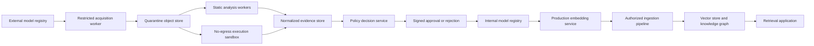
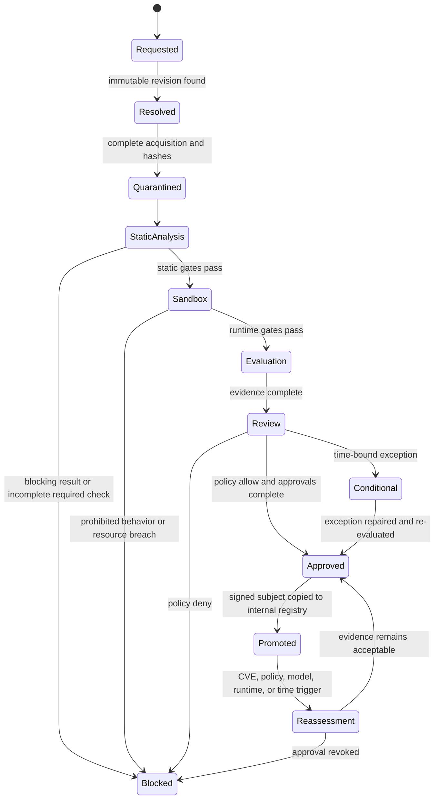

# Model Intake Security Review and Implementation Roadmap

**Status:** Implemented product roadmap with operational model-approval gates remaining per deployment

**Reviewed checkout:** `239f887d9f10e997b9844c916c28073fab71ee79`

**Review date:** 2026-07-28

**Implementation completion review:** 2026-07-29

**Scope:** ShakerScan Model Intake, CodeRankEmbed, CodeSage Base v2, CodeSage Large v2, and the knowledge-graph/vector-embedding deployment path

**Audience:** Security engineering, ML platform, application security, infrastructure, legal/privacy, model owners, and release approvers

## 1. Purpose

This document defines the work needed to turn ShakerScan Model Intake from a useful artifact preflight
check into a defensible corporate model-admission control. It also provides the complete security-review
procedure for the following embedding models:

- `nomic-ai/CodeRankEmbed`
- `codesage/codesage-base-v2`
- `codesage/codesage-large-v2`

The intended use is a corporate knowledge graph whose developers want vector embeddings. Approval must
therefore cover more than the model file. It must cover the repository snapshot, executable model code,
Python and container dependencies, the isolated inference runtime, the embedding pipeline, the vector
store, knowledge-graph authorization, ongoing vulnerability monitoring, and the evidence used to make the
deployment decision.

This is both:

1. A point-in-time audit of the current Model Intake implementation.
2. A target architecture, implementation backlog, operating procedure, and acceptance plan.

It is not an approval of any model, a replacement for legal/privacy review, or a claim that a clean scan
proves a model is safe.

## 2. Executive decision

ShakerScan already provides a meaningful Model Intake foundation. It can resolve a Hugging Face model,
pin a revision, select an artifact, download a bounded prefix, inspect several formats, compare hashes when
enough bytes are present, verify detached signatures with configured trust material, apply policy profiles,
record evidence, and produce a deployment decision.

The text below preserves the point-in-time audit of checkout `239f887`. The implementation completed after
that audit is summarized in section 2.1. Statements phrased as “current condition” in sections 6–7 describe
the reviewed checkout, not the post-roadmap implementation.

The original checkout was not sufficient as the sole corporate approval control for these three models.

The most important reasons are:

1. Remote artifacts and related metadata are fetched before a complete destination-safety decision. An
   attacker-controlled URL can therefore create server-side request forgery exposure unless outbound
   network controls compensate for it.
2. The public download limit is 100 MB, while every target weight artifact is larger than 500 MB. A normal
   run cannot fully hash or fully inspect any of the three weight files.
3. The repository inventory excludes arbitrary Python files. All three models require custom Python code
   through `trust_remote_code=True`, so the most security-sensitive files are outside the present automatic
   review path.
4. SBOM, malware, and evaluation fields are primarily caller-supplied evidence. ShakerScan validates their
   shape and policy presence but does not currently run the underlying SCA, malware, secrets, or model-file
   scanners.
5. Unsafe-serialization detection is a useful heuristic, not a semantic pickle/PyTorch analysis.
6. There is no isolated load-and-inference sandbox, embedding-abuse evaluation, knowledge-graph/vector-store
   control test, native Sigstore/Rekor verification, or signed final approval report.

The recommended admission order is:

1. Build the acquisition, complete-hash, custom-code, SCA, model-scan, and sandbox controls.
2. Pilot CodeRankEmbed in a no-egress sandbox.
3. Pilot CodeSage Base v2, preferably after controlled conversion to `safetensors` and equivalence testing.
4. Admit CodeSage Large v2 only after the Base v2 workflow passes and resource-abuse controls are proven.

Until those conditions are met, the correct corporate decision for all three models is **conditional hold**,
not unconditional approval.

### 2.1 Implementation completion addendum

ShakerScan now implements the roadmap as a model-agnostic admission framework rather than as logic tied to
CodeRankEmbed or CodeSage. The named models remain immediate validation targets, but the same contracts accept
other Hugging Face repositories, HTTPS artifacts, S3, GCS, Azure Blob, OCI registry exports, MLflow exports,
and future source adapters.

Implemented controls include:

- Every-hop SSRF policy, DNS/IP validation and pinning, redirect limits, cross-origin credential stripping,
  HTTPS/private-network policy, exact host/port allowlists, and approval-gated network exceptions.
- Complete streamed acquisition, full SHA-256, content-addressed quarantine, byte/file quotas, safe retention
  preview/execution, and complete pinned Hugging Face repository snapshots.
- Complete normalized manifests, custom-code/`auto_map` inventory, recursive ZIP/TAR analysis, and traversal,
  symlink, device, collision, archive-bomb, nested-archive, and unsafe-serialization gates.
- Generated evidence contracts for pickle semantics, Python AST, secrets, malware rules, CycloneDX SBOM,
  dependencies/SCA adapters, native binaries, and licenses. Caller assertions remain `declared`; they are not
  silently promoted to generated evidence.
- Fail-closed ModelScan, Fickling, ClamAV, Gitleaks, Syft, Trivy, OSV-Scanner, and pip-audit adapters. Missing
  binaries, bad schemas, empty output, timeout, crash, and incomplete coverage cannot satisfy a required gate.
- Atomic detached-signature trust decisions and offline DSSE/in-toto subject verification, with explicit
  transparency-log non-support where no trusted inclusion bundle verifier is configured.
- A separate non-root, read-only, capability-free, no-egress sandbox service with CPU, memory, PID, scratch,
  and wall-time limits. It performs safe-format semantic inspection and prohibits executable serialization;
  operator-provided runtime images remain required for actual custom-code model loading.
- A provider-neutral, content-free embedding/data-plane evaluator for retrieval quality, vector validity,
  dimensionality, collisions, poisoning, sensitive/ACL leakage, tenant boundaries, runtime stability,
  latency/RSS, graph authorization, deletion receipts, cache authorization context, and index/model digest
  compatibility. Raw benchmark vectors are request-transient and are not persisted in scan options.
- Canonical signed admission statements bound to artifact, snapshot, scanner, sandbox, attestation,
  evaluation, findings, and policy digests; deployment verification uses operator trust roots and exact
  expected subjects.
- A durable admission registry with active/denied/reassessment-required/revoked/expired/superseded states,
  event history, automatic worker registration, expiry, scoped trigger ingestion, immediate high-consequence
  revocation, and deploy-time active-registry enforcement.
- UI/API visibility for provider capabilities, complete acquisition, generated scanners, sandbox and
  evaluation gates, signed admission, admission age/reassessment/expiry, and evaluation metrics.

The framework deliberately does not fabricate external evidence. A production profile still blocks until
the operator supplies the pinned scanner binaries/rule databases, an organization-controlled signing key and
deployment trust roots, a purpose-built runtime image for the chosen model loader, a versioned corporate
synthetic benchmark, application/vector-store observations, and the required human/legal/privacy approvals.
Likewise, the CodeRankEmbed and CodeSage model-specific runbooks are not marked complete until real controlled
runs produce the required evidence. These are operational admission inputs, not missing model-specific code.

## 3. Review principles

The implementation and operating process must follow these principles:

- **Pin before inspection.** A mutable branch or tag is not an identity.
- **Acquire once, scan many.** Every scanner must inspect the same content-addressed snapshot.
- **No executable trust by default.** Model code and serialized objects are untrusted programs or data that
  may become programs during loading.
- **No network trust by location.** Internal IP space and cloud metadata endpoints are not valid artifact
  sources.
- **Absence of findings is not proof of absence.** Coverage, tool status, truncation, crashes, and unsupported
  formats must remain visible.
- **Declared evidence is not generated evidence.** A caller saying “malware scan passed” is not equivalent
  to ShakerScan running a pinned scanner and preserving its output.
- **Production decisions require reproducibility.** The model, code, dependencies, configuration, scanner
  versions, policy version, and decision must be reconstructable.
- **The deployment system is in scope.** Security does not stop at the weight file.
- **Prefer fail-closed gates for integrity and execution risk.** Unknown is not pass.

## 4. In-scope assets and trust boundaries

### 4.1 Assets

The review protects:

- Corporate source code, documents, graph records, identities, and access-control metadata.
- Embeddings, vector indexes, retrieval results, and model caches.
- Build credentials, registry credentials, proxy credentials, and signing keys.
- Inference nodes, GPUs, container runtimes, artifact stores, and CI/CD workers.
- ShakerScan evidence, policy decisions, exceptions, and audit trails.
- Downstream applications that consume retrieved knowledge-graph content.

### 4.2 Untrusted inputs

Treat all of the following as untrusted:

- Model repositories and every file in them.
- Model cards, README files, metadata JSON, dependency files, tokenizer files, and configuration.
- Weight formats including pickle-backed PyTorch archives.
- Custom Python imported by Transformers.
- Redirects, DNS answers, HTTP response headers, filenames, archive members, and MIME types.
- Scanner output until its provenance and execution status are verified.
- User documents and source code submitted to the embedding pipeline.
- Text retrieved from the vector store or knowledge graph.

### 4.3 Trust boundaries



Only an immutable, approved artifact from the internal registry may cross into production. Production must
not download model code or weights directly from Hugging Face.

## 5. Model inventory at the reviewed revisions

Model repositories change. The following values are valid only for the named commit revisions and must be
re-resolved and re-verified at intake time.

| Model | Pinned revision | Primary artifact | Size | LFS SHA-256 | License | Important risk |
|---|---|---:|---:|---|---|---|
| CodeRankEmbed | `3c4b60807d71f79b43f3c4363786d9493691f8b1` | `model.safetensors` | 546,938,168 bytes | `827529bcd58aef0d9082e66eeff7e7d53a02f62bd005f841a26b3d3e2fb17ebe` | MIT | Custom remote code despite safer weight format |
| CodeSage Base v2 | `92eac4f44c8674638f039f1b0d8280f2539cb4c7` | `pytorch_model.bin` | 709,569,721 bytes | `4a3ec46f2ba2027c541e159b4f1598ddbc4043ad41ac2b1f704adc69b96bcbfe` | Apache-2.0 | Pickle-backed PyTorch artifact and custom code |
| CodeSage Large v2 | `6e5d6dc15db3e310c37c6dbac072409f95ffa5c5` | `pytorch_model.bin` | 2,627,013,817 bytes | `78a7ed76ffa5ca4e145100610e5541201ca0f3ecc75f1b73433303ae9348c77c` | Apache-2.0 | Same execution risks plus materially larger resource exposure |

Authoritative model records:

- [CodeRankEmbed model page](https://huggingface.co/nomic-ai/CodeRankEmbed) and
  [API record with blobs](https://huggingface.co/api/models/nomic-ai/CodeRankEmbed?blobs=true)
- [CodeSage Base v2 model page](https://huggingface.co/codesage/codesage-base-v2) and
  [API record with blobs](https://huggingface.co/api/models/codesage/codesage-base-v2?blobs=true)
- [CodeSage Large v2 model page](https://huggingface.co/codesage/codesage-large-v2) and
  [API record with blobs](https://huggingface.co/api/models/codesage/codesage-large-v2?blobs=true)

### 5.1 CodeRankEmbed observations

- The repository uses custom configuration and model code, including
  `configuration_hf_nomic_bert.py` and `modeling_hf_nomic_bert.py`.
- The model card instructs consumers to use `trust_remote_code=True`.
- The reviewed source imports PyTorch, Transformers, Safetensors, and Einops. It also contains a
  `torch.load` fallback path, so a safetensors primary artifact does not make the complete repository
  execution-free.
- The model is approximately 137 million parameters and advertises a long context. Long-context attention
  makes memory, latency, batching, and denial-of-service testing important.
- The model is based on Snowflake Arctic Embed lineage. Parent model and dataset provenance must be captured,
  not just the leaf repository.

### 5.2 CodeSage v2 observations

- Base v2 and Large v2 use custom files such as `config_codesage.py`, `modeling_codesage.py`, and
  `tokenization_codesage.py`.
- Their model cards require `trust_remote_code=True`.
- The primary artifacts are `.bin` PyTorch weights and must be treated as unsafe serialization until semantic
  scanners and an isolated load test say otherwise.
- Base v2 is approximately 356 million parameters with a 1,024-dimensional embedding.
- Large v2 is approximately 1.3 billion parameters with a 2,048-dimensional embedding.
- The model cards identify The Stack-derived training data. License, attribution, opt-out, sensitive-code,
  and corporate policy questions remain separate from an Apache-2.0 repository license.
- Base and Large share substantial code lineage. A clean source review can be reused only when file digests
  are identical; artifact and runtime results remain model-specific.

## 6. What ShakerScan Model Intake checks today

The reviewed implementation exposes Model Intake through the request model in
[`api/api.py`](../api/api.py), executes it through [`api/worker.py`](../api/worker.py), and implements the
artifact checks in [`scanner/scanner_tools/model_intake.py`](../scanner/scanner_tools/model_intake.py).

| Control | Current behavior | Security value | Current limitation |
|---|---|---|---|
| Hugging Face resolution | Resolves repository information, selects an artifact, and supports a revision | Reduces ambiguity | Does not create a complete immutable repository snapshot |
| Bounded download | Enforces timeout and byte cap | Limits resource consumption | Prevents complete inspection of all three target artifacts |
| Checksum comparison | Compares a supplied checksum when the complete artifact is observed | Strong integrity when complete | Truncated downloads become `known_unverified_truncated` |
| Safetensors inspection | Parses and validates the structural header | Useful format sanity | Not a full tensor/content or runtime safety proof |
| ZIP/PyTorch hints | Detects ZIP and suspicious serialization markers | Useful preflight | Does not semantically analyze pickle opcodes or all archive members |
| ONNX/GGUF hints | Recognizes and performs bounded format checks | Useful format coverage | Format recognition is not operator allowlisting or execution testing |
| Detached signatures | Supports Ed25519, RSA-PSS, and ECDSA with configured keys/fingerprints | Can prove possession of an expected signing key | No native registry transparency/log policy; subject-digest semantics need tightening |
| License and model card | Checks presence and policy metadata | Supports governance workflow | Presence is not legal approval or content verification |
| Provenance/governance metadata | Applies profile requirements | Gives policy hooks | Much of the evidence is declared by the caller |
| AIBOM | Builds an inventory from known metadata | Provides a starting manifest | Not a generated, complete repository or runtime SBOM |
| Policy profiles | Applies reusable deployment gates | Enables consistent decisions | Does not compensate for missing observations |
| Exceptions/approvals | Product has lifecycle support | Enables governance | Model Intake evidence must bind every exception to exact digests and policy version |

Focused tests at the reviewed commit completed with **40 passed and 1 skipped**:

```text
python3 -m pytest tests/test_model_intake.py tests/test_model_intake_signature_crypto.py -q
```

This result confirms the tested behavior. It does not validate external scanners or controls that are not
implemented.

## 7. Current gaps and required remediations

### 7.1 P0 — Block SSRF and unsafe outbound acquisition

**Current condition:** The request accepts artifact, metadata, signature, and public-key URLs. Scheme
validation occurs before `_fetch_artifact`, but destination scope validation is not consistently enforced
before every connection and redirect. Runtime scope-guard handling occurs too late to be the primary
protection for acquisition.

**Risk:** A user able to submit an intake can make the worker contact loopback, RFC1918, link-local, IPv6
local, cloud metadata, or other internal services. DNS rebinding and redirect chains can bypass a check that
only considers the original string.

**Required design:**

- Move all acquisition into a dedicated, low-privilege worker with no route to internal application,
  database, orchestration, or metadata networks.
- Permit only `https` by default. Make `http` an explicit development-only policy exception.
- Resolve the hostname before connect and reject loopback, private, link-local, multicast, reserved,
  unspecified, documentation, carrier-grade NAT, and organization-denied address ranges for IPv4 and IPv6.
- Pin the validated resolved address for the connection or use a controlled egress proxy that enforces the
  same policy.
- Re-run URL, hostname, DNS, and IP validation for every redirect. Set a small redirect limit.
- Reject embedded credentials, ambiguous authorities, noncanonical ports, invalid IDNs, and URL parser
  disagreement.
- Maintain registry/domain allowlists per policy profile. Do not treat a domain suffix string match as an
  allowlist decision.
- Apply response-header, content-length, decompression-ratio, transfer-duration, and total-byte limits.
- Log a content-free destination decision without persisting credentials or signed query strings.

**Acceptance gate:** Automated tests must cover loopback, RFC1918, link-local, AWS/GCP/Azure metadata
addresses, IPv4-in-IPv6, decimal/octal IP forms, DNS rebinding simulation, redirect-to-private, redirect
loops, cross-scheme redirects, oversized and compressed responses, slow responses, and proxy behavior.

### 7.2 P0 — Acquire and hash complete artifacts

**Current condition:** The request default is 10 MB and the maximum is 100 MB. The smallest target artifact
is over 500 MB. The current correct result for a supplied full-file checksum is therefore
`known_unverified_truncated`, not pass or mismatch.

**Risk:** Malicious content can be placed after the inspected prefix. ZIP central directories and later
members may not be available. The artifact inspected may not be the artifact deployed.

**Required design:**

- Stream the complete artifact to quarantined object storage while calculating SHA-256 and size.
- Separate **retention cap** from **inspection memory cap**. Large files must stream without entering API or
  worker memory as one object.
- Address the object by digest and make it immutable.
- Compare registry LFS digest, caller-required digest, acquired digest, and eventual internal-registry digest.
- Reject mismatches and incomplete transfers. Never relabel incomplete as pass.
- Record exact byte count, digest algorithm, digest, HTTP validators, source URL with secrets removed,
  registry revision, acquisition time, and downloader version.
- Deduplicate scans by digest while preserving a new provenance statement for each acquisition.
- Apply per-tenant storage quotas and retention policy.

**Acceptance gate:** A real public-model E2E must completely acquire and verify each selected artifact, while
the existing capped-partial E2E must continue to report `known_unverified_truncated` rather than a false
hash mismatch.

### 7.3 P0 — Snapshot and inspect the complete repository

**Current condition:** Hugging Face inventory selection focuses on model, tokenizer, dependency, and metadata
filenames. Arbitrary `.py` files are not all selected. The target models execute custom Python code.

**Risk:** The most dangerous repository content may never be downloaded or analyzed. A safe weight file can
be paired with malicious model code, tokenizer code, import hooks, build scripts, or dynamic imports.

**Required design:**

- Enumerate every file at the pinned commit through the registry API.
- Acquire every file needed to reproduce loading, plus all executable and governance files. Default to a
  complete snapshot unless a policy explicitly excludes a known-safe large file class.
- Include `.py`, shell scripts, notebooks, shared libraries, wheels, archives, configuration, tokenizer,
  requirements, lockfiles, model cards, licenses, Git attributes, and registry metadata.
- Preserve the path, mode, size, digest, LFS identity, and source revision for every file.
- Reject path traversal, symlinks that escape the snapshot, device nodes, case-collision attacks, duplicate
  normalized paths, and oversized file counts.
- Detect dynamic module mappings such as `auto_map` and identify which classes require remote code.
- Produce a repository manifest before any scanner runs.

**Acceptance gate:** A fixture containing benign weights and a malicious unreferenced Python file must still
scan and block. The CodeRankEmbed and CodeSage custom-code files must appear in the produced manifest and
evidence.

### 7.4 P0 — Generate evidence; do not accept assertions as scan results

**Current condition:** SBOM, malware, and evaluation policy logic validates caller-provided metadata. The
current AIBOM is derived from known metadata and its check does not prove a scanner ran.

**Risk:** A mistaken or malicious caller can satisfy a gate with unverified claims. Approvers cannot tell
whether a field was declared, attested by a third party, or generated by ShakerScan.

**Required design:** Every evidence item must have one of these provenance classes:

| Class | Meaning | Production-gate eligibility |
|---|---|---|
| `declared` | Supplied by the requester or model publisher | Context only unless policy explicitly allows it |
| `externally_attested` | Signed by an allowed external identity and bound to exact digest | Eligible when attestation policy passes |
| `shakerscan_generated` | Produced by a pinned ShakerScan worker/tool against a content-addressed object | Eligible |

The evidence record must include artifact digest, snapshot digest, tool and version, rules/database version,
command contract, start/end time, exit code, normalized status, raw-result digest, worker image digest, and
policy version. User-supplied metadata must never be silently promoted to generated evidence.

### 7.5 P0 — Tighten signature and attestation semantics

**Current condition:** Detached cryptographic verification exists, but a cryptographically valid signature
can be represented separately from an attestation subject-digest mismatch. The public schema exposes
`require_signature_verification`; the internal/documented notion of requiring cryptographic verification is
not consistently surfaced as an independent public policy control.

**Required decision rule:** An artifact signature passes only when all are true:

1. The complete artifact was observed and its digest computed.
2. The signature is cryptographically valid.
3. The signer key or workload identity is allowed by policy.
4. The signed subject digest exactly equals the acquired artifact digest.
5. The signature/attestation type, algorithm, issuance time, and trust-root status meet policy.
6. Required transparency-log and inclusion-proof checks pass when the profile requires them.

Add native verification contracts for Sigstore/Cosign, Rekor inclusion, DSSE, and in-toto/SLSA provenance.
Offline verification must use a trusted bundle captured at acquisition time. Keyless identity policy must
bind issuer and subject, not merely accept any valid Fulcio certificate.

### 7.6 P0 — Add semantic unsafe-model analysis

**Current condition:** `_looks_like_pickle` uses bounded prefix and marker heuristics, while ZIP inspection is
shallow. CodeSage `.bin` files are conservatively flagged, which is appropriate, but the result is not a
semantic analysis.

**Required design:**

- Run [ModelScan](https://github.com/protectai/modelscan) against the complete repository and each supported
  artifact.
- Run [Fickling](https://github.com/trailofbits/fickling) and Python `pickletools` analysis for pickle-backed
  objects, including pickle members inside PyTorch ZIP containers.
- Inspect every archive member recursively within bounded depth, count, expanded size, and ratio.
- Maintain an explicit format/operator allowlist per policy. Unknown opcodes, globals, reducers, extensions,
  persistent IDs, and dynamic imports must block or require review.
- Pin scanner versions and scanner images. A scanner itself processes hostile input and is part of the attack
  surface.
- Keep multiple engines. No individual pickle scanner is a complete security boundary.
- Treat scanner timeout, crash, unsupported format, partial analysis, or database failure as non-pass.

The current Fickling release and advisories must be reviewed before pinning. A tool designed to inspect
hostile serialization must receive the same dependency, sandbox, and update discipline as the model loader.

### 7.7 P1 — Generate SBOMs and perform SCA

Model weights do not have CVEs in the same way as conventional packages. SCA applies to custom model code,
Python packages, native libraries, base images, GPU runtimes, model servers, and supporting services.

The recommended tool set is layered:

| Purpose | Primary tool | Complement | Required output |
|---|---|---|---|
| Repository/runtime SBOM | [Syft](https://oss.anchore.com/) | Trivy SBOM | CycloneDX JSON and SPDX JSON |
| SBOM vulnerability match | Grype | Trivy | Vulnerabilities with package evidence and DB version |
| Python dependency audit | [pip-audit](https://github.com/pypa/pip-audit) | OSV-Scanner | PyPI advisories and dependency paths |
| Source/lock/container scan | [OSV-Scanner](https://google.github.io/osv-scanner/usage/) | Trivy | OSV IDs, reachability/context where available |
| Filesystem/image scan | [Trivy](https://trivy.dev/docs/latest/target/filesystem/) | Grype | Vulnerability, secret, misconfiguration, and license results |
| License inventory | ScanCode or ORT | Trivy license scan | License expressions, files, and obligations |

Representative scanner commands for a quarantined snapshot are:

```bash
syft dir:/snapshot -o cyclonedx-json=sbom.cdx.json
syft dir:/snapshot -o spdx-json=sbom.spdx.json
grype sbom:sbom.cdx.json -o json
trivy fs --scanners vuln,secret,misconfig,license --format json /snapshot
pip-audit -r /snapshot/requirements.lock --format=json
osv-scanner scan source -r /snapshot --format json
```

These are command contracts, not instructions to run untrusted code on the ShakerScan API host. Execute them
in disposable, no-egress scanner workers with read-only input and bounded output. Do not invoke automatic
fix/remediation modes against untrusted repositories because package-manager hooks and scripts can execute.

Required SCA policy:

- Resolve an exact, hash-locked runtime environment. A repository with no lockfile is incomplete, not clean.
- Scan both source-declared and actually installed dependencies.
- Include the Transformers remote-code loader, PyTorch, Safetensors, Tokenizers, Einops, NumPy, CUDA/ROCm,
  OS packages, model server, and base image.
- Preserve dependency paths and distinguish direct from transitive dependencies.
- Define severity, exploitability, fix availability, age, and exception gates.
- Re-scan on advisory database updates even when the model digest has not changed.

### 7.8 P1 — Add malware, secrets, and native-binary scanning

Run at least:

- YARA with versioned organization and community rule sets.
- ClamAV or an approved enterprise anti-malware engine.
- Gitleaks or TruffleHog against the complete snapshot and relevant Git history metadata.
- File-type identification by magic bytes, not extension.
- Native binary inventory, signature checks where available, strings/import analysis, and platform hardening
  checks for `.so`, `.dll`, `.dylib`, wheels, and executables.
- Archive bomb, recursive archive, path traversal, symlink, and polyglot detection.

[Hugging Face documents malware scanning](https://huggingface.co/docs/hub/main/en/security-malware),
[secret scanning](https://huggingface.co/docs/hub/security-secrets), and
[Protect AI scanning](https://huggingface.co/docs/hub/security-protectai). These registry signals are useful
external evidence, but corporate intake must still generate its own evidence because registry scans can be
incomplete, stale, bypassed, or governed by a different policy.

### 7.9 P1 — Execute in a hardened sandbox

Static checks cannot prove how custom model code behaves when imported or invoked. A deterministic dynamic
stage is required.

The sandbox must have:

- A disposable microVM or equivalently isolated runtime. Prefer a microVM for untrusted custom code.
- No network route and no proxy credentials.
- No host filesystem mounts. Provide only a read-only content-addressed snapshot and scratch storage.
- No cloud metadata, Docker socket, Kubernetes service-account token, SSH agent, GPU management socket, or
  production secret.
- A non-root UID, read-only root filesystem, dropped capabilities, seccomp, AppArmor/SELinux, PID limits,
  memory limits, CPU limits, file-size limits, open-file limits, and wall-clock timeout.
- No package installation at runtime. Build the exact dependency image in a separate controlled pipeline.
- Separate import, construction, weight-load, tokenize, encode, and teardown phases with telemetry.
- System-call, file-write, process-spawn, DNS/connect, and module-import monitoring.
- Snapshot destruction after evidence collection.

Dynamic tests must detect:

- Unexpected network or DNS attempts.
- Child process, shell, compiler, or package-manager execution.
- Reads outside the model/runtime directories.
- Writes outside the approved cache/scratch directories.
- Dynamic library loading not present in the runtime manifest.
- Excessive file descriptors, threads, processes, disk, memory, GPU memory, CPU, or wall time.
- Nondeterministic or environment-sensitive loading.
- Exceptions, hangs, crashes, and malformed-input behavior.

### 7.10 P1 — Add embedding-specific security and quality evaluation

A model can be free of malware and still be unsuitable. Build a versioned corporate evaluation corpus with
public, internal-synthetic, and access-labeled cases. Do not put production secrets in a general benchmark.

Evaluate:

- Retrieval quality on code search, documentation search, entity linking, and graph-neighbor retrieval.
- Language and framework coverage important to the organization.
- Very long, empty, binary-like, Unicode-confusable, repeated-token, and adversarial inputs.
- Prompt-injection-like strings embedded in code comments and documents. Embeddings are not instructions,
  but retrieved text can later influence an LLM.
- Poisoning: repeated attacker-controlled phrases, nearest-neighbor hijacking, trigger strings, and malicious
  documents designed to dominate search.
- Cross-tenant and cross-ACL retrieval leakage.
- Membership inference and embedding inversion risk using synthetic sensitive data.
- Stability across CPU/GPU, batching, precision, library versions, and safetensors conversion.
- Norm distribution, NaN/Inf, degenerate vectors, excessive collisions, unexpected dimensionality, and
  anomalous similarity clusters.
- Throughput, p50/p95/p99 latency, peak RSS, GPU memory, startup time, and worst-case input amplification.

Define minimum quality and maximum resource thresholds before results are known. A security exception must
not be used to waive unacceptable retrieval quality or capacity risk.

### 7.11 P1 — Test the knowledge graph and vector store

The data plane needs its own controls:

- Classify every source record before embedding.
- Exclude secrets, credentials, private keys, regulated fields, and unsupported data classes before chunking.
- Propagate source identity, tenant, classification, ACL, retention, and deletion metadata to every chunk,
  embedding, graph node, and edge.
- Enforce authorization before similarity search whenever supported. Post-filtering an already retrieved
  unauthorized result is insufficient when the service or logs can observe it.
- Use separate indexes or cryptographic/administrative isolation where the vector database cannot enforce
  row-level ACLs safely.
- Prevent graph traversal from crossing an authorization boundary through an allowed starting node.
- Re-authorize at retrieval time; do not assume the ACL at indexing time remains valid.
- Ensure cache keys include tenant, principal, authorization context, model digest, and index version.
- Encrypt in transit and at rest; manage keys through corporate KMS and separation of duties.
- Authenticate services with short-lived workload identity and least privilege.
- Rate-limit ingestion, embedding, query, and graph expansion. Bound `top_k`, traversal depth, result size,
  and query cost.
- Keep user text and retrieved content out of logs by default. Record identifiers and digests where possible.
- Implement source deletion, chunk deletion, vector deletion, graph-edge deletion, cache purge, backup expiry,
  and reindex receipts.
- Test index rebuild and model rollback. Embeddings from incompatible models must not silently share an index.
- Separate untrusted retrieved content from system instructions in downstream LLM applications.

### 7.12 P2 — Produce a signed decision package

The final report must be machine-verifiable and human-readable. It should include:

- Requester, business owner, technical owner, security reviewer, and approver.
- Intended use, prohibited uses, environment, data classes, and expected users.
- Repository, pinned revision, complete file manifest, snapshot digest, artifact digests, and internal-registry
  identity.
- Model lineage, model card, license evidence, training-data declarations, and legal/privacy decisions.
- Exact runtime SBOM and image digest.
- Every scanner status, version, rules/database version, findings, raw-output digest, and evidence location.
- Sandbox configuration and observed behavior.
- Embedding, performance, poisoning, and authorization evaluation results.
- Policy profile/version, input digest, decision, rationale, blocking findings, accepted risks, exceptions,
  owners, expiry, and compensating controls.
- Signature or attestation over the complete report subject and the approved artifact/runtime digests.

Produce CycloneDX and in-toto/SLSA-compatible evidence where practical, and sign the admission statement with
an organization-controlled workload identity. The deployed system must verify the admission statement before
pulling or loading the model.

### 7.13 P2 — Correct documentation and public contract mismatches

Current documentation describes archive coverage more broadly than the runtime provides. The implementation
performs ZIP-specific inspection; it does not yet provide equivalent complete `tar.gz` analysis. Documentation
and runtime behavior must use the same supported-format registry.

The API, policy schema, UI, report, and docs must consistently distinguish:

- Signature present.
- Cryptographic signature valid.
- Signer trusted.
- Attestation subject digest matched.
- Transparency requirement satisfied.
- Complete artifact observed.

## 8. Target Model Intake architecture

### 8.1 Components

1. **Intake controller** — validates the request, resolves policy, issues a job, and never parses model bytes.
2. **Registry resolver** — resolves an immutable revision and complete repository manifest using a registry
   adapter.
3. **Acquisition worker** — performs safe egress, streams full files, hashes them, and stores immutable
   quarantine objects.
4. **Manifest service** — normalizes paths, formats, digests, provenance, dependencies, and execution mappings.
5. **Static scanner workers** — run model, serialization, SCA, malware, secret, license, and native-binary
   tools in isolated containers.
6. **Runtime builder** — creates a hash-locked internal runtime image without executing repository build hooks
   on a privileged host.
7. **Dynamic sandbox** — imports, loads, and evaluates the model under no-egress microVM isolation.
8. **Evaluation harness** — measures embeddings, abuse resistance, authorization separation, and capacity.
9. **Evidence store** — keeps immutable raw results and normalized summaries bound to digests.
10. **Policy decision point** — converts complete evidence into block, review, conditional approval, or approval.
11. **Attestation signer** — signs the decision and approved subject digests.
12. **Internal registry/promoter** — copies only approved artifacts and runtimes into production distribution.
13. **Continuous monitor** — re-evaluates CVEs, rules, policy, signatures, exceptions, and registry drift.

### 8.2 State machine



No transition may skip a required state. Retrying a failed scanner creates a new execution record; it does not
overwrite the failure.

## 9. Scanner plug-in contract

Adding tools as one-off shell commands will make policy and reporting unreliable. Every scanner should use a
versioned plug-in contract.

### 9.1 Required inputs

- `scan_id`, `intake_id`, and `execution_id`
- Snapshot and artifact digests
- Read-only local object paths
- Declared format/media type and detected format/media type
- Policy profile and limits
- Expected tool image digest and command template
- Network policy, normally `none`

### 9.2 Required normalized statuses

| Status | Meaning | May satisfy a required production control? |
|---|---|---|
| `PASS` | Tool completed and found no policy-relevant issue | Yes |
| `FAIL` | Tool completed and found a blocking issue | No |
| `WARNING` | Tool completed with reviewable concerns | Only if policy allows and reviewer resolves it |
| `NOT_APPLICABLE` | Check is provably irrelevant to this subject | Yes, with reason |
| `UNSUPPORTED` | Tool cannot analyze this subject | No |
| `TIMEOUT` | Execution exceeded a bound | No |
| `CRASHED` | Tool or worker failed | No |
| `INCOMPLETE` | Only part of the subject was analyzed | No |
| `SKIPPED_BY_POLICY` | Policy intentionally omitted the check | Only when the profile explicitly permits it |

An exit code of zero is not automatically `PASS`. The adapter must parse and validate the expected result
schema. Empty or malformed output is `CRASHED` or `INCOMPLETE`.

### 9.3 Example normalized result

```json
{
  "schema_version": "model-intake-scanner-result/v1",
  "intake_id": "uuid",
  "execution_id": "uuid",
  "scanner": {
    "name": "modelscan",
    "version": "pinned-version",
    "image_digest": "sha256:...",
    "rules_digest": "sha256:..."
  },
  "subject": {
    "kind": "repository_snapshot",
    "digest": "sha256:...",
    "complete": true
  },
  "execution": {
    "status": "PASS",
    "exit_code": 0,
    "network": "none",
    "started_at": "RFC3339",
    "finished_at": "RFC3339",
    "raw_result_digest": "sha256:..."
  },
  "coverage": {
    "files_discovered": 18,
    "files_supported": 18,
    "files_analyzed": 18,
    "bytes_discovered": 709569721,
    "bytes_analyzed": 709569721
  },
  "findings": []
}
```

## 10. End-to-end corporate model security-review procedure

### Step 1 — Open the intake and establish ownership

Record:

- Requester, business owner, model owner, platform owner, security reviewer, and approver.
- Business purpose and why an external model is needed.
- Candidate models and a simpler/safer alternative.
- Data classifications, tenants, jurisdictions, retention, and downstream systems.
- Production, development, research, or offline-only environment.
- Required quality, latency, availability, and cost targets.
- Whether custom code, GPUs, internet egress, or privileged libraries are expected.
- Authorization to download and test the model.

Reject incomplete ownership. A model without a named owner cannot receive a production exception.

### Step 2 — Resolve and freeze the source

- Resolve the full commit SHA from the named repository.
- Enumerate all files and LFS objects at that revision.
- Capture registry metadata and publisher identity information.
- Record parent-model and dataset lineage.
- Reject mutable-only identifiers for production intake.
- Place the repository on a monitoring watch for later changes, deletion, malware flags, or ownership changes.

### Step 3 — Acquire into quarantine

- Use the restricted acquisition worker.
- Stream all files to a content-addressed quarantine store.
- Compute hashes and compare registry digests.
- Normalize and validate paths.
- Do not import, deserialize, render notebooks, or run package tooling during acquisition.
- Produce and freeze the repository manifest.

### Step 4 — Verify authenticity and provenance

- Verify publisher signatures or attestations when available.
- Verify subject digest and trusted identity.
- Check transparency records and inclusion proofs when required.
- Evaluate SLSA/in-toto provenance for any produced binaries or containers.
- Record what is not signed. “Unsigned” is a factual result, not an automatic vulnerability severity; policy
  decides whether it blocks.
- Mirror approved subjects only after the decision is signed.

### Step 5 — Identify formats and executable surfaces

- Identify every file by magic bytes and structure.
- Extract archives with safe bounded logic.
- Detect pickle, PyTorch ZIP, safetensors, ONNX, GGUF, TensorFlow, Keras, joblib, native binaries, scripts,
  notebooks, and unknown formats.
- Parse Transformers `auto_map`, tokenizer mappings, entry points, imports, dynamic imports, and load paths.
- Build a load graph showing which code and data are reached by the intended API call.
- Scan the complete repository even when a file is not in the nominal load graph.

### Step 6 — Perform model and serialization scans

- Run ModelScan.
- Run Fickling and pickletools for pickle-compatible content.
- Run structural validators for safetensors and other supported formats.
- Compare results across engines; investigate disagreement.
- Block unsafe globals, reducers, executable payloads, unsupported serialization, incomplete coverage, and tool
  failures according to policy.

### Step 7 — Review custom source code

Perform automated and manual review of all custom code:

- Semgrep/Bandit rules for command execution, unsafe deserialization, temporary files, path traversal, archive
  extraction, weak crypto, and network use.
- Secret scan and high-entropy review.
- Imports, monkey-patching, metaprogramming, `eval`/`exec`, subprocess, `os.system`, `ctypes`, dynamic libraries,
  package installation, and environment-variable access.
- File access, network clients, telemetry, download helpers, and cache behavior.
- Transformers registration and remote-code entry points.
- `torch.load` call sites and whether `weights_only` is enforced where supported.
- Native extension loading and fallback paths.
- Diff against upstream parent code and prior approved revisions.

The manual reviewer must record files reviewed, commit/digest, findings, disposition, and reviewer identity.
A cursory review is not sufficient for a production gate.

### Step 8 — Resolve, lock, and scan dependencies

- Infer minimum compatible versions but produce an exact organization-approved lock.
- Download packages through the approved package proxy into quarantine.
- Verify package hashes and signatures where policy requires them.
- Generate SBOMs for the source snapshot and the actual runtime image.
- Run pip-audit, OSV-Scanner, Grype, and Trivy as applicable.
- Review licenses for direct and transitive components.
- Block prohibited packages, critical exploitable vulnerabilities, unapproved package indexes, unhashed direct
  URLs, and unresolved dependency conflicts.

### Step 9 — Scan for malware, secrets, and suspicious binaries

- Run YARA, anti-malware, and secret scanners.
- Analyze native binaries and wheels.
- Review registry-provided scan indicators as external evidence.
- Quarantine any positive result until independently resolved.
- Never publish malicious samples or raw secrets in normal findings or reports.

### Step 10 — Build the candidate runtime

- Use a minimal, digest-pinned base image.
- Install only locked packages from the approved proxy.
- Disable build network after dependencies are present.
- Do not execute arbitrary repository setup scripts.
- Generate an image SBOM and scan the completed image.
- Sign the image and bind it to the model snapshot digest.
- Store it in a non-production internal registry namespace pending approval.

### Step 11 — Run sandbox loading and inference

- Import custom modules.
- Construct tokenizer and model.
- Load weights from the quarantined subject.
- Run deterministic known-answer embeddings.
- Run malformed and boundary inputs.
- Record system calls, file writes, imports, processes, network attempts, resources, and exceptions.
- Repeat with intended precision, device, batching, and maximum input length.
- Destroy the sandbox after collecting signed evidence.

### Step 12 — Evaluate model behavior and operational safety

- Run the corporate retrieval benchmark.
- Run poisoning and nearest-neighbor hijack cases.
- Test sensitive-data and ACL-separated corpora.
- Measure capacity and worst-case resource usage.
- Confirm embeddings contain no NaN/Inf and dimensions/norms match expectations.
- Establish thresholds and compare with the approved baseline model.

### Step 13 — Test application, vector-store, and graph controls

- Trace data from source authorization through chunking, embedding, storage, graph edges, retrieval, cache, and
  downstream use.
- Execute cross-user, cross-role, and cross-tenant negative tests.
- Test ACL changes after indexing.
- Test deletion and reindex receipts.
- Verify backup, replica, analytics, and logging behavior.
- Validate injection-safe handling of retrieved text by downstream LLMs or agents.

### Step 14 — Run policy and human review

- Verify all required scanner executions are complete and current.
- Resolve findings or create time-bound exceptions with owner, approver, compensating control, and expiry.
- Obtain security, ML platform, application owner, legal/license, and privacy approval as required by data and
  use case.
- Do not allow the requester to be the sole approver.

### Step 15 — Sign, promote, and deploy

- Generate the final decision package.
- Sign the admission statement.
- Promote the exact snapshot and runtime image to the production internal registry.
- Configure deployment admission to require the signature and exact subject digests.
- Start with a canary, resource limits, no unnecessary egress, and explicit rollback.
- Create a fresh index namespace; do not mix incompatible embeddings.

### Step 16 — Continuously monitor and reassess

Trigger reassessment on:

- New model revision, changed file digest, changed runtime, or changed loader configuration.
- New CVE, malware rule, secret rule, unsafe-model rule, or scanner version.
- Policy or data-classification change.
- Exception expiry.
- Upstream repository compromise, deletion, ownership transfer, or newly reported security issue.
- Material retrieval drift, resource regression, poisoning indicator, or authorization incident.
- Scheduled review interval even without an event.

The monitor may revoke approval. Revocation must stop new deployments, alert owners, preserve evidence, and
start rollback/reindex procedures according to incident severity.

## 11. Model-specific runbooks

### 11.1 CodeRankEmbed

Required evidence before a controlled pilot:

1. Complete snapshot of revision `3c4b60807d71f79b43f3c4363786d9493691f8b1`.
2. Full SHA-256 verification of `model.safetensors` against
   `827529bcd58aef0d9082e66eeff7e7d53a02f62bd005f841a26b3d3e2fb17ebe`.
3. Safetensors structural and tensor inventory validation.
4. Full static and manual review of `configuration_hf_nomic_bert.py`,
   `modeling_hf_nomic_bert.py`, and every other Python file.
5. Explicit review of all `torch.load` fallback paths and proof that the production load path uses the
   approved safetensors artifact.
6. Hash-locked runtime with exact PyTorch, Transformers, Safetensors, Tokenizers, Einops, and native runtime.
7. Complete source and image SBOM plus SCA, secret, malware, and license results.
8. No-egress import/load/encode test with syscall and resource telemetry.
9. Long-context resource tests, including maximum-length and repeated-token inputs.
10. Corporate code-search and knowledge-graph retrieval benchmark.

Recommended initial decision: **controlled pilot only**. Safetensors reduces weight-deserialization risk but
does not reduce custom remote-code risk. The production runtime should package reviewed code internally and
must not use network-based `trust_remote_code` loading.

### 11.2 CodeSage Base v2

Required evidence before a controlled pilot:

1. Complete snapshot of revision `92eac4f44c8674638f039f1b0d8280f2539cb4c7`.
2. Full SHA-256 verification of `pytorch_model.bin` against
   `4a3ec46f2ba2027c541e159b4f1598ddbc4043ad41ac2b1f704adc69b96bcbfe`.
3. ModelScan, Fickling, pickletools, archive-member, malware, and YARA analysis of the complete `.bin`.
4. Full static and manual review of `config_codesage.py`, `modeling_codesage.py`,
   `tokenization_codesage.py`, and every other executable file.
5. Locked runtime SBOM and all SCA/license gates.
6. No-egress sandbox load from the original artifact.
7. Controlled conversion to safetensors if the model can be loaded safely in quarantine.
8. Re-scan the converted artifact, sign it internally, and verify tensor names, shapes, dtypes, and values.
9. Compare known-answer embeddings between original and converted representations under a documented numeric
   tolerance.
10. Run the retrieval, poisoning, ACL, and resource suite.

Recommended initial decision: **evaluate before Large v2**. Base limits blast radius and operational cost while
validating the CodeSage code path. Conversion does not erase the need to review how the original artifact was
loaded or prove that conversion was isolated.

### 11.3 CodeSage Large v2

Perform every Base v2 step against revision `6e5d6dc15db3e310c37c6dbac072409f95ffa5c5` and digest
`78a7ed76ffa5ca4e145100610e5541201ca0f3ecc75f1b73433303ae9348c77c`.

Additional gates:

- Prove the custom code files are byte-identical to the already reviewed Base files or perform a fresh diff
  and review.
- Increase acquisition, scanner, sandbox, and registry quotas for a 2.6 GB artifact without relaxing global
  safety limits.
- Measure cold-start, peak host memory, GPU memory, concurrency, maximum-length input, and out-of-memory
  recovery.
- Confirm resource exhaustion cannot destabilize colocated services.
- Demonstrate a material quality benefit over Base v2 for the corporate corpus. Size alone is not a security
  or business justification.

Recommended initial decision: **hold until Base v2 succeeds**.

## 12. Policy model

ShakerScan currently uses saved Python policy profiles. Keep that path for compatibility, but make evidence
and policy inputs stable enough that an external engine such as OPA could be added later without redefining
security semantics.

### 12.1 Decision outcomes

- `BLOCKED` — a mandatory control failed or required evidence is incomplete.
- `REVIEW_REQUIRED` — evidence is complete but a human decision is required.
- `CONDITIONALLY_APPROVED` — a time-bound exception permits a constrained use.
- `APPROVED` — all required controls and approvals pass for the exact subject and use.
- `REVOKED` — a prior approval is no longer valid.

Do not reduce this to a numeric score. A high score must never override an integrity mismatch, untrusted
signature, unsafe deserialization, prohibited sandbox behavior, or authorization failure.

### 12.2 Minimum production blockers

Production must block when any of the following is true:

- Revision or any required artifact is mutable or incomplete.
- Full digest does not match the required digest.
- Repository snapshot or deployed runtime differs from the reviewed subjects.
- Required signature, identity, subject digest, or transparency verification fails.
- A required scanner is unsupported, timed out, crashed, or incomplete.
- Unsafe serialization or executable model content is unresolved.
- Custom code has not received required automated and manual review.
- Critical/high vulnerabilities violate the configured exploitability/fix/exception policy.
- Malware or secret detection is unresolved.
- Sandbox shows network access, process execution, unauthorized file access, or resource-limit violation.
- License/privacy/data-provenance approval is missing.
- Cross-tenant or cross-ACL retrieval succeeds.
- Required exception is expired.
- Final attestation is absent or its subject does not match the deployed artifacts.

## 13. Implementation roadmap

The phases are ordered by risk dependency, not calendar estimate.

### Phase 0 — Contract and immediate containment

**Work:**

- Document current Model Intake as a preflight, not a complete approval.
- Add explicit UI/API/report language for partial downloads and caller-declared evidence.
- Disable or tightly allowlist remote acquisition in corporate profiles until the SSRF boundary is fixed.
- Define evidence provenance, scanner statuses, subject identities, and decision outcomes.
- Reconcile archive/signature documentation with actual runtime behavior.

**Exit criteria:** No user can interpret truncated, declared, skipped, crashed, or unsupported evidence as a
pass. Corporate deployments have an egress control that compensates for the current fetch path.

### Phase 1 — Safe full acquisition and immutable manifests

**Work:**

- Implement the restricted acquisition worker.
- Add pre-connect and per-redirect URL/DNS/IP policy.
- Stream complete objects to quarantine with full hashes.
- Create complete Hugging Face repository snapshots and normalized manifests.
- Add object-store quotas, deduplication, retention, and cleanup.
- Bind existing signature verification to complete subject digests.

**Exit criteria:** The three target repositories and artifacts can be acquired completely and reproducibly,
with SSRF and archive/path negative tests passing.

### Phase 2 — Generated static evidence

**Work:**

- Implement the scanner plug-in framework.
- Integrate ModelScan, Fickling/pickletools, YARA, anti-malware, and secret scanning.
- Integrate Syft, Grype, Trivy, pip-audit, and OSV-Scanner.
- Add code analysis and review workflow for custom Python.
- Add license inventory and human decision recording.
- Persist raw and normalized evidence with tool/rules/image digests.

**Exit criteria:** No production gate depends on an unattested caller assertion. Complete fixture and public
model snapshots receive deterministic multi-tool results.

### Phase 3 — Runtime construction and dynamic sandbox

**Work:**

- Build locked candidate runtime images through the controlled package proxy.
- Add image SBOM, SCA, signature, and snapshot binding.
- Implement no-egress microVM loading and inference.
- Add syscall, file, process, import, network, and resource observations.
- Add safetensors conversion and equivalence workflow for approved cases.

**Exit criteria:** CodeRankEmbed and CodeSage Base can be loaded and exercised without exposing corp networks,
credentials, or host state. Prohibited behavior and limit breaches reliably block.

### Phase 4 — Model and application evaluation

**Work:**

- Build the versioned corporate embedding benchmark.
- Add poisoning, adversarial input, sensitive-data, inversion, stability, and resource tests.
- Build vector-store and knowledge-graph ACL test harnesses.
- Add deletion, reindex, rollback, and incompatible-index tests.
- Define quality and capacity thresholds by use case.

**Exit criteria:** Each approval contains empirical evidence for the intended corpus, runtime, authorization
model, and operational bounds.

### Phase 5 — Signed admission and continuous monitoring

**Work:**

- Generate signed, machine-readable decision packages.
- Add Sigstore/Cosign, Rekor, DSSE, and in-toto/SLSA verification where policy requires them.
- Enforce signed subject admission in deployment.
- Add CVE/rules/policy/upstream-drift reassessment.
- Add revocation, rollback, reindex, and owner notification workflows.
- Surface fleet/tool/database freshness in UI and reports.

**Exit criteria:** Production can load only exactly approved subjects, and a later risk event can automatically
invalidate approval without losing the historical evidence trail.

## 14. Test and acceptance strategy

### 14.1 Unit tests

- URL parsing, hostname canonicalization, IP-range classification, redirect policy, and DNS decisions.
- Streaming hashes, byte counts, interrupted transfers, resume behavior, and digest mismatch.
- Path normalization, archive limits, symlink escape, duplicate paths, and case collisions.
- Evidence provenance and status transitions.
- Policy behavior for every non-pass status.
- Signature algorithm, key trust, subject digest, identity, time, and transparency combinations.
- Result-adapter validation for malformed, empty, contradictory, and oversized scanner output.

### 14.2 Contract tests

- Every plug-in against golden tool outputs and known malicious fixtures.
- Tool upgrade comparison before changing a pinned version.
- CycloneDX/SPDX schema validation.
- Decision-package and attestation schema compatibility.
- Registry adapter behavior against recorded Hugging Face responses.

### 14.3 Security regression fixtures

Maintain content-safe fixtures for:

- Benign safetensors and malformed headers.
- Benign pickle and blocked pickle opcode/global patterns.
- PyTorch ZIP with a malicious later member.
- Nested archives, archive bombs, traversal paths, escaping symlinks, and polyglots.
- Malicious unreferenced `.py` file.
- Secret-like tokens and verified dummy test secrets.
- Native binary and unsupported format.
- Scanner timeout, crash, partial output, false exit code, and stale database.
- SSRF destinations and redirect/DNS bypasses.
- Sandbox network, subprocess, host-file, memory, disk, PID, and timeout violations.

Do not place live malware, live credentials, or uncontrolled exploit samples in the normal repository.
Use access-controlled security-fixture storage where stronger samples are necessary.

### 14.4 Integration tests

- Request through policy decision with a local registry fixture.
- Complete acquisition to object storage and fan-out to multiple scanners.
- Worker retry without duplicate or overwritten evidence.
- Exception creation, expiry, repair, and re-evaluation.
- Approval promotion to internal registry and rejection of a digest variant.
- Continuous reassessment after a synthetic CVE/rules update.

### 14.5 Real-model E2E tests

- Preserve `make e2e-model-intake` semantics for the public-model path.
- Preserve `make e2e-model-intake-fixture` for intentional network isolation.
- Add explicit full-artifact jobs for CodeRankEmbed and CodeSage Base in a controlled, quota-aware environment.
- Keep Large v2 out of ordinary PR tests; run it in scheduled/release infrastructure with sufficient storage
  and resource budgets.
- Stamp expected worker build, scanner image digests, and rule/database freshness at submission.
- Never convert a capped partial download into a full-integrity assertion.

### 14.6 Application-control tests

- User A cannot retrieve User B-only vectors or graph facts.
- Tenant A cannot influence Tenant B nearest neighbors.
- Revoking source access prevents future retrieval without waiting for a complete platform redeploy.
- Deletion removes source, chunks, vectors, graph edges, caches, replicas, and eventually backups according to
  policy.
- A changed model digest cannot write to an old incompatible index.
- Downstream LLM prompts isolate retrieved content from trusted instructions.
- Logs, traces, metrics, and failure reports do not expose source content or embeddings unnecessarily.

## 15. Observability and operations

Expose metrics and alerts for:

- Intake volume, state, age, queue time, and failure reason.
- Bytes acquired, storage quota, transfer interruption, redirect rejection, and SSRF-policy rejection.
- Scanner duration, status, coverage, crash/timeout rate, version, and rules/database age.
- Sandbox resource peaks and prohibited events.
- Decision count by outcome, policy version, model, owner, and environment.
- Exception count, age, and approaching expiry.
- Approval age, reassessment due date, revocation, and deployed-subject mismatch.
- Retrieval authorization failures, anomalous query rate, poisoning indicators, and resource saturation.

Logs must use stable IDs and digests, not raw model URLs with signed credentials, source documents, secrets,
embeddings, or scanner payloads. Access to raw evidence must be audited and limited by role.

## 16. Incident response and rollback

Prepare runbooks for:

1. Upstream model or account compromise.
2. Newly discovered unsafe serialization or custom-code vulnerability.
3. Vulnerability in the inference runtime, GPU stack, or model server.
4. Secret found in a repository snapshot or runtime.
5. Cross-tenant retrieval or graph authorization leak.
6. Poisoned corpus or index.
7. Incorrect deletion or retention.
8. Scanner compromise or materially incorrect scanner result.

Minimum response actions are: identify deployed digests, revoke the admission statement, stop new deployment,
isolate affected services, preserve evidence, rotate exposed credentials, roll back runtime/model/index, rebuild
from known-good sources, notify owners, and reassess dependent decisions. If a scanner is compromised, treat
every decision relying on the affected scanner image/rules digest as requiring reassessment.

## 17. Risk register

| Risk | Present control | Residual risk | Target treatment | Priority |
|---|---|---|---|---|
| SSRF through intake URLs | Scheme and runtime scope checks | Internal/metadata destination may be reached before complete validation | Restricted acquisition worker and every-hop egress validation | P0 |
| Truncated artifact analysis | Byte cap and honest truncated status | Malicious suffix and no full integrity proof | Complete streamed acquisition and digest | P0 |
| Unscanned custom code | Selected-file inventory | Required remote code escapes review | Complete snapshot, static/manual review, sandbox | P0 |
| Caller-asserted scan evidence | Shape/policy validation | False assurance | Provenance classes and generated evidence | P0 |
| Unsafe PyTorch serialization | Extension and prefix heuristics | Semantic payload can evade | Multiple semantic scanners and isolated load | P0 |
| Signature subject mismatch | Crypto and digest fields exist | Misleading independent success states | Atomic trust decision and complete digest | P0 |
| Dependency CVEs | Metadata hooks | No generated dependency resolution/SCA | Lock, SBOM, multiple SCA engines, monitoring | P1 |
| Malware/secrets | Metadata hooks | No local generated scan | YARA, anti-malware, secret and binary scans | P1 |
| Malicious runtime behavior | None in Model Intake | Static-only assurance | No-egress microVM test | P1 |
| Retrieval/ACL leakage | Outside current Model Intake | Corporate data disclosure | Data-plane authorization test suite | P1 |
| Embedding poisoning/inversion | Outside current Model Intake | Integrity/privacy loss | Adversarial model/application evaluation | P1 |
| Unsigned final decision | Evidence and policy records | Deployment can drift from reviewed subject | Signed admission and deploy-time enforcement | P2 |

## 18. Required decisions and open questions

Owners must decide and record:

- Which model registries and publisher identities are allowed?
- Is unsigned upstream content prohibited, reviewable, or allowed only after internal signing?
- What formats are allowed in production? Is pickle-backed PyTorch prohibited after conversion is possible?
- Which scanner results and severities are absolute blockers?
- What scanner/rules/database freshness is required?
- Which licenses, training-data sources, and code/data provenance are prohibited?
- Which data classes may be embedded, and may embeddings leave a jurisdiction or security boundary?
- Does the chosen vector database provide sufficiently strong pre-query authorization and tenant isolation?
- What retrieval-quality benefit justifies CodeSage Large over Base?
- What is the approval duration, reassessment interval, and maximum exception duration?
- Who holds signing authority, who can approve exceptions, and who can revoke deployments?
- How long are snapshots, raw evidence, reports, embeddings, and indexes retained?

## 19. Definition of done

Model Intake is ready to act as a production admission control only when all of the following are true:

The product mechanisms for the items below are implemented. The boxes intentionally remain an
**admission-run checklist**: they are checked separately for each exact model, runtime, corpus, environment,
and deployment. Shipping the mechanism is not evidence that a particular model passed it.

- [ ] All URLs are acquired through a tested SSRF-resistant, restricted egress boundary.
- [ ] The complete immutable repository and artifacts are captured and fully hashed.
- [ ] All executable and custom model code is inventoried and reviewed.
- [ ] Unsafe model formats receive complete multi-engine semantic analysis.
- [ ] SBOM, SCA, malware, secrets, license, and binary evidence is generated by pinned tools.
- [ ] Scanner status, coverage, freshness, and evidence provenance are explicit and fail closed.
- [ ] Signatures and attestations bind trusted identity to the exact complete subject digest.
- [ ] The exact locked runtime is built, scanned, signed, and bound to the model snapshot.
- [ ] Import, load, and inference pass in a no-egress hardened sandbox.
- [ ] Embedding quality, poisoning, privacy, stability, and resource thresholds pass.
- [ ] Knowledge-graph and vector-store authorization, tenant isolation, deletion, and rollback tests pass.
- [ ] Legal, license, privacy, security, platform, and business approvals are recorded as required.
- [ ] Exceptions are scoped, owned, approved, expiring, and continuously visible.
- [ ] The complete decision package is immutable and signed.
- [ ] Deployment verifies the signed admission and exact subject digests.
- [ ] Continuous reassessment and revocation are operationally tested.
- [ ] CodeRankEmbed completes its model-specific gates.
- [ ] CodeSage Base v2 completes its model-specific gates before CodeSage Large v2 is considered.

## 20. Primary security references

- [Hugging Face: Pickle scanning and security](https://huggingface.co/docs/hub/security-pickle)
- [Hugging Face Hub security overview](https://huggingface.co/docs/hub/en/security)
- [Hugging Face malware scanning](https://huggingface.co/docs/hub/main/en/security-malware)
- [Hugging Face secrets scanning](https://huggingface.co/docs/hub/security-secrets)
- [Hugging Face Protect AI integration](https://huggingface.co/docs/hub/security-protectai)
- [Protect AI ModelScan](https://github.com/protectai/modelscan)
- [Trail of Bits Fickling](https://github.com/trailofbits/fickling)
- [Python Packaging Authority pip-audit](https://github.com/pypa/pip-audit)
- [OSV-Scanner usage](https://google.github.io/osv-scanner/usage/)
- [Trivy filesystem scanning](https://trivy.dev/docs/latest/target/filesystem/)
- [Anchore Syft and Grype](https://oss.anchore.com/)
- [Sigstore Cosign verification](https://docs.sigstore.dev/cosign/verifying/verify/)
- [NIST adversarial machine learning taxonomy](https://www.nist.gov/publications/adversarial-machine-learning-taxonomy-and-terminology-attacks-and-mitigations)

These sources describe tool and ecosystem capabilities. ShakerScan acceptance must depend on locally generated,
digest-bound evidence and organization policy, not documentation claims alone.
