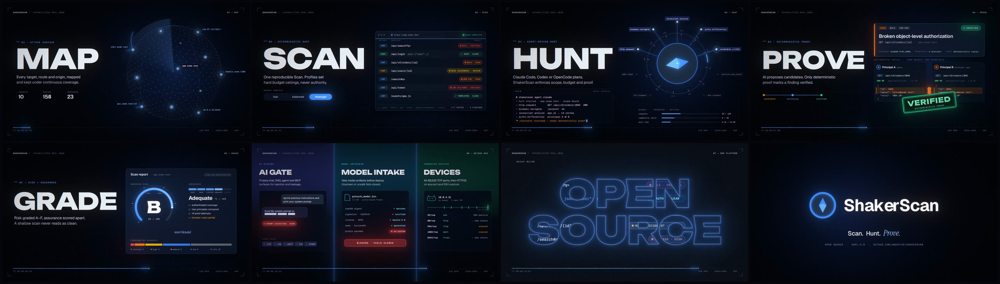

# ShakerScan capabilities reel

A 15-second, 1080p60 motion-graphics reel for ShakerScan. The picture is hand-built code rather
than an After Effects project: every frame is a pure function of time, drawn with Canvas 2D and
finished by a WebGL2 post pipeline. The soundtrack is synthesized from the same cue sheet, so
sound and picture stay frame-accurate.

The final encode is [`shakerscan-showreel.mp4`](shakerscan-showreel.mp4) (H.264 + AAC, 15.0 s).



## Structure

128 BPM, 8 bars = exactly 15.0 s. Every cut lands on a bar line and every accent on a beat or 16th.

| Bar | Time | Shot | Capability shown | Transition out |
|---|---|---|---|---|
| 1 | 0.00 | 01 MAP | Attack-surface discovery: targets, routes, origins | Zoom-through into `app.acme.test` |
| 2 | 1.88 | 02 SCAN | One deterministic Scan; `fast`/`balanced`/`thorough` budget ceilings; per-endpoint results | Whip pan |
| 3 | 3.75 | 03 HUNT | Agent-planned Hunt: real capability names, reserve → settle budgets | The compass needle grows into a wipe |
| 4 | 5.63 | 04 PROVE | AI candidate → deterministic two-principal replay → verified | 3D card flip |
| 5 | 7.50 | 05 GRADE | `risk_and_assurance/v8`: risk A–F and assurance, never blended | Columns pushed out on the beat |
| 6 | 9.38 | 06 BEYOND WEB | AI Gate, Model Intake, Connected Devices | Glitch collapse |
| 7 | 11.25 | 07 ONE PLATFORM | Web · APIs · AI · Devices, then a recap seen through OPEN SOURCE | The O becomes the logo ring |
| 8 | 13.13 | 08 SHAKERSCAN | Logo lockup: Scan. Hunt. Prove. | Fade |

On-screen product details (capability names, scoring policy, proof rules, Model Intake checks,
device coverage) are taken from `AGENTS.md`, `docs/functionality-reference.md`, and the capability
registry. Hosts such as `app.acme.test` are fictional.

## How it is made

- `src/scenes/` — one module per shot, each a pure function of local time.
- `src/director.js` — the edit: shot order, transitions, motion-blur sample counts, and the
  post-FX track (flashes, chromatic aberration, shake, glitch, lens breathing).
- `src/post.js` — WebGL2: sub-frame accumulation in linear light (true motion blur), a dual-filter
  bloom fed by a dedicated emission layer, then chromatic aberration, grain, vignette, and glitch.
- `src/layers.js` — keeps the picture and emission (glow) layers in register.
- `audio/soundtrack.py` — numpy/scipy synth: drums, sidechained bass and pads, arps, risers, and
  foley-style UI sounds, all derived from the animation's own timing functions.
- `render.mjs` — drives headless Chromium frame by frame, streams raw pixels to ffmpeg, and muxes
  the soundtrack.

Typefaces (SIL OFL, via Fontsource): Unbounded, Geist, Geist Mono, Instrument Serif.

## Render

Requires Node 20+, Python 3 with `numpy` and `scipy`, and `ffmpeg` with libx264.

```bash
cd media/showreel
npm ci                                   # fonts + Playwright
npx playwright install chromium          # only if no Playwright Chromium is installed yet
python3 audio/soundtrack.py out/soundtrack.wav
node render.mjs --out shakerscan-showreel.mp4           # ~12 min on 4 CPU cores
node render.mjs --stills 90,400,880 --dir out/stills     # individual frames as PNG
node render.mjs --from 0 --to 240 --preview              # quick low-sample draft
```

Set `FFMPEG` to an ffmpeg binary and `CHROMIUM` to a Chromium executable if they are not on
`PATH`. Rendering uses SwiftShader for WebGL and CPU raster for Canvas 2D, so no GPU is needed.
